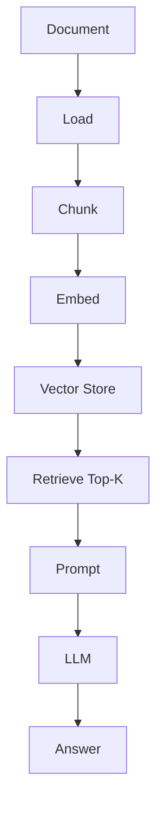
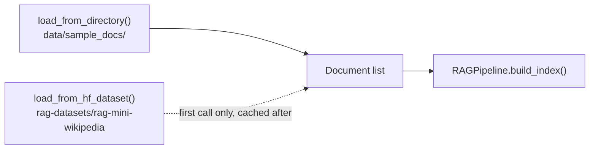

# Level 1 — Naive RAG

> **Status:** ✅ implemented — a real, runnable, end-to-end pipeline. Everything below is accurate to the code in this folder, not a plan.

[← Back to roadmap](../README.md) · [Next level: Advanced RAG →](../02-advanced-rag/README.md)

---

## Objective

Build a complete RAG system from first principles — no framework hiding the mechanics — so every later abstraction (Level 2–7) can be understood as an improvement on something you've actually built and can read top to bottom.

---

## Architecture



Every arrow above is one small, single-responsibility module:

| Stage | Module |
|---|---|
| Load | [`src/ingest.py`](src/ingest.py) |
| Chunk | [`src/chunk.py`](src/chunk.py) |
| Embed | [`src/embed.py`](src/embed.py) |
| Vector Store / Retrieve | [`src/retrieve.py`](src/retrieve.py) |
| Prompt / LLM / Answer | [`src/generate.py`](src/generate.py) |
| Orchestration | [`src/pipeline.py`](src/pipeline.py) |

---

## Stack — 100% open-source, 100% local

| Purpose | Tool | Notes |
|---|---|---|
| Package manager | **uv** | Single environment for the whole repo (root `pyproject.toml`) |
| Embeddings (default) | **Ollama** — `nomic-embed-text` | No API key, nothing leaves your machine |
| Embeddings (optional) | **sentence-transformers** — `all-MiniLM-L6-v2` | In-process, no server required, heavier install (torch) |
| Generation | **Ollama** — `llama3.2` | Swappable via `OLLAMA_CHAT_MODEL` |
| Vector store (default) | In-memory numpy (`InMemoryVectorStore`) | Zero infrastructure |
| Vector store (optional) | **Qdrant** | Persistent, via Docker Compose |
| Dataset | **`rag-datasets/rag-mini-wikipedia`** (Hugging Face) | Open, small, purpose-built for RAG demos — see [Dataset](#dataset) |

No OpenAI/Anthropic/cloud API is used anywhere in this level.

---

## Dataset

Level 1 does **not** ship any data in the repo. Two sources are supported, both in [`src/ingest.py`](src/ingest.py):

1. **`data/sample_docs/`** — three short, hand-written Markdown files (refund policy, onboarding FAQ, product overview) committed to this repo so the default examples and the entire test suite run **fully offline**, with no download at all.
2. **[`rag-datasets/rag-mini-wikipedia`](https://huggingface.co/datasets/rag-datasets/rag-mini-wikipedia)** — an open-source, Wikipedia-derived passage corpus with a matching question-answer split, built specifically for RAG tutorials. It is downloaded and cached locally by the `datasets` library **only when you explicitly call** `load_from_hf_dataset()` (used by `examples/rag_with_ollama.py`, `src/build_eval_set.py`, and the CLI's default `--source hf-dataset`) — never at import time, never as a side effect of anything else.



---

## Setup

```bash
# from the repo root
cp .env.example .env        # optional — defaults work as-is
uv sync                     # installs numpy, datasets, pypdf, ollama client, etc.

ollama serve                 # in another terminal, if not already running
ollama pull nomic-embed-text
ollama pull llama3.2
```

Optional extras:

```bash
uv sync --extra sentence-transformers   # alternative embedding backend (no Ollama needed for embeddings)
uv sync --extra qdrant                  # for the Qdrant-backed example
uv sync --extra dev                     # pytest, ruff
docker compose up -d qdrant             # from repo root, only if using Qdrant
```

> This repo never runs `uv sync`, `ollama pull`, or dataset downloads for you — everything above is a command **you** run, on your machine, when you're ready.

### Environment variables

All optional — sensible defaults are baked into [`src/config.py`](src/config.py). Full list in the repo-root [`.env.example`](../.env.example):

| Variable | Default | Purpose |
|---|---|---|
| `OLLAMA_HOST` | `http://localhost:11434` | Ollama server address |
| `OLLAMA_EMBED_MODEL` | `nomic-embed-text` | Embedding model |
| `OLLAMA_CHAT_MODEL` | `llama3.2` | Generation model |
| `EMBEDDING_BACKEND` | `ollama` | `ollama` or `sentence-transformers` |
| `GENERATION_BACKEND` | `ollama` | `ollama` or `extractive` (no LLM, for testing) |
| `VECTOR_STORE_BACKEND` | `memory` | `memory` or `qdrant` |
| `CHUNK_SIZE` / `CHUNK_OVERLAP` | `500` / `50` | Naive fixed-size chunking (words) |
| `TOP_K` | `3` | Chunks retrieved per query |
| `HF_DATASET_NAME` | `rag-datasets/rag-mini-wikipedia` | Open dataset used by `load_from_hf_dataset` |

---

## Folder Structure

```mermaid
flowchart TD
    ROOT["01-naive-rag/"] --> README["README.md"]
    ROOT --> THEORY["theory/"]
    ROOT --> NB["notebooks/"]
    ROOT --> SRC["src/"]
    ROOT --> EX["examples/"]
    ROOT --> TESTS["tests/"]
    ROOT --> DATA["data/"]

    THEORY --> T1["embeddings.md"]
    THEORY --> T2["cosine_similarity.md"]
    THEORY --> T3["chunking.md"]
    THEORY --> T4["vector_search.md"]

    NB --> N1["01_embeddings.ipynb"]
    NB --> N2["02_similarity.ipynb"]
    NB --> N3["03_vector_search.ipynb"]
    NB --> N4["04_first_rag.ipynb"]

    SRC --> S0["config.py · schema.py"]
    SRC --> S1["ingest.py"]
    SRC --> S2["chunk.py"]
    SRC --> S3["embed.py"]
    SRC --> S4["retrieve.py"]
    SRC --> S5["generate.py"]
    SRC --> S6["pipeline.py"]
    SRC --> S7["cli.py · build_eval_set.py"]

    EX --> E1["simple_rag.py"]
    EX --> E2["rag_with_qdrant.py"]
    EX --> E3["rag_with_ollama.py"]

    TESTS --> TS1["conftest.py"]
    TESTS --> TS2["test_chunking.py"]
    TESTS --> TS3["test_retrieval.py"]
    TESTS --> TS4["test_pipeline.py"]

    DATA --> D1["sample_docs/*.md"]
    DATA --> D2["index/ (generated, gitignored)"]
```



| Folder | Purpose |
|---|---|
| `theory/` | Concept write-ups with diagrams: embeddings, cosine similarity, chunking, vector search. |
| `notebooks/` | Runnable, step-by-step tutorials mirroring `theory/`, ending in the full pipeline. |
| `src/` | The pipeline itself — see [Architecture](#architecture) table above. |
| `examples/` | Three end-to-end runnable scripts (see [Examples](#examples)). |
| `tests/` | Offline unit + integration tests (no network, no Ollama required). |
| `data/sample_docs/` | Hand-written offline corpus. `data/index/` is a generated, gitignored cache. |

---

## Running it

```bash
cd 01-naive-rag
```

**Quick answer (in-memory, offline sample docs):**
```bash
uv run python examples/simple_rag.py "What is the refund period?"
```

**Persist an index, then ask repeatedly via the CLI:**
```bash
uv run python -m src.cli ingest --source sample-docs
uv run python -m src.cli ask "How many PTO days do employees get?"
```
Or, from the repo root: `make ask Q="How many PTO days do employees get?"`.

**Qdrant-backed:**
```bash
docker compose up -d qdrant     # from repo root
uv run python examples/rag_with_qdrant.py "What is the refund period?"
```

**Full open-source dataset + sentence-transformers embeddings:**
```bash
uv run python examples/rag_with_ollama.py "Who was Ada Lovelace?"
```

**Notebooks:**
```bash
uv run --with jupyter jupyter lab notebooks/
```

---

## Examples

| Script | Vector store | Embeddings | Generation | Data |
|---|---|---|---|---|
| `examples/simple_rag.py` | In-memory | Ollama | Ollama | `data/sample_docs/` (offline) |
| `examples/rag_with_qdrant.py` | Qdrant | Ollama | Ollama | `data/sample_docs/` (offline) |
| `examples/rag_with_ollama.py` | In-memory | sentence-transformers | Ollama | Full HF dataset (downloads on first run) |

The point of all three sharing `src/pipeline.py`: swapping infrastructure (vector store) or a model backend (embeddings) never touches retrieval or generation logic — only the constructor arguments change.

---

## Notebooks

| Notebook | Covers |
|---|---|
| [`01_embeddings.ipynb`](notebooks/01_embeddings.ipynb) | Generate real embeddings, inspect vectors |
| [`02_similarity.ipynb`](notebooks/02_similarity.ipynb) | Cosine similarity, related vs. unrelated pairs |
| [`03_vector_search.ipynb`](notebooks/03_vector_search.ipynb) | Hand-build a tiny in-memory index and query it |
| [`04_first_rag.ipynb`](notebooks/04_first_rag.ipynb) | The full pipeline, including a deliberate failure case |

---

## Evaluation

```bash
cd 01-naive-rag
uv run python -m src.build_eval_set     # one-time: derive shared/evaluation/*.jsonl from the open dataset
uv run python -m src.cli evaluate        # reports Recall@K
```

[`src/build_eval_set.py`](src/build_eval_set.py) samples question/answer pairs from `rag-mini-wikipedia`'s QA split and writes them into [`../shared/evaluation/`](../shared/README.md#evaluation-dataset) in the repo-wide format, so Level 2+ can reuse the exact same questions. Since the dataset doesn't ship official passage-level ground truth, `expected_sources.jsonl` is a **documented best-effort heuristic** (word-overlap between each answer and the corpus, via `shared/utils/text.py`) — not authoritative. Metrics beyond Recall@K (Precision@K, MRR, NDCG, faithfulness) start at [Level 2](../02-advanced-rag/README.md).

---

## Tests

```bash
uv sync --extra dev
uv run pytest -v        # from the repo root — or `make test`
```

The suite never touches Ollama, Qdrant, or the network: `tests/conftest.py` provides a deterministic `FakeHashEmbedder` (hashing-trick vectors, no real model) and every test uses `ExtractiveGenerator` in place of an LLM. This means a green suite verifies the real chunking, storage, and retrieval logic — not a mock of it — while staying fast and CI-friendly.

- `test_chunking.py` — window size, overlap, edge cases (empty text, invalid sizes).
- `test_retrieval.py` — cosine similarity, Top-K ranking, save/load round-trip.
- `test_pipeline.py` — full build_index → ask loop, prompt construction, error handling.
- `test_ingest.py` — added against the RAG-Anything gap review (see
  [`../missing_to_complite.md`](../missing_to_complite.md)): `load_from_directory` now also reads
  `.docx`, `.pptx`, and `.xlsx` files (pure-Python parsers — `python-docx`/`python-pptx`/
  `openpyxl`, deliberately not a LibreOffice dependency), verified against three real committed
  Office sample files (`data/sample_docs/remote_work_policy.docx`, `q3_product_update.pptx`,
  `support_ticket_volume.xlsx`) alongside synthetic `tmp_path` fixtures for edge cases. No test file
  covered `src/ingest.py` at all before this addition.

---

## Mini Project

Build a local PDF question-answering assistant (or a Word/PowerPoint/Excel one — `load_from_directory` now reads `.docx`, `.pptx`, and `.xlsx` too, not just `.pdf`/`.txt`/`.md`):

```bash
mkdir -p data/my_pdfs && cp ~/some-document.pdf data/my_pdfs/
```
```python
from src.ingest import load_from_directory
from src.pipeline import RAGPipeline

pipeline = RAGPipeline()
pipeline.build_index(load_from_directory("data/my_pdfs"))
pipeline.save_index()

answer = pipeline.ask("What does this document say about ...?")
print(answer.answer)
```

---

## Common Failure Modes

- Chunk boundaries splitting a fact in half (see [`theory/chunking.md`](theory/chunking.md)) — try a small `CHUNK_SIZE` against `data/sample_docs/refund_policy.md` and watch "5-7 business days" get split.
- Brute-force search always returns Top-K, even when nothing relevant exists — see the deliberate "CEO's home address" failure case in `04_first_rag.ipynb`.
- The LLM answering fluently despite weak/irrelevant retrieved context (hallucination despite "working" retrieval) — the `SYSTEM_PROMPT` in `src/generate.py` explicitly instructs the model to refuse when the context doesn't contain the answer, but a small/undertrained local model may not always comply.
- Mixing embeddings from two different models in the same vector store — they are not comparable (see `theory/embeddings.md`).

---

## What I Learned

- **A one-file-format-per-branch `if/elif` ladder scales cleanly to new formats, right up until it
  doesn't.** Adding `.docx`/`.pptx`/`.xlsx` to `load_from_directory` was a clean three-line
  addition to the existing suffix dispatch — but each new format needed its own private `_read_*`
  helper with real domain knowledge (python-docx's tables are separate from its paragraphs;
  python-pptx's speaker notes needed an explicit decision to exclude; openpyxl needs
  `data_only=True` or a formula cell yields its formula text, not its displayed value). The
  dispatch is trivial; the format-specific correctness is where the real work is.
- **No test file existed for `ingest.py` at all, for any format, before this pass** — including
  the original PDF/text/markdown support. Adding a new format was the forcing function that
  finally gave this module its first tests, not something planned ahead of time.

---

## Checklist

- [x] Theory notes written (`theory/`)
- [x] `src/` pipeline implemented end-to-end
- [x] All 4 notebooks runnable
- [x] Three examples implemented (in-memory, Qdrant, mixed-backend)
- [x] Offline test suite (`tests/`)
- [x] Evaluation harness (`src/build_eval_set.py`, `src/cli.py evaluate`)
- [ ] Run everything yourself: `uv sync`, pull the Ollama models, run the examples
- [ ] Build the mini project against your own PDFs
- [x] Fill in **What I Learned** above
- [ ] Commit results

---

## Next Level

Once you can explain **why embeddings work**, **why chunk size changes retrieval quality**, **what Top-K means**, and **why the LLM can still hallucinate even when retrieval works** — move to [Level 2 — Advanced RAG](../02-advanced-rag/README.md).
