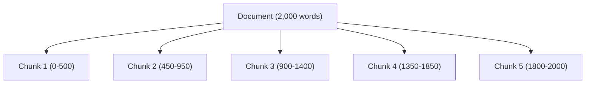
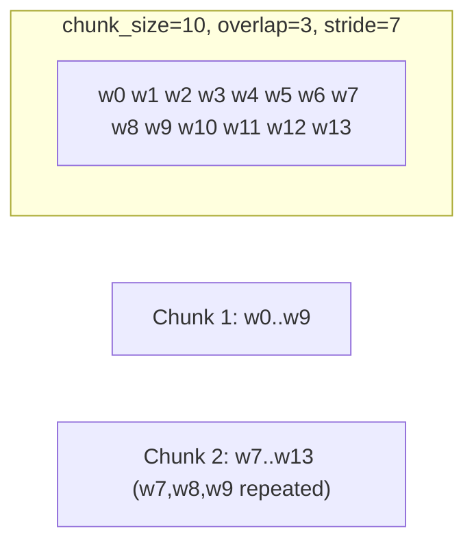

# Chunking

## Why chunk at all?

Embedding models have a limited context window, and — more importantly —
a single embedding vector loses precision the more distinct ideas it has
to compress into it. A whole 20-page document embedded as one vector
produces a blurry average of everything in it; a well-scoped paragraph
embeds into a vector that actually represents *one idea*, which retrieves
much more precisely.



## Level 1's strategy: naive fixed-size chunking

[`../src/chunk.py`](../src/chunk.py) splits text into fixed-size,
overlapping **word** windows:

```python
def chunk_text(text, chunk_size=500, chunk_overlap=50):
    words = text.split()
    stride = chunk_size - chunk_overlap
    ...
```

- **`chunk_size`** — words per chunk (default 500).
- **`chunk_overlap`** — words repeated between consecutive chunks (default
  50), so a sentence sitting on a boundary has a chance of appearing whole
  in at least one chunk.
- **`stride = chunk_size - chunk_overlap`** — how far the window moves each
  step.



## Why this is "naive" — and what breaks

Fixed-size chunking ignores the actual structure of the text: sentences,
paragraphs, headings, list items. Concretely, this means:

| Failure mode | Example |
|---|---|
| **Splitting a fact in half** | "Refunds take 5-7" \| "business days to process." — the number and its unit end up in different chunks. |
| **Merging unrelated ideas** | A chunk boundary lands mid-paragraph, so one chunk ends with half of the *refund policy* and starts the next paragraph about *shipping costs*. |
| **Losing structural signal** | A Markdown heading (`## Enterprise refunds`) that scopes the paragraph below it can end up in a different chunk than the paragraph itself. |

You can watch this happen directly using the hand-written documents in
[`../data/sample_docs/`](../data/sample_docs/) — try a small `chunk_size`
(e.g. 20) against `refund_policy.md` and see the "5-7 business days"
sentence get split.

## Chunk size and overlap are a trade-off, not a constant

| Choice | Effect |
|---|---|
| Smaller `chunk_size` | More precise retrieval (less unrelated text per chunk), but more chunks to search, and more risk of splitting a fact. |
| Larger `chunk_size` | Fewer, more context-rich chunks, but each embedding vector represents a blurrier mix of ideas. |
| More `chunk_overlap` | Facts near boundaries are more likely to appear whole somewhere — at the cost of redundant, near-duplicate chunks in the index. |
| No overlap | Smaller index, but boundary facts are genuinely lost. |

Level 2's experiments
([`02-advanced-rag/chunking/`](../../02-advanced-rag/README.md)) run this
comparison systematically (256 vs. 512 vs. 1024, overlap 0 vs. 50 vs. 100)
against the shared evaluation set, and Level 2 also introduces
**recursive**, **semantic**, and **parent-child** chunking, which split on
actual sentence/paragraph boundaries instead of a raw word count.

## Next

[Vector search →](./vector_search.md) — what happens to these chunks once
they're embedded.
