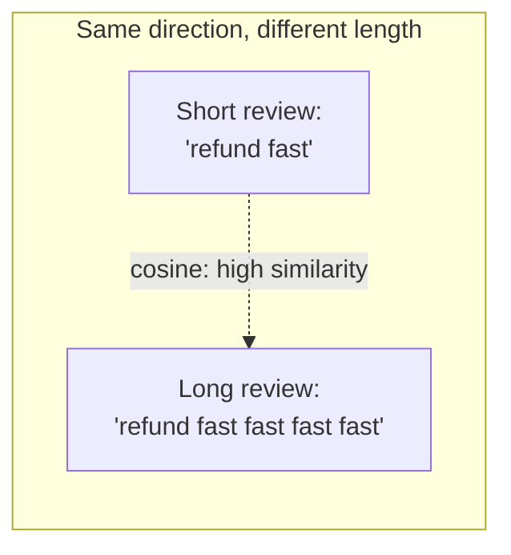

# Cosine Similarity

## The formula

For two vectors **a** and **b**:

```
cosine_similarity(a, b) = (a · b) / (‖a‖ ‖b‖)
```

- `a · b` is the dot product (element-wise multiply, then sum).
- `‖a‖` and `‖b‖` are the vectors' magnitudes (Euclidean/L2 norm).

The result is always between **-1** (opposite direction) and **1**
(identical direction). In practice, embedding vectors almost never point in
truly opposite directions, so RAG similarity scores usually fall in
**0 to 1**, with values above ~0.7-0.8 typically indicating a strong match
(this threshold is model-dependent — always calibrate on your own data).

## Why cosine, not Euclidean distance?



Cosine similarity only cares about **direction**, not **magnitude**. This
matters for text: a short and a long passage about the same topic can have
very different vector lengths (magnitude often correlates with text length
or word frequency) but should still be considered similar if they point
the same way in the embedding space. Euclidean distance would penalize the
length difference; cosine similarity ignores it.

## Worked example

```
a = [1, 0]          # "cat"
b = [0.9, 0.1]       # "kitten"  (close direction to "cat")
c = [-1, 0]          # "dog" in this toy example, pointing opposite

cosine(a, b) = (1*0.9 + 0*0.1) / (1 * sqrt(0.9² + 0.1²))
             = 0.9 / 0.905
             ≈ 0.994   -> very similar

cosine(a, c) = (1*-1 + 0*0) / (1 * 1)
             = -1        -> opposite
```

## How it is implemented in this repo

```python
# src/retrieve.py — simplified
def _cosine_similarity(matrix, query):
    matrix_norms = np.linalg.norm(matrix, axis=1)
    query_norm = np.linalg.norm(query)
    return (matrix @ query) / (matrix_norms * query_norm + 1e-12)
```

- `matrix @ query` computes the dot product of the query against **every**
  stored vector at once (a single matrix-vector multiply) — this is the
  entire "search" step.
- `+ 1e-12` avoids a divide-by-zero if a stored vector happens to be all
  zeros.
- The result is a 1-D array of similarity scores, one per stored chunk;
  `InMemoryVectorStore.search()` then takes the Top-K largest.

## Why this matters for retrieval quality

Cosine similarity is a **measurement**, not a guarantee. It tells you which
stored chunks are *closest in direction* to the query — it does not know
whether that chunk actually *answers* the question. This is exactly the
gap that reranking (Level 2) and answer verification (Level 5) exist to
close: retrieval finds *plausible* candidates by geometry; something else
has to judge *relevance* and *correctness*.

## Next

[Chunking →](./chunking.md) — deciding what a "vector" actually represents
before you ever compute a similarity score.
