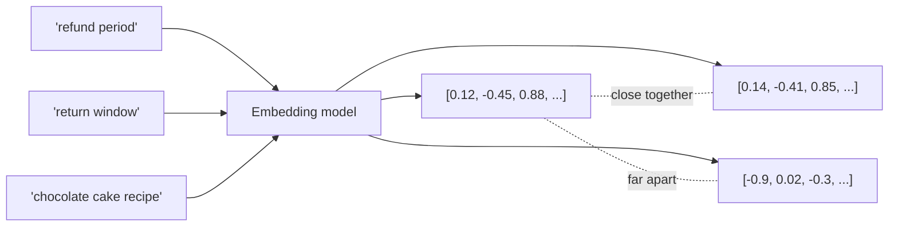
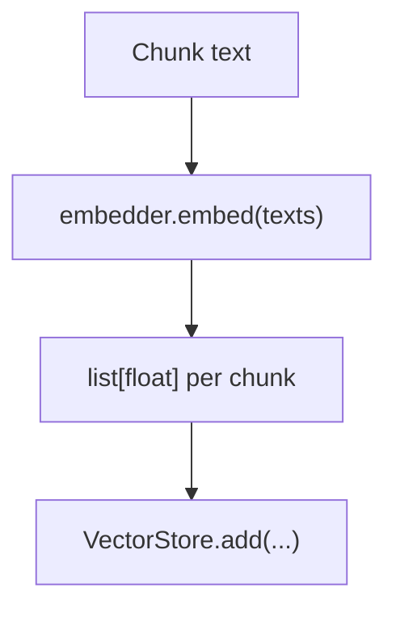

# Embeddings

## What is an embedding?

An embedding is a function that maps a piece of text to a fixed-size vector
of numbers, such that texts with **similar meaning** end up **close
together** in that vector space, and unrelated texts end up far apart.

`"refund period"` and `"return window"` share no words in common, but an
embedding model trained on lots of text learns that they are used in
similar contexts — so their vectors end up close together. This is exactly
what makes semantic search possible: you can retrieve a passage about
*"return window"* even when the user's query says *"refund period."*

## Where do the numbers come from?

An embedding model (a neural network, usually a small transformer) is
trained so that vectors for semantically related text end up close under a
distance metric — almost always **cosine similarity** (see
[`cosine_similarity.md`](./cosine_similarity.md)). You never write this
model yourself; you call a pretrained one:

- **Ollama** (`nomic-embed-text`, used by default in this level) — runs
  locally, no API key, embeddings never leave your machine.
- **Sentence Transformers** (`all-MiniLM-L6-v2`, optional backend here) —
  runs in-process in Python.

Both are swappable in [`../src/embed.py`](../src/embed.py) behind the same
`Embedder` interface.

## Properties that matter for RAG

| Property | Why it matters |
|---|---|
| **Dimensionality** | `nomic-embed-text` outputs 768-dim vectors, `all-MiniLM-L6-v2` outputs 384-dim. Higher isn't automatically better — it's a memory/speed/accuracy trade-off. |
| **Same model for indexing and querying** | Vectors from two *different* embedding models are not comparable — never mix them in the same vector store. |
| **Normalization** | Many models output unit-length vectors; if not, normalize before storing, since cosine similarity implicitly does this anyway (see `_cosine_similarity` in [`../src/retrieve.py`](../src/retrieve.py)). |
| **Domain fit** | A general-purpose embedding model can struggle on highly specialized text (legal, medical, code). Level 2+ covers evaluating and fixing this. |

## In this repo

See [`01_embeddings.ipynb`](../notebooks/01_embeddings.ipynb) to generate
real embeddings and inspect the raw vectors, and
[`../src/embed.py`](../src/embed.py) for the implementation.

## Common misconceptions

- **"Bigger embedding model = better retrieval."** Not always — a larger
  model that's a poor domain fit can lose to a smaller, well-matched one.
- **"Embeddings understand facts."** They understand *similarity of
  usage/context*, not truth. A confidently wrong statement can embed very
  close to a correct one if phrased similarly.
- **"You can compare embeddings from different models."** You cannot — the
  vector spaces are unrelated between models.

## Next

[Cosine similarity →](./cosine_similarity.md) — the metric that turns
"close together" into a number.
