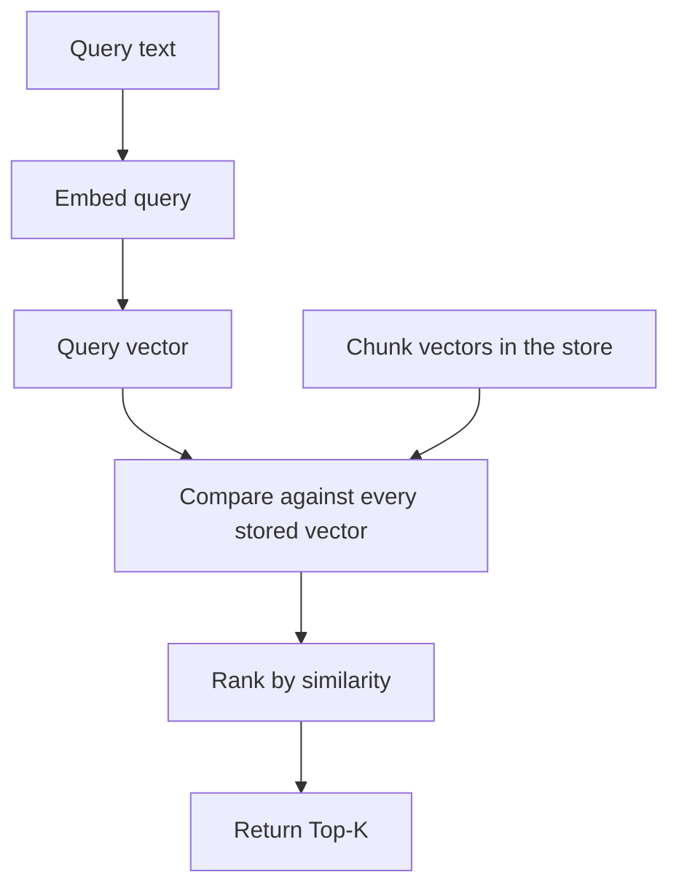
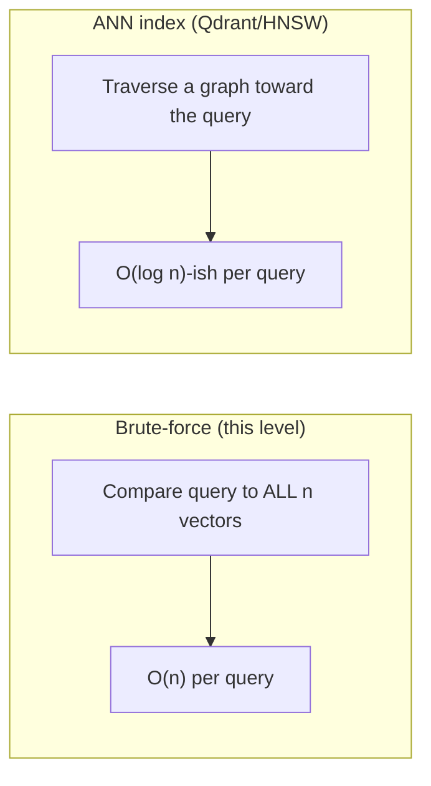

# Vector Search

## The idea

Once every chunk has an embedding, "search" means: embed the query with
the **same model**, then find the stored chunk vectors closest to it by
cosine similarity (see [`cosine_similarity.md`](./cosine_similarity.md)).



## Brute-force search (Level 1's approach)

[`InMemoryVectorStore`](../src/retrieve.py) does the simplest thing that
works: compute the similarity of the query against **every** stored
vector, then take the K largest.

```python
def search(self, query_vector, top_k):
    scores = _cosine_similarity(self._vectors, query)   # one score per chunk
    top_indices = np.argpartition(-scores, top_k - 1)[:top_k]
    return sorted_by_score(top_indices)
```

This is a single matrix-vector multiply — for a few thousand chunks it
runs in milliseconds and needs zero infrastructure. That's exactly why it
is the right choice for Level 1: the goal here is to *see* what retrieval
does, not to make it scale.

## Why this doesn't scale, and what replaces it

Brute-force search is **O(n)** in the number of chunks: double your corpus,
double the search time. At real-world scale (millions of chunks), this
becomes too slow, and dedicated vector databases (Qdrant, in this repo's
stack) use **Approximate Nearest Neighbor (ANN)** indexes — commonly
HNSW (Hierarchical Navigable Small World graphs) — that trade a small,
tunable amount of recall for search times that stay roughly constant as
the corpus grows.



[`examples/rag_with_qdrant.py`](../examples/rag_with_qdrant.py) swaps
`InMemoryVectorStore` for `QdrantVectorStore` with **no other code
change** — both implement the same `add()` / `search()` interface — so you
can feel the difference directly: same pipeline, persistent + scalable
storage.

## Top-K: how many chunks to retrieve

`top_k` controls how many chunks get passed to the LLM as context.

| Too small (e.g. K=1) | Too large (e.g. K=20) |
|---|---|
| Misses the answer if it's split across two chunks, or if the single most-similar chunk isn't actually the most relevant one. | Dilutes the prompt with irrelevant text, increases cost/latency, and can confuse the LLM into blending unrelated context ("context poisoning"). |

Level 1 defaults to `TOP_K=3` (see [`.env.example`](../../.env.example)).
Level 2 makes this dynamic — retrieve wide (Top-20), then rerank down to a
precise Top-5 — see
[`02-advanced-rag/README.md`](../../02-advanced-rag/README.md).

## What vector search does *not* do

Vector search finds chunks that are **semantically close** to the query.
It does not:

- Verify the chunk actually answers the question (that's the LLM's job,
  and it can still fail — see the Common Failure Modes in the main
  README).
- Guarantee the top result is *correct* — only that it's the closest match
  in the embedding space, which is a proxy for relevance, not truth.
- Handle exact keyword/entity matches well by itself — a product SKU or an
  exact legal term is often better served by keyword (BM25) search, which
  is why Level 2 introduces **hybrid search**.

## Next

Put it all together in
[`04_first_rag.ipynb`](../notebooks/04_first_rag.ipynb), or jump straight
to [`../README.md`](../README.md) for the full pipeline and how to run it.
