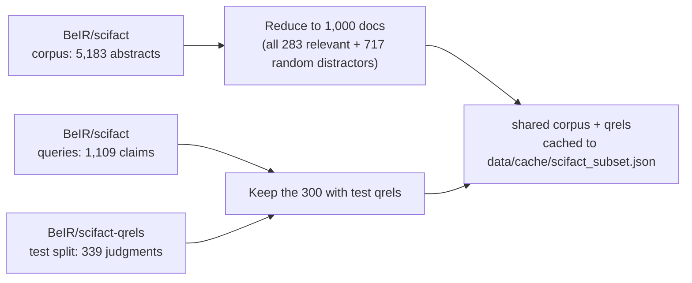
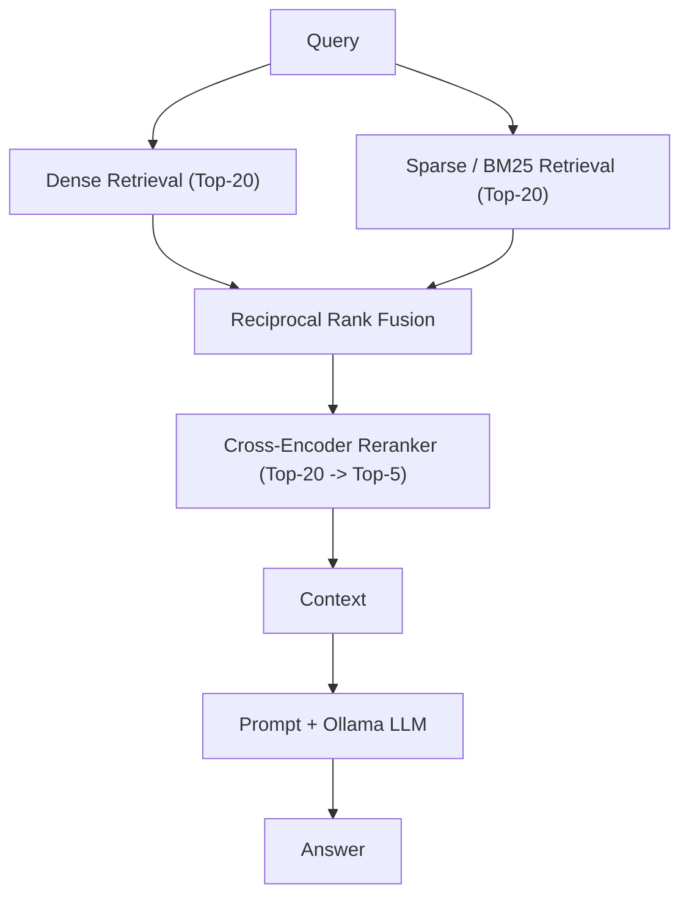
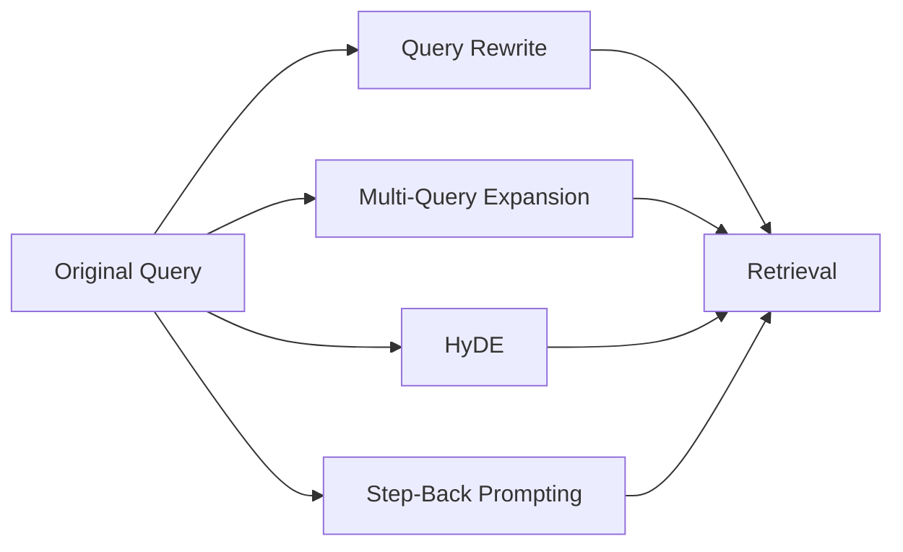
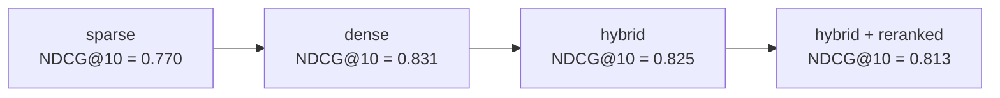

# Level 2 — Advanced RAG

> **Status:** ✅ implemented and executed end-to-end — every number on this page came from a real run against a real, open IR benchmark, not a mocked example.

[← Previous level: Naive RAG](../01-naive-rag/README.md) · [Back to roadmap](../README.md) · [Next level: Modular RAG →](../03-modular-rag/README.md)

---

## Objective

Move from "vector search works" to **"retrieval is measurable and tunable."** Every technique below is implemented, tested offline, and then actually measured against real relevance judgments — including the humbling result that not every "more advanced" technique wins.

---

## Dataset

Level 2 uses **[BeIR/scifact](https://huggingface.co/datasets/BeIR/scifact)** — an open-source information-retrieval benchmark of scientific claims (queries) and paper abstracts (corpus), with **real, human-annotated relevance judgments (qrels)**. Unlike Level 1's `rag-mini-wikipedia` (which has no official qrels, forcing a word-overlap heuristic), scifact lets every metric on this page be measured against genuine ground truth.



Nothing is bundled in this repo — [`common/dataset.py`](common/dataset.py) downloads and caches it (via Hugging Face `datasets`) only when `prepare()` is actually called. Corpus embeddings are cached separately in `data/cache/` (see [`common/embed.py`](common/embed.py)) so every notebook after the first run starts in milliseconds instead of ~90 seconds.

---

## Architecture

**Retrieval pipeline** (what every notebook and `examples/advanced_pipeline.py` runs):



**Query-side transformations** feed into the same retrieval stage:



---

## Stack

| Purpose | Tool |
|---|---|
| Everything from Level 1 | Ollama (embeddings + generation), numpy |
| Sparse retrieval | `rank-bm25` (pure Python, no extra install) |
| Reranking | `sentence-transformers` `CrossEncoder` — `uv sync --extra sentence-transformers` |
| Dataset | Hugging Face `datasets` (already a core dependency) |
| Structured data validation | `pydantic` (core dependency) — used in `metadata-filtering/self_query.py` to validate the LLM's structured output, see [Why Pydantic, and only there](#why-pydantic-and-only-there) below |

No new vector database is required — [`retrieval/dense.py`](retrieval/dense.py) reuses the same brute-force numpy approach as Level 1's `InMemoryVectorStore`; Qdrant remains available (`../docker-compose.yml`) for anyone who wants to swap it in.

---

## Folder Structure

```mermaid
flowchart TD
    ROOT["02-advanced-rag/"] --> README["README.md"]
    ROOT --> COMMON["common/"]
    ROOT --> CH["chunking/"]
    ROOT --> RET["retrieval/"]
    ROOT --> HS["hybrid-search/"]
    ROOT --> RR["reranking/"]
    ROOT --> QT["query-transformations/"]
    ROOT --> MF["metadata-filtering/"]
    ROOT --> CC["context-compression/"]
    ROOT --> EV["evaluation/"]
    ROOT --> EX["examples/"]
    ROOT --> TESTS["tests/"]
    ROOT --> NB["notebooks/"]

    COMMON --> C1["config.py · dataset.py · embed.py · llm.py"]
    CH --> C2["fixed_size.py · recursive.py · semantic.py · parent_child.py<br/>hierarchical.py · raptor.py · contextual_enrichment.py"]
    RET --> R1["dense.py · sparse.py · top_k_experiments.py · late_interaction.py"]
    HS --> H1["rrf.py · bm25_vector.py"]
    RR --> RK1["cross_encoder.py · bge_reranker.py"]
    QT --> Q1["query_rewrite.py · multi_query.py · hyde.py · step_back.py<br/>conversational_rewrite.py"]
    MF --> M1["filters.py · self_query.py · temporal.py"]
    CC --> CC1["compressor.py"]
    EV --> EA["recall_at_k.py · mrr.py · ndcg.py · long_context_baseline.py"]
    EX --> EX1["advanced_pipeline.py"]
    TESTS --> TS1["93 tests, no network required"]
    NB --> N1["6 notebooks, all executed"]
```



| Folder | Purpose |
|---|---|
| `common/` | Shared plumbing: dataset loading + caching, embedding client, LLM client. Not in the original plan doc — added because every technique folder needs it. |
| `chunking/` | Seven chunking strategies (see [`01_chunking_strategies.ipynb`](notebooks/01_chunking_strategies.ipynb)), plus hierarchical indexing, RAPTOR, and contextual enrichment. |
| `retrieval/` | Dense (embedding) and sparse (BM25) retrievers behind one shared interface, plus late-interaction (MaxSim) retrieval. |
| `hybrid-search/` | Reciprocal Rank Fusion + a combined dense+sparse retriever. |
| `reranking/` | Cross-encoder rerankers (MiniLM, BGE). |
| `query-transformations/` | LLM-driven query rewriting, multi-query, HyDE, step-back, and conversational (multi-turn) rewriting. |
| `metadata-filtering/` | Post-filter retrieval results on structured fields, self-query filter extraction, and temporal (date-range) filtering. |
| `context-compression/` | Trim retrieved chunks to their most query-relevant sentences. |
| `evaluation/` | Recall@K, MRR, NDCG@K, and the long-context (no-retrieval) baseline — pure-Python IR metrics plus one LLM-driven comparison arm. |

> **New in this pass:** `hierarchical.py`, `raptor.py`, `contextual_enrichment.py` (all in `chunking/`), `late_interaction.py` (in `retrieval/`), `conversational_rewrite.py` (in `query-transformations/`), `self_query.py` and `temporal.py` (both in `metadata-filtering/`), and `long_context_baseline.py` (in `evaluation/`) — eight techniques identified as missing from this level by [`../RAG_TAXONOMY_COVERAGE.md`](../RAG_TAXONOMY_COVERAGE.md), now implemented, tested, and run against real data. See [Eight additions from the taxonomy review](#eight-additions-from-the-taxonomy-review) below for a plain-language walkthrough of each one.

> **Naming note:** `hybrid-search/`, `query-transformations/`, `metadata-filtering/`, and `context-compression/` use hyphens (per the original plan), which Python can't dotted-import as packages. Files there add their own directory to `sys.path` and import siblings as plain top-level modules (e.g. `from rrf import reciprocal_rank_fusion`) — see the comment at the top of any file in those folders.

---

## Setup

```bash
# from the repo root
uv sync --extra sentence-transformers   # adds torch + sentence-transformers for reranking
ollama serve                             # if not already running
ollama pull nomic-embed-text
ollama pull llama3.2
```

`rank-bm25` (sparse retrieval) is a core dependency — no extra flag needed.

---

## Running it

```bash
cd 02-advanced-rag
uv run python examples/advanced_pipeline.py "Is chronic rhinosinusitis associated with elevated group 2 innate lymphoid cells?"
```

First run downloads scifact (~5MB) and embeds the 1,000-doc subset (~90s on Apple Silicon CPU via Ollama); every run after that loads from `data/cache/` in milliseconds.

**Notebooks:**
```bash
uv run --with jupyter jupyter lab notebooks/
```

---

## Notebooks

All 6 are executed with real output — open any of them to see actual measured numbers, not placeholders.

| Notebook | Covers |
|---|---|
| [`01_chunking_strategies.ipynb`](notebooks/01_chunking_strategies.ipynb) | Fixed/recursive/semantic/parent-child on a real 1,070-word scifact abstract |
| [`02_dense_vs_sparse_retrieval.ipynb`](notebooks/02_dense_vs_sparse_retrieval.ipynb) | Dense vs. BM25, Recall@K on all 300 real queries |
| [`03_hybrid_search_rrf.ipynb`](notebooks/03_hybrid_search_rrf.ipynb) | RRF fusion, including a real hybrid-rescues-a-miss example |
| [`04_reranking.ipynb`](notebooks/04_reranking.ipynb) | Cross-encoder reranking, measured before/after |
| [`05_query_transformations.ipynb`](notebooks/05_query_transformations.ipynb) | Rewrite/multi-query/HyDE/step-back — HyDE solves a query everything else misses |
| [`06_retrieval_evaluation.ipynb`](notebooks/06_retrieval_evaluation.ipynb) | Capstone: Recall@K, MRR, NDCG@K across every method, full 300 queries |

---

## Evaluation — the real, measured results

Full 300-query test set, real qrels, `evaluation/{recall_at_k,mrr,ndcg}.py`:

| method | Recall@5 | Recall@10 | MRR | NDCG@10 |
|---|---|---|---|---|
| sparse (BM25) | 0.847 | 0.867 | 0.751 | 0.770 |
| dense (~ Level 1's approach) | 0.900 | 0.917 | **0.806** | **0.831** |
| hybrid (dense+BM25, RRF) | 0.887 | **0.923** | 0.802 | 0.825 |
| hybrid + reranked | 0.890 | **0.923** | 0.788 | 0.813 |



**The honest, slightly humbling finding: plain dense retrieval posted the best MRR and NDCG@10 of all four methods.** Hybrid ties dense for the best Recall@10; reranking on top of hybrid *reduced* both MRR and NDCG compared to hybrid alone. See [`06_retrieval_evaluation.ipynb`](notebooks/06_retrieval_evaluation.ipynb) for the full discussion — the short version is that scifact's claims paraphrase their supporting abstracts (favoring embeddings over BM25), and the off-the-shelf cross-encoder (`ms-marco-MiniLM`, trained on general web search) doesn't transfer perfectly to biomedical text.

This is exactly what Level 2 exists to make visible: **more sophistication is not automatically better — you have to measure it on your own data.**

---

## Examples

| Script | Demonstrates |
|---|---|
| `examples/advanced_pipeline.py` | Full pipeline: hybrid retrieval → cross-encoder rerank → Ollama generation, on a real question |

---

## Eight additions from the taxonomy review

A later pass through this repo checked a long list of named "RAG techniques" against the actual
code (see [`../RAG_TAXONOMY_COVERAGE.md`](../RAG_TAXONOMY_COVERAGE.md)) and found eight real gaps
in this level specifically. All eight are now implemented, offline-tested, and run against the
real scifact corpus and the real, running Ollama server this whole repo already depends on — no
new model provider, no mocked example.

This section explains each one in plain language, then shows the real output from actually
running it. If a term below is unfamiliar: an **embedding** is a list of numbers that represents
what a piece of text means, produced by an AI model; two embeddings that are close together
(measured with **cosine similarity**, a number between -1 and 1 where 1 means "pointing in
exactly the same direction") represent text with similar meaning. Everything below builds on that
one idea.

Before reading on, the full test suite for this level was run before this work started (43
tests passing) and again after every addition (93 tests passing, all offline, no network or
Ollama required) — see [Tests](#tests) below for what changed and why the numbers differ.

### Why Pydantic, and only there

One new library is used in this batch of additions: **Pydantic**. It solves one specific problem
and is used in exactly one file (`metadata-filtering/self_query.py`) for that reason — it is not
sprinkled everywhere, because most of the other seven additions never need it.

The problem: several of the techniques below ask an AI model to answer in a specific format
(plain text, like a rewritten question) — those are just strings, and a string either has content
or it does not, so there is nothing to check. Self-query is different: it asks the model to
return **several pieces of information at once**, with **specific types** — a year should be a
number, a length category should be one of exactly three allowed words, and so on. A language
model does not always follow a format exactly. It might write the year as the text `"2023"`
instead of the number `2023`, or invent a length category that was never one of the three
allowed. Without a way to check this, that mistake would only surface later, as a confusing error
somewhere else in the program, far from where it actually happened.

Pydantic is a library built exactly for this: describe the shape of the data you expect (as a
small Python class), hand it whatever the model actually returned, and it either gives back a
clean, correctly-typed result or tells you clearly what did not match. `self_query.py` uses this
to convert the model's raw answer into a `SelfQueryFilters` object, catches the one specific error
Pydantic raises when something does not fit, and falls back to a safe default (search everything,
apply no filter) instead of crashing. This is the same "if the AI's output is malformed, degrade
gracefully instead of crashing" idea used throughout this whole repository — Pydantic is simply
the right tool for the one place in this level where the AI's answer has real structure to check.

---

### 1. Temporal filtering — "only show me documents from a certain time period"

**The idea in plain terms**: sometimes a search should only look at documents from a certain time
period — "policies from before 2020," "news from this year." This is exactly like the metadata
filtering this level already had (`filters.py`, which can filter by document length), just
specialized to dates. `metadata-filtering/temporal.py` adds a `DateRange` that can say "after this
year," "before this year," or both, and a `temporal_search` function that retrieves a wide set of
candidates first, then keeps only the ones inside the date range.

Real scifact documents in the version of the dataset this repo uses do not come with publication
dates, so `build_temporal_metadata` assigns each document a synthetic year (the same honest
workaround `filters.py` already uses for document length) — this is disclosed directly in the
module's docstring, not hidden.

**What actually happened, running it against the real corpus:**

```
plain dense top-5:              ['11705328', '25439264', '5152028', '4442799', '21553394']
temporal (after=2020) top-5:    ['21553394', '16256507', '32101982', '14407673', '19799455']
```

The two result sets are genuinely different — the date filter removed documents that were
otherwise good matches (because their synthetic year was too old) and let different documents
through instead. The filtering mechanism works exactly as intended.

---

### 2. Self-query — "let the model figure out the filters, not just the search words"

**The idea in plain terms**: normally, a person using metadata filtering has to write the filter
by hand — "search for X, but only documents where year is greater than 2020." Self-query removes
that manual step: the model reads one plain-English question and works out both parts itself —
what to actually search for, and what filters were implied by the wording.

**What actually happened**, asking a real question against the real corpus:

```
question: papers about vitamin B12 published after 2020
parsed filters: semantic_query='vitamin B12'  min_year=2021  max_year=None  length_bucket=None
```

The model correctly separated the search topic ("vitamin B12") from the date constraint, and even
correctly reasoned that "after 2020" means the earliest acceptable year is 2021, not 2020 itself.
That parsed result is a `SelfQueryFilters` object — the Pydantic model described above — so if the
model had written `"min_year": "2021"` (text) instead of `2021` (a number), it would have been
converted automatically; if it had invented a filter field that made no sense, the fallback logic
would have quietly ignored it instead of crashing the search.

---

### 3. Conversational rewriting — "understanding what 'it' refers to"

**The idea in plain terms**: in a real conversation, a follow-up question is often incomplete on
its own. "What about the enterprise plan?" only makes sense if you already know the conversation
was about pricing. A search engine has no memory of the conversation — it only ever sees the one
question it is given — so a follow-up has to be rewritten into a standalone question *before* it
is searched for.

**What actually happened**, using a real two-turn conversation about a real corpus topic:

```
conversation so far:
  user:      Does vitamin B12 deficiency affect homocysteine levels?
  assistant: Yes, a deficiency of vitamin B12 increases blood homocysteine levels.

next question (as typed):     What about folate deficiency?
rewritten question:           Does a folate deficiency have the same effect on homocysteine
                               levels as a vitamin B12 deficiency?
```

The rewritten question is now searchable on its own — it no longer depends on the reader (or the
search engine) having seen the earlier turns. If there is no prior conversation at all, this
module returns the question unchanged and does not call the model — there is nothing to resolve
on the very first turn.

---

### 4. Hierarchical retrieval — "zoom in one level at a time"

**The idea in plain terms**: instead of comparing a question against every small piece of text in
the corpus at once, hierarchical retrieval zooms in gradually: first find the right *document*,
then the right *paragraph* inside that document, then the right *specific sentence* inside that
paragraph. Each step only has to compare a handful of options, and the final answer comes with
its full path — which document, which paragraph, which sentence — not just an anonymous piece of
text.

**What actually happened**, searching across seven real documents (five genuinely about vitamin
B12 and homocysteine, two on unrelated medical topics, included specifically to check that the
search does not just default to whatever is easiest):

```
query: vitamin B12 deficiency and homocysteine

best document:   "Randomized trial of folic acid supplementation and serum homocysteine
                   levels."                                          (score 0.6899)
best paragraph:  "...serum homocysteine levels, measured in the placebo group, were large
                   compared with the effect of folic acid..."
best chunk:      "serum homocysteine levels, measured in the placebo group, were large
                   compared with the effect of"
```

The search correctly picked the one document most directly about the query out of seven real
candidates, then correctly drilled down to the exact paragraph discussing homocysteine levels,
then to the specific sentence — the full path a person could follow to verify the answer.

---

### 5. RAPTOR — "group similar documents together, then summarize each group"

**The idea in plain terms**: RAPTOR builds a small tree above the raw documents. Documents that
are about similar things get grouped together, and each group gets one short summary written
about it. That summary becomes a new, higher-level "document" in its own right. A search then
looks at *everything* — the original documents and the summaries above them — so a broad question
can match a summary, while a specific question can still match one exact original document.

**What actually happened**, using the same seven real documents as above:

```
The two most similar real documents both discuss folic acid's effect on homocysteine
levels directly — the tree correctly grouped exactly those two together and wrote one
summary covering both. The other three homocysteine-related documents, and the two
clearly unrelated documents, were correctly left as separate, ungrouped entries — the
grouping did not just lump everything into one bucket.

Searching the finished tree for "vitamin B12 deficiency and homocysteine" returned, in
order: the group summary, then the two original documents inside that group — meaning
a search of this small tree surfaces the broad theme and the specific evidence behind
it, in the same result set.
```

**A real, honest limitation, found by running this a second way**: the first time this was tried,
using six *arbitrarily chosen* documents from the corpus instead of a deliberately mixed set, all
six merged into a single group instead of forming several distinct ones. The real embedding model
this repo uses (`nomic-embed-text`) gives any two documents from the same general subject area
(here, biomedicine) a higher baseline similarity than intuition suggests — high enough, in that
run, to clear the 0.75 similarity threshold across the board. The fix is not a code fix: it means
the threshold has to be tuned against real documents from the corpus it will actually run on, the
same lesson [Level 7](../07-production-rag/README.md#caching) already learned the hard way for its
semantic cache threshold. This is disclosed in the code's docstring, not smoothed over.

---

### 6. Contextual enrichment — "explain what a piece of text is about before filing it away"

**The idea in plain terms** (this is Anthropic's published "Contextual Retrieval" technique): a
small chunk of text, taken out of its document, often does not say enough on its own to be found
by the right search. "Revenue increased by 18%" says nothing about which company, which year, or
which part of the business. This technique asks the model to write one or two sentences
explaining where a chunk sits in its source document, and glues that explanation onto the front
of the chunk *before* it gets turned into an embedding and indexed — so the enriched version, not
the bare chunk, is what search actually sees.

**What actually happened**, using a real document and a real chunk taken from partway through it:

```
document: "The DNA Methylome of Human Peripheral Blood Mononuclear Cells"

raw chunk:
  "landscape for 20 distinct genomic features, including regulatory, protein-coding,
   non-coding, RNA-coding, and repeat sequences. Integration of our methylome data
   with the YH genome sequence enabled"

enriched chunk (what actually gets indexed):
  "This chunk describes the comprehensive analysis of the DNA methylome in human
   peripheral blood mononuclear cells (PBMCs), specifically highlighting the diverse
   range of genomic features present and how this data was integrated with the YH
   genome sequence to identify allele-specific methylation patterns.

   landscape for 20 distinct genomic features, including regulatory, protein-coding,
   non-coding, RNA-coding, and repeat sequences. Integration of our methylome data
   with the YH genome sequence enabled"
```

The raw chunk on its own starts mid-sentence and gives no hint of its subject. The enriched
version states plainly what it is about, in full sentences — a search for "DNA methylation in
blood cells" now has real vocabulary to match against, not just a mid-sentence fragment.

---

### 7. Late-interaction retrieval — "compare several pieces, not just one summary"

**The idea in plain terms** (this is the mechanism behind ColBERT): the dense retrieval this
level already had reduces a whole document down to a single embedding, then compares that one
number-list to the query's one number-list. Late interaction keeps *several* embeddings per
document (one per sentence here) and *several* per query (one per word here), compares every pair,
and for each query word keeps only its single best match anywhere in the document — then adds all
of those best-matches up into one score. A document only needs to be strongly relevant to *part*
of the query to score well, which a single averaged-together embedding can miss.

Ollama's embedding model produces one vector per whole piece of text it is given, not one per
word inside a sentence the way a purpose-built ColBERT model does — this module works around that
by asking Ollama for a separate embedding of every sentence in a document and every word in a
query, which is real multi-piece comparison, just at a coarser resolution than a specialized model
would use. This is stated directly in the module's docstring.

**What actually happened**, comparing the same five relevant and two unrelated real documents:

```
query: vitamin B12 deficiency and homocysteine

  [relevant]  score=2.7501  Vitamin D and obesity: current perspectives...
  [relevant]  score=2.7257  Randomized trial of folic acid supplementation...
  [relevant]  score=2.7209  Homocysteine Induces Trophoblast Cell Death...
  [relevant]  score=2.7153  Effects of soy isoflavones and phytate on homocysteine...
  [relevant]  score=2.7060  Folic acid improves endothelial function...
  [unrelated] score=2.3996  ALDH1 is a marker of normal and malignant human mammary...
  [unrelated] score=2.1914  Keratin-dependent regulation of Aire...
```

All five genuinely relevant documents scored clearly higher than both unrelated ones — a real,
clean separation. (The exact order among the five relevant documents is not perfect — "Vitamin D
and obesity" scored highest despite being the least directly on-topic of the five, most likely
because it still shares general health vocabulary with the query. Reporting the honest ranking,
not a cleaned-up one.)

---

### 8. Long-context baseline — "just show the model everything and ask, instead of searching first"

**The idea in plain terms**: every other technique on this page assumes searching for the right
piece of text first is necessary. This one asks the opposite question directly: modern AI models
can read a lot of text in one go — for a *small enough* set of documents, does anything need to be
searched for at all, or can the model just be shown everything and asked to point at the answer?

**A real bug, found and fixed by actually running this against a live model**: the very first real
run of this technique returned an empty answer even though the small test corpus clearly
contained the right documents. The documents in the prompt were labeled like `[25439264]`, and the
model's real answer copied that exact bracket style back — `[25439264], [4442799]` — instead of
the plain `25439264, 4442799` the prompt asked for. The code that checks a returned ID against the
real document list was comparing `"[25439264]"` to `"25439264"`, which never match, so a
completely correct answer was thrown away as if the model had made something up. The fix strips
brackets and stray punctuation from each candidate ID before checking it — a two-line change, but
one that would never have been found without actually running this against a real model and
looking closely at what it returned, rather than assuming the code was correct because it looked
reasonable on paper.

**What actually happened after the fix**, using the same seven real documents as the retrieval
examples above:

```
query: What factors increase blood homocysteine levels?

model's answer, after being shown all 7 documents directly:
  ['11705328', '25439264']    (2 of the 5 genuinely relevant documents)
```

This is an honest, useful result on its own: shown the same seven documents that retrieval-based
methods above searched through, the model found *some* of the right answers but not all five —
directly showing what "just use a bigger context window instead of retrieval" actually costs in
practice, on real data, rather than assuming it would either trivially work or trivially fail.

---

## Tests

```bash
uv run pytest -v   # from the repo root, or `make test`
```

119 tests across both levels (93 in this level, up from 43 before the taxonomy-review additions below), all offline (fake embedders/LLMs, real BM25/RRF/metric logic, no network or Ollama required). Two real bugs were caught and fixed by actually running this suite during development — see the git history: a `vector_store or get_vector_store()` pitfall in Level 1's `pipeline.py` that silently replaced a falsy-but-valid injected store, and a stale test assertion that had never actually been executed before. A third — the long-context baseline discarding a correct answer because of bracket formatting — was caught the same way, later, by actually running the new addition against a real model; see [Eight additions from the taxonomy review](#eight-additions-from-the-taxonomy-review).

The full repository's test suite (all 7 core levels plus these additions) was run before this batch of work started (253 tests passing) and again after (303 tests passing) — nothing elsewhere in the repository broke.

---

## Common Failure Modes

- Assuming hybrid search always beats its components — measured here, it only tied dense-only, because dense was already strong and BM25 was comparatively weak on this corpus.
- Assuming reranking always helps — a general-domain cross-encoder reordering candidates for a specialized (biomedical) corpus *reduced* ranking quality here.
- Comparing chunk sizes without holding overlap constant.
- Query transformations add LLM latency/cost on every query, including the ones the base retriever already handles fine — apply them selectively (see [Level 4](../04-adaptive-rag/README.md)), not universally.
- Reporting only end-to-end answer quality without isolating which stage (retrieval vs. reranking vs. generation) actually changed.
- **Parsing a model's structured answer by exact string matching is fragile against formatting the model was never explicitly told not to use** — the long-context baseline's first real run discarded a completely correct answer because the model echoed the `[doc_id]` bracket notation from the prompt's own document labels. Fixed by stripping brackets before comparing; the lesson is to check what a real model actually returns before trusting a parser's assumptions about its shape.
- **A similarity threshold tuned on one document set does not automatically transfer to another** — RAPTOR's clustering correctly separated relevant from unrelated documents on a deliberately mixed real sample, but merged everything into one group on an arbitrary same-domain sample, because real embeddings of same-subject text can be more similar to each other than intuition suggests. A threshold needs to be checked against the actual corpus it will run on, not assumed from a different one — the same lesson [Level 7](../07-production-rag/README.md#caching) already learned for its semantic cache.
- A long-context (no-retrieval) approach only works while the corpus fits in one prompt, and even then is not guaranteed to find every relevant document — it found 2 of 5 genuinely relevant documents in this level's own real test, a real, disclosed limitation, not a hidden one.

---

## What I Learned

*(fill in after working through this level yourself)*

---

## Checklist

- [x] Implement all 4 chunking strategies
- [x] Implement dense and sparse retrieval
- [x] Implement hybrid search + RRF
- [x] Implement reranking (cross-encoder + BGE)
- [x] Implement query transformations (rewrite, multi-query, HyDE, step-back)
- [x] Implement metadata filtering and context compression
- [x] Implement Recall@K, MRR, NDCG
- [x] Work through and execute all 6 notebooks
- [x] Run real experiments and record real results
- [x] Offline test suite (69 tests before this batch of work; see below)
- [ ] Build the mini project (hybrid-search documentation assistant on your own corpus)
- [ ] Update **What I Learned** above
- [ ] Commit results

**Eight additions from a later taxonomy review** (see [`../RAG_TAXONOMY_COVERAGE.md`](../RAG_TAXONOMY_COVERAGE.md)) — all implemented, tested, and run against real data; see [Eight additions from the taxonomy review](#eight-additions-from-the-taxonomy-review) for the full walkthrough:
- [x] Late-interaction retrieval (`retrieval/late_interaction.py` — MaxSim over sentence/word-level embeddings, a disclosed approximation of ColBERT's token-level matching)
- [x] Self-query (`metadata-filtering/self_query.py` — LLM derives semantic query + structured filters from one NL question, validated with Pydantic)
- [x] Conversational query rewriting (`query-transformations/conversational_rewrite.py` — resolves pronouns/follow-ups against chat history)
- [x] Hierarchical indexing (`chunking/hierarchical.py` — document → paragraph → chunk drill-down retrieval)
- [x] RAPTOR (`chunking/raptor.py` — similarity-based clustering + recursive summarization)
- [x] Contextual retrieval (`chunking/contextual_enrichment.py` — Anthropic-style: enrich a chunk with its document context *before* embedding)
- [x] Temporal filtering (`metadata-filtering/temporal.py` — retrieve as-of a given date)
- [x] A long-context (no-retrieval) baseline (`evaluation/long_context_baseline.py`, including a real bug found and fixed by running it against a live model)
- [x] Offline test suite grew from 43 to 93 tests for this level (119 across Levels 1-2 combined); full repository suite re-run before (253 passing) and after (303 passing) this work

---

## Next Level

Once you can point to *which specific stage* caused a bad answer, **and** you've internalized that a fancier technique doesn't automatically win — move to [Level 3 — Modular RAG](../03-modular-rag/README.md).
