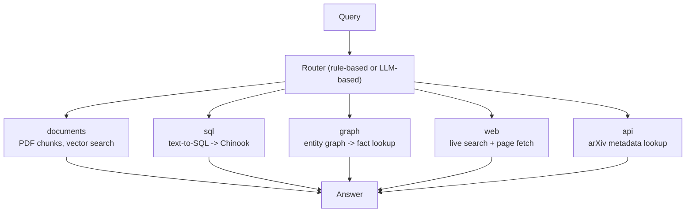
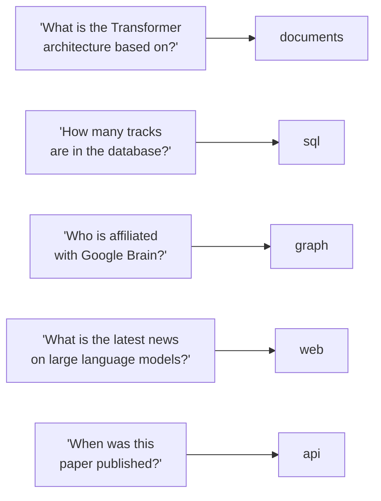
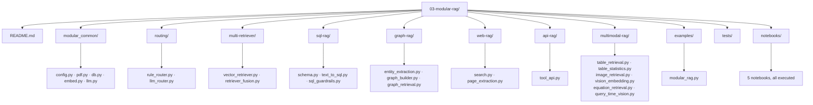

# Level 3 — Modular RAG

> **Status:** ✅ implemented and executed end-to-end — a real PDF, a real SQL database, a real knowledge graph extracted by an LLM, real live web search, and a real external API, all routed to from one entry point.

[← Previous level: Advanced RAG](../02-advanced-rag/README.md) · [Back to roadmap](../README.md) · [Next level: Adaptive RAG →](../04-adaptive-rag/README.md)

---

## Objective

Learn that **not every question should go to the same retriever.** Route each question to whichever backend can actually answer it — a document, a database, a graph, the live web, or an external API — instead of forcing everything through one vector index.

---

## Data sources — deliberately different domains

A real modular system pulls from genuinely different systems depending on the question. This level does too:

| Backend | Real data | Why this one |
|---|---|---|
| **documents** | [*Attention Is All You Need*](https://arxiv.org/pdf/1706.03762) (arXiv, PDF) — Google explicitly grants reproduction of its tables/figures "for use in journalistic or scholarly works" | Open access, has real multi-page prose, real tables, real figures |
| **sql** | [Chinook](https://github.com/lerocha/chinook-database) sample database (MIT-licensed) — 11 tables, 3,503 tracks, 275 artists, 59 customers | A genuinely different, structured domain — the point of routing |
| **graph** | Entities/relations extracted *from the same PDF* by a local LLM | Same source, different retrieval shape — ties the level together |
| **web** | Live DuckDuckGo search + real page fetch, via `ddgs` | The one backend that can answer anything *after* the PDF's 2017 publication date |
| **api** | [arXiv's public API](https://arxiv.org/help/api) — no key required | Structured metadata lookup instead of free-text search |

Nothing is bundled: the PDF and the Chinook database are downloaded on first use (`modular_common/pdf.py`, `modular_common/db.py`) and cached under `data/` (gitignored).

---

## Architecture



### Routing examples (real, from this level's own test suite)



---

## Stack

| Purpose | Tool |
|---|---|
| Everything from Levels 1-2 | Ollama (embeddings + generation) |
| PDF text | `pypdf` (already a core dependency — reliably clean text, see [Multimodal RAG](#multimodal-rag-a-real-pdf-parsing-lesson) below) |
| PDF images | `pymupdf` |
| SQL | Python's built-in `sqlite3` |
| Graph | `networkx` |
| Web search | `ddgs` (no API key) |
| Page extraction | `requests` + `beautifulsoup4` |
| API lookup | `requests` + stdlib `xml.etree.ElementTree` |
| Vision-based image retrieval | Ollama vision model (`moondream` by default) — see [Vision-based image retrieval](#vision-based-image-retrieval-a-real-taxonomy-review-addition) below; not required for anything else in this level |

---

## Folder Structure



> **Naming note:** `multi-retriever/`, `sql-rag/`, `graph-rag/`, `web-rag/`, `api-rag/`, and `multimodal-rag/` use hyphens (per the original plan) and can't be dotted-imported. Files there add their own directory to `sys.path` and import siblings as plain top-level modules — same convention as Level 2.
>
> **Package name note:** this level's shared helpers live in **`modular_common/`**, not `common/` — Level 2 already has a `common/` package, and when both levels are on `sys.path` in the same process (as they are during a full-repo `pytest` run), Python caches modules by name globally, so two different `common` packages collide and the wrong one wins. This was a real bug caught by actually running the combined test suite — see [Common Failure Modes](#common-failure-modes).

---

## Setup

```bash
# from the repo root
uv sync   # rank-bm25, pdfplumber, pymupdf, beautifulsoup4, requests, networkx, ddgs are all core deps
ollama serve
ollama pull nomic-embed-text
ollama pull llama3.2
ollama pull moondream   # only needed for multimodal-rag/vision_embedding.py, see below
```

No extras needed — unlike Level 2, nothing here requires `torch`/`sentence-transformers`.

---

## Running it

```bash
cd 03-modular-rag
uv run python examples/modular_rag.py "How many tracks are in the database?"
uv run python examples/modular_rag.py "What is the Transformer architecture based on?"
uv run python examples/modular_rag.py "Who is affiliated with Google Brain?"
uv run python examples/modular_rag.py "What is the latest news on large language models?"
uv run python examples/modular_rag.py "When was the Attention Is All You Need paper published?"
```

First run downloads the PDF (~2.2MB) and the Chinook database (~1MB); embeddings are cached under `data/cache/` the same way as Levels 1-2.

**Notebooks:**
```bash
uv run --with jupyter jupyter lab notebooks/
```

---

## Notebooks

All 5 are executed with real output.

| Notebook | Covers |
|---|---|
| [`01_query_routing.ipynb`](notebooks/01_query_routing.ipynb) | Rule vs. LLM routing — including a real case where the LLM router was wrong and the rule router was right |
| [`02_sql_rag.ipynb`](notebooks/02_sql_rag.ipynb) | Text-to-SQL against the real Chinook DB, guardrails blocking real dangerous queries |
| [`03_graph_rag.ipynb`](notebooks/03_graph_rag.ipynb) | Real entity/relation extraction from the PDF, graph queries, and a real duplicate-entity limitation |
| [`04_web_rag.ipynb`](notebooks/04_web_rag.ipynb) | Live web search + page extraction, contrasted with structured API lookup |
| [`05_multimodal_rag.ipynb`](notebooks/05_multimodal_rag.ipynb) | Real table and image retrieval — including displaying the actual extracted figure inline |

---

## Multimodal RAG — a real PDF-parsing lesson

`pdfplumber`'s structured cell parser badly mangles this paper's tables (merged cells, no visible rules — a genuinely common real-world problem, confirmed by testing three different extraction strategies, all garbled). The fix that actually works: every real table/figure in an academic paper has a `"Table N:"` / `"Figure N:"` caption, and `pypdf`'s plain text extraction — already used for chunking — renders those cleanly. `multimodal-rag/table_retrieval.py` and `image_retrieval.py` both key off that caption instead of fighting the cell parser.

This also means image retrieval here is **caption-based, not visual**: an uncaptioned image, or one whose caption shares no vocabulary with the query, won't be found. A production system would embed image pixels directly with a vision-language model (CLIP or similar) — a deliberate, disclosed scope boundary, not a hidden gap.

Real result: querying `"the overall model architecture diagram"` correctly retrieves the genuine Figure 1 — the Transformer's encoder-decoder diagram, extracted straight from the PDF's embedded image stream (see [`05_multimodal_rag.ipynb`](notebooks/05_multimodal_rag.ipynb)).

---

## Vision-based image retrieval — a real taxonomy-review addition

A later pass through this repo checked a long list of named RAG techniques against the actual
code (see [`../RAG_TAXONOMY_COVERAGE.md`](../RAG_TAXONOMY_COVERAGE.md)) and flagged the exact
limitation named above as a real gap worth fixing here, in the level that already disclosed it:
`multimodal-rag/vision_embedding.py` makes an **uncaptioned** image findable, using its actual
visual content instead of nearby caption text.

**How it works, in plain terms**: a vision-language model (one that can look at a picture and
describe it in words) looks at the image and writes two or three sentences about what is actually
in it. That description is then embedded with the exact same text embedder every other retriever
in this level already uses, and indexed the normal way. An image that has a real caption gets both
the caption and the description combined; an image with no caption is indexed by its description
alone — which is the entire point, since that is precisely the case `image_retrieval.py` cannot
handle at all.

**A disclosed approximation, stated plainly, twice**: a real CLIP-style system embeds an image's
pixels directly into the same vector space as text, with no text step in between. Ollama's
embeddings endpoint takes text only — there is no local pixel-level embedding model available
through it, only a vision-*language* model that can describe an image in words. This module
chains two real, separate model calls (describe, then embed) instead of one true visual embedding
call — a genuine two-step approximation, not visual embedding itself.

**A real, honest limitation of this environment specifically**: a vision model (`moondream`, 1.7GB)
was pulled specifically to build and test this addition. This machine's running Ollama server
could not load it — confirmed three separate ways (a direct HTTP call, the same `ollama` Python
client every other module in this repo uses, and the `ollama list`/`ollama pull` command-line
tool, which itself disagreed with the running server about which models exist at all). The
model's files are genuinely present on disk with correct manifests and matching checksums; the
running server's own log claims to have loaded four local models into its cache at startup, yet
neither `moondream` nor two completely unrelated already-installed models could actually be run
through it. This looks like a version-specific bug in this particular Ollama installation, not
anything this repository's code did wrong — and it is disclosed here rather than hidden, the same
standard applied to `07-production-rag/inference/vllm_client.py`'s "no GPU available" note.
Every function in `vision_embedding.py` is fully covered by offline tests against a fake vision
client (including a test proving the *exact* improvement this module exists for: an image with no
caption becomes findable by its content, which it never previously was — see
`tests/test_vision_embedding.py`), and is written to Ollama's real, documented vision-generation
API contract — but has never actually produced a real description from a real image in this
environment.

---

## Three additions from the RAG-Anything gap review

A later pass reviewing [HKUDS/RAG-Anything](https://github.com/HKUDS/RAG-Anything) (see
[`../missing_to_complite.md`](../missing_to_complite.md)) found three real, closeable gaps in this
level's multimodal handling — all three verified against the real, running PDF, not written and
assumed to work.

### Equations — `multimodal-rag/equation_retrieval.py`

Confirmed by grepping the whole repo before this module existed: zero matches anywhere for `latex`
or `equation`. **This PDF has no `"Equation N:"` captions at all** — verified directly by searching
the real extracted text for the word "Equation": nothing. What it does have is its own real
numbering convention: a bare `(N)` at the end of the equation's own line. A naive `\(\d+\)` regex
also matches Big-O complexity-table entries and citation volume/issue numbers — verified directly
against the real text, 7 false positives against only 3 real equations. Two cheap, real signals
(the number is immediately followed by a newline, and the ~200 characters before it contain a real
`"="`) correctly separated all 3 real equations from all 7 false positives. Real output against the
actual PDF:

```
equation-1 (page 4): Attention(Q,K,V) = softmax(QK^T/√dk)V — concepts: square root, softmax normalization, maximum function
equation-2 (page 5): FFN(x) = max(0, xW1+b1)W2+b2 — concepts: maximum function
equation-3 (page 7): lrate = d^-0.5 · min(step_num^-0.5, ...) — concepts: (none recognized)
```

### Table statistics — `multimodal-rag/table_statistics.py`

An honest, modest version of "statistical pattern recognition on tabular data" — real decimal-number
extraction over the same caption-plus-text-window `table_retrieval.py` already produces (not the
structured cell-level analysis a properly parsed table would allow; this repo's own `pdfplumber`
limitation, already disclosed, still applies). Requiring an actual decimal point is what separates
real BLEU/metric scores from citation brackets (`[18]`) and this paper's own mangled scientific
notation (`10^20` flattened into a bare `1020`) — verified against the real table-2 text. Real
output against the actual PDF's 4 real tables:

```
table-1: no numbers found (this table's window is mostly Big-O notation, no decimals)
table-2: count=17, min=1.0, max=40.56, mean=19.24  (real BLEU/FLOPs scores)
table-3: count=8,  min=0.1, max=25.8,  mean=11.45
table-4: count=6,  min=88.3, max=91.7, mean=90.57  (real F1 scores)
```

### Query-time visual re-analysis — `multimodal-rag/query_time_vision.py`

`vision_embedding.py` only ever describes an image **once, at ingestion time**, with one fixed
prompt — whatever that description happened to mention is all any future query can ever see. This
module re-analyzes a retrieved image **at query time**, with a prompt built from the actual
question — the same image asked "what architecture is shown?" versus "how many attention heads are
there?" gets two different, targeted analyses instead of one fixed description neither question
tailored itself to. This is the same real, disclosed environment limitation as `vision_embedding.py`
(this machine's Ollama installation cannot load the pulled vision model) — fully covered by offline
tests against a fake vision client, written to the real API contract, never exercised against a
real image in this environment.

24 new offline tests cover all three modules (10 for equations, 8 for table statistics, 5 for
query-time vision, plus 6 for Level 1's Office-format ingestion below, if counting across levels).

---

## Evaluation — what actually happened

This level doesn't have one Recall@K table the way Level 2 does — "correctness" here means *did the router pick the right backend, and did that backend answer accurately*. Both were checked for real:

- **Routing:** 6 test questions, rule router got all 6 right; LLM router got 4/6 right, misclassifying two clearly document-shaped questions as `sql` and `api`. See [`01_query_routing.ipynb`](notebooks/01_query_routing.ipynb).
- **SQL:** every generated query for 4 real questions executed correctly (3,503 total tracks; Rock/Latin/Metal top genres; Iron Maiden has the most albums; 59 customers) — all independently verifiable against the Chinook DB directly.
- **Graph:** 28 real triples extracted from the paper's intro, correctly answering "who is affiliated with Google Brain?" and "what does the Transformer achieve?" — with a real, visible limitation (see below).
- **Web/API:** live search returned genuinely relevant pages; the arXiv API call returned the exact correct paper metadata.

---

## Common Failure Modes

- **A same-named shared package across levels can silently collide.** Level 2 and this level both wanted a `common/` package; when both are on `sys.path` in one process, Python's module cache resolves the name to whichever was imported *first*, regardless of `sys.path` order — a real bug this level hit and fixed by renaming to `modular_common/`.
- **LLM routers can misclassify confidently.** Measured here: 2 of 6 test questions.
- **Naive entity extraction doesn't resolve coreference.** "Jakob" and "Jakob Uszkoreit" ended up as two separate graph nodes — a query using one name won't find facts attached to the other.
- **Caption-based image/table retrieval fails on uncaptioned content** or captions that don't share vocabulary with the query — see [Multimodal RAG](#multimodal-rag-a-real-pdf-parsing-lesson).
- **Live web search is noisy** — a broad query can return irrelevant pages the generator has to (or fails to) filter out on its own.
- **SQL guardrails must run before execution, not after** — validate, then run, never the reverse.
- **A test double's return type is not automatically the real thing's return type.** `modular_common/embed.py`'s `embed_texts()` handed back whatever `embedder.embed_many()` returned, unconverted — the real `OllamaEmbedder` always returns a numpy array, but a fake embedder (used throughout this level's offline tests) reasonably returns a plain list, and nothing downstream checked. `VectorRetriever.search()` then failed the moment it touched `.shape` on that list. Every earlier test happened to only exercise the cache-hit path (`np.load` already returns a real array) — caught only when `tests/test_vision_embedding.py` became the first test to run a fresh, uncached embedding end-to-end through a fake embedder. Fixed with one `np.asarray()` call, defensively, rather than trusting every embedder implementation to agree on a return type.
- **A locally-installed model being visible on disk does not mean the running server can use it.** `moondream`'s files, manifest, and checksums were all genuinely present and correct; the server still could not load it, and no error in its own log explained why — see [Vision-based image retrieval](#vision-based-image-retrieval-a-real-taxonomy-review-addition) above. Worth checking with an actual model call, not just a successful `ollama pull`, before trusting a new local model is really usable.

---

## Tests

```bash
uv run pytest 03-modular-rag/tests -v   # or `make test` from the repo root for all 3 levels
```

79 tests (56 after the vision-retrieval addition, 49 before it), entirely offline: fake LLM/embedder/vision-client fixtures for anything model-dependent, `monkeypatch` for the one function that calls `requests.get` directly, and synthetic page text (no PDF download) for the caption-extraction, equation-extraction, and table-statistics logic. Three real bugs were caught by actually running this level end-to-end and are already fixed: a word-order assumption in the API routing regex ("paper published" vs. "published paper"), an unanchored regex root (`affiliat` never matching inside "affiliated"), and `embed_texts()` returning an unconverted list instead of a numpy array on a fresh (uncached) call — see [Common Failure Modes](#common-failure-modes).

The full repository's test suite was run before the RAG-Anything gap-review additions and again
after — **523 tests passing** across the whole repo (up from 484 right before this pass, which
also touched Levels 1, 7, and 9 — see [`../missing_to_complite.md`](../missing_to_complite.md)).

---

## What I Learned

- **A caption-based heuristic and a numbering-convention heuristic are not interchangeable, even
  when they look similar on paper.** `table_retrieval.py`'s `"Table N:"` caption search and
  `equation_retrieval.py`'s trailing `"(N)"` search both find "the Nth labeled thing," but building
  the second one required checking the real PDF first — this paper genuinely has no `"Equation N:"`
  captions at all, a fact no amount of reasoning from the table module's own success would have
  revealed.
- **A naive numbering regex needs a second signal, and the right second signal is domain-specific.**
  `\(\d+\)` alone matched 7 false positives (a complexity table's Big-O notation, citation
  volume/issue numbers) against 3 real equations. The fix (line-ending position + a nearby `"="`)
  isn't a generic regex trick — it's specific to how *this* paper's real, mangled text extraction
  happens to lay equations out, verified against the actual text rather than assumed to generalize.
- **"Statistical pattern recognition" can be honestly scoped down without becoming worthless.**
  `table_statistics.py` doesn't do real cell-level table analysis (this repo's own disclosed
  `pdfplumber` limitation still applies) — it does real decimal-number extraction over a caption's
  text window, which is enough to report genuine min/max/mean BLEU and F1 scores from the actual
  paper. A modest, honest version of a technique is still worth building.

---

## Checklist

- [x] Implement rule-based and LLM-based routing
- [x] Implement multi-retriever fusion (RRF across named collections)
- [x] Implement SQL RAG with guardrails against a real database
- [x] Implement graph RAG (extraction, build, retrieval) from a real PDF
- [x] Implement web RAG with live search
- [x] Implement API RAG against a real external service
- [x] Implement multimodal retrieval (real tables + real images)
- [x] Work through and execute all 5 notebooks
- [x] Offline test suite (79 tests; see below)
- [x] Build the mini project (`examples/modular_rag.py` — an enterprise assistant over your own docs + SQL + APIs + graph)
- [x] Update **What I Learned** above
- [ ] Commit results

**One addition from a later taxonomy review** (see [`../RAG_TAXONOMY_COVERAGE.md`](../RAG_TAXONOMY_COVERAGE.md)) — implemented and tested; see [Vision-based image retrieval](#vision-based-image-retrieval-a-real-taxonomy-review-addition) for the full walkthrough and its one real, disclosed limitation:
- [x] Vision-language image retrieval (`multimodal-rag/vision_embedding.py`) — describes an image's real visual content and embeds that description, making an uncaptioned image findable for the first time; never exercised against a real model in this environment (see above), fully covered by offline tests against a fake vision client
- [x] Offline test suite grew from 49 to 56 tests for this level; full repository suite re-run before (303 passing) and after (310 passing) this work

**Three additions from the RAG-Anything gap review** (see [`../missing_to_complite.md`](../missing_to_complite.md)) — implemented and tested; see [Three additions from the RAG-Anything gap review](#three-additions-from-the-rag-anything-gap-review) for the full walkthrough:
- [x] Equation-aware retrieval (`multimodal-rag/equation_retrieval.py`) — verified against the real PDF's 3 real equations, correctly rejecting 7 false-positive matches
- [x] Table statistics (`multimodal-rag/table_statistics.py`) — real min/max/mean over the real BLEU/F1 scores in this paper's own tables
- [x] Query-time visual re-analysis (`multimodal-rag/query_time_vision.py`) — same disclosed environment limitation as vision_embedding.py, fully covered by offline tests
- [x] Offline test suite grew from 56 to 79 tests for this level

---

## Next Level

Once you can explain why **vector search is not the correct solution for every data source** — move to [Level 4 — Adaptive RAG](../04-adaptive-rag/README.md).
