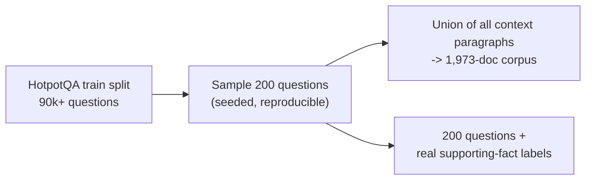
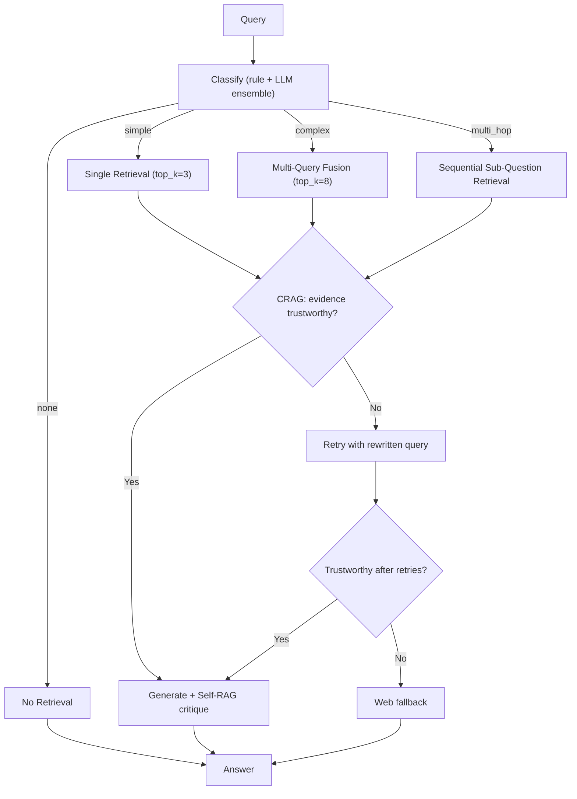
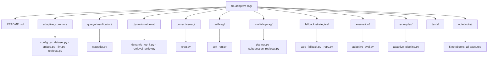

# Level 4 — Adaptive RAG

> **Status:** ✅ implemented and executed end-to-end — a real multi-hop QA benchmark, real classifier accuracy numbers, and a real bug fix (caught by actually running the eval, not assuming) that changed the headline result.

[← Previous level: Modular RAG](../03-modular-rag/README.md) · [Back to roadmap](../README.md) · [Next level: Agentic RAG →](../05-agentic-rag/README.md)

---

## Objective

Make retrieval dynamic instead of always following a fixed pipeline. Let the system decide how much retrieval effort a question needs, judge its own evidence before trusting it, and prove — with real numbers — whether that extra sophistication is actually worth it.

---

## Dataset

Level 4 uses **[HotpotQA](https://huggingface.co/datasets/hotpotqa/hotpot_qa)** — a different open dataset and domain from every prior level (not `rag-mini-wikipedia`, not `BeIR/scifact`, not the arXiv PDF). It's a genuine multi-hop QA benchmark: every question ships **real ground truth** — the exact Wikipedia paragraph titles required to answer it (`supporting_facts`), plus a `type` (`bridge` = needs sequential reasoning, `comparison` = needs two facts at once) and a `level` (`easy`/`medium`/`hard`).



Every real HotpotQA question is inherently 2-document by construction — there is no genuinely single-hop question in the dataset. That's why this level's `"none"` (conversational) and `"simple"` (single-paragraph factual) examples are hand-authored against the sampled corpus, not pulled from HotpotQA — see `query-classification/classifier.py`'s docstring.

---

## Architecture



---

## Stack

Everything from Levels 1-3 (Ollama for embeddings + generation), plus `ddgs` for the web fallback (same as Level 3, reimplemented here to keep the level self-contained). No new dependencies.

---

## Folder Structure



> **Package name note:** this level's shared helpers are `adaptive_common/` — a unique name per level, following the lesson learned in [Level 3](../03-modular-rag/README.md#folder-structure) after two same-named `common/` packages collided when both were on `sys.path` in one process.

---

## Setup

```bash
uv sync
ollama serve
ollama pull nomic-embed-text
ollama pull llama3.2
```

## Running it

```bash
cd 04-adaptive-rag
uv run python examples/adaptive_pipeline.py "hi there!"
uv run python examples/adaptive_pipeline.py "Where is Russell Hobbs based?"
uv run python examples/adaptive_pipeline.py "Peter Hobbs founded the company that is based in what town in Manchester?"
```

First run downloads HotpotQA and embeds the ~2,000-paragraph corpus (~2 min); cached under `data/cache/` after that, same as every prior level.

**Notebooks:**
```bash
uv run --with jupyter jupyter lab notebooks/
```

---

## Notebooks

| Notebook | Covers |
|---|---|
| [`01_query_classification.ipynb`](notebooks/01_query_classification.ipynb) | Rule vs. LLM vs. ensemble classification, measured against real HotpotQA labels |
| [`02_dynamic_retrieval.ipynb`](notebooks/02_dynamic_retrieval.ipynb) | Top-K and strategy actually changing per question, live |
| [`03_corrective_rag.ipynb`](notebooks/03_corrective_rag.ipynb) | CRAG grading — including a real bug that made it look artificially perfect, found and fixed |
| [`04_self_rag.ipynb`](notebooks/04_self_rag.ipynb) | Self-critique triggering an unnecessary retry on a correct answer |
| [`05_multi_hop_rag.ipynb`](notebooks/05_multi_hop_rag.ipynb) | The headline finding: multi-hop decomposition *lost* to plain retrieval here |

---

## Evaluation — what actually happened

### Query classification (measured against real HotpotQA `type` labels, 15 questions/type)

| Classifier | bridge → `multi_hop` | comparison → `complex` |
|---|---|---|
| rule-based | 6/15 | 12/15 |
| LLM (few-shot) | 2-3/15 | 15/15 |
| **ensemble** | **6/15** | **14-15/15** |

The zero-shot LLM prompt scored **0/15** on comparison questions before few-shot examples were added — it defaulted to `simple` almost every time. The ensemble (trust the rule classifier's `none`/`multi_hop` calls, defer to the LLM otherwise) matched or came close to each approach's own ceiling on both categories — a measured reason to combine them, not a guess.

### Multi-hop retrieval vs. plain single-shot retrieval (30 real bridge questions, 60 gold documents)

| Method | Gold-doc recall |
|---|---|
| Plain single retrieval | **0.90** |
| Multi-hop decomposition | 0.77-0.80 |

**Plain retrieval won.** Decomposing a bridge question risks compounding an early-hop error, and a full bridge question embedded whole often already encodes both entities better than either half does alone — especially on a corpus this size (~2,000 paragraphs), where multi-hop's real advantage (finding a needle in a much bigger haystack) doesn't get to show up. See [`05_multi_hop_rag.ipynb`](notebooks/05_multi_hop_rag.ipynb) for the full discussion.

### Corrective RAG (CRAG) agreement with real gold-evidence presence (20 questions)

| Trustworthy criterion | Agreement |
|---|---|
| ≥50% of Top-K graded relevant (ratio) | 0/20 |
| **≥1 of Top-K graded relevant** | **17/20** |

A ratio-based threshold is miscalibrated for multi-fact questions: a question needing 2 specific documents out of a Top-5 always has 3 unavoidable distractors graded irrelevant, capping precision at 40% even when retrieval succeeds completely. `corrective-rag/crag.py` now defaults to the recall-oriented check.

---

## Corrective RAG — a bug that hid behind a *good-looking* result

`grade_passage()` originally checked `"relevant" in response` before `"irrelevant" in response`. Since `"relevant"` is a literal substring of `"irrelevant"`, every `"irrelevant"` verdict was silently read as `"relevant"` — CRAG's confidence was always artificially high (agreement looked like 1.0/20 in early manual testing), which *felt* like success. Actually running the aggregate evaluation (not just a couple of hand-picked examples) is what surfaced it: fixed with word-boundary regex matching, and the honest, lower numbers above are what's real. A takeaway worth keeping: a suspiciously perfect result from a grading/scoring function deserves the same scrutiny as a bad one.

---

## Common Failure Modes

- **A substring-containment check on natural-language labels is fragile both ways** — `"relevant"` inside `"irrelevant"` here, `"affiliat"` failing to match `"affiliated"` in Level 3. Prefer word-boundary regex or exact-token matching for LLM-output parsing.
- **A confidence metric must match the shape of the question.** Ratio/majority thresholds work for single-fact evidence; multi-fact questions need a recall-oriented check instead.
- **Few-shot examples reshape the whole decision boundary**, not just the category you added an example for — verify every category again after adding examples to fix one.
- **Self-critique has its own error rate.** Self-RAG's critique step marked a correct, grounded answer "ungrounded" in this level's own testing — see [`04_self_rag.ipynb`](notebooks/04_self_rag.ipynb).
- **A more sophisticated technique can lose to a simpler one on a given corpus size** — multi-hop decomposition underperformed plain retrieval here; the fix isn't to trust the more elaborate pipeline by default, it's to measure both.

---

## Tests

```bash
uv run pytest 04-adaptive-rag/tests -v   # or `make test` from the repo root for all 4 levels
```

31 tests, entirely offline (fake LLM/embedder fixtures, no network or Ollama required). Two real, load-bearing bugs were caught by actually running this level's code against real data rather than assuming it worked: the `"relevant"`/`"irrelevant"` substring bug above, and an LLM classifier that never recognized its own `multi_hop` label because the model reliably answered `"multi-hop"` (hyphen) instead of `"multi_hop"` (underscore).

---

## What I Learned

*(fill in after working through this level yourself)*

---

## Checklist

- [x] Implement query complexity classification (rule, LLM, ensemble)
- [x] Implement dynamic Top-K / retrieval policy
- [x] Implement Corrective RAG (CRAG)
- [x] Implement Self-RAG
- [x] Implement multi-hop planner + sub-question retrieval
- [x] Implement fallback strategies (retry, web fallback)
- [x] Work through and execute all 5 notebooks
- [x] Run real evaluation and record real (including surprising) results
- [x] Offline test suite (31 tests)
- [ ] Build the mini project (a RAG system that automatically selects its retrieval strategy on your own data)
- [ ] Update **What I Learned** above
- [ ] Commit results

---

## Next Level

Once you can explain why **more retrieval — or more decomposition — is not always better**, and you've seen a "clean" result get corrected by actually measuring it, move to [Level 5 — Agentic RAG](../05-agentic-rag/README.md).
