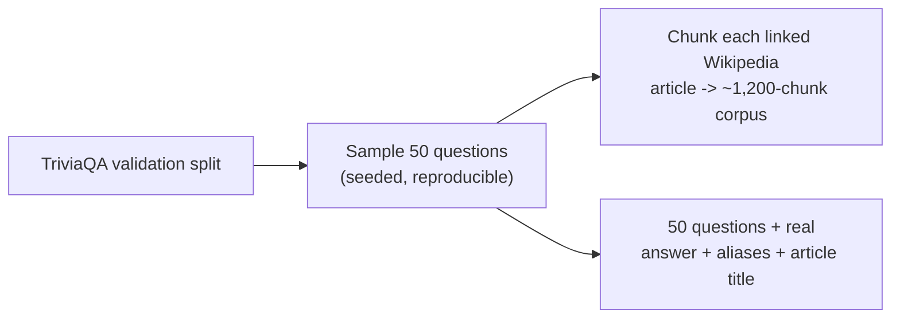
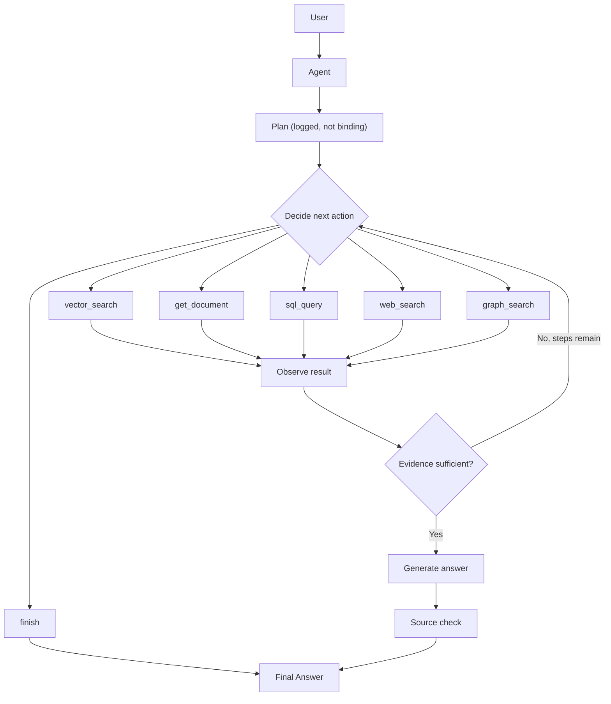
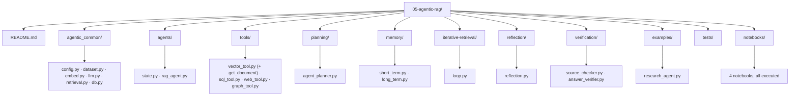

# Level 5 — Agentic RAG

> **Status:** ✅ implemented and executed end-to-end — a real hand-rolled ReAct agent choosing among 5 real tools over real, open data, with correctness checked against real ground-truth answers.

[← Previous level: Adaptive RAG](../04-adaptive-rag/README.md) · [Back to roadmap](../README.md) · [Next level: Multi-Agent RAG →](../06-multi-agent-rag/README.md)

---

## Objective

Move from fixed workflows to an agent that can plan, retrieve, inspect evidence, and retry — choosing *which* tool to use and *when* to stop, instead of following a pipeline someone else already decided on.

---

## Data — yet another fresh open source

| Backend | Real data |
|---|---|
| documents (vector + get_document) | **[TriviaQA](https://huggingface.co/datasets/mandarjoshi/trivia_qa)** — real trivia questions, each with a full linked Wikipedia article and **real accepted-answer aliases** |
| sql | **[Northwind](https://github.com/jpwhite3/northwind-SQLite3)** — a different open sample database (orders/products/suppliers) from Level 3's Chinook (music) |
| graph | Entities/relations LLM-extracted from the same TriviaQA articles |
| web | Live DuckDuckGo search (`ddgs`), same mechanism as Levels 3-4 |

TriviaQA's answer aliases are what make this level's headline capability possible: **`verification/answer_verifier.py` checks a generated answer against the real accepted answer**, not a proxy like "did we retrieve the right document" (every prior level's evaluation approach).



---

## Architecture



This is a **hand-rolled ReAct loop** (`agents/rag_agent.py`), not LangGraph — consistent with every prior level's "understand the mechanism before adopting a framework" approach. It uses a line-based `ACTION: / INPUT:` output format instead of JSON, because local models follow it far more reliably (no JSON-escaping failures to parse around).

---

## Stack

Everything from Levels 1-4 (Ollama, `networkx`, `ddgs`) — no new dependencies.

---

## Folder Structure



> **Naming conventions carried forward from Levels 3-4:** shared helpers live in `agentic_common/` (not `common/`), and `planning/agent_planner.py` is named to avoid colliding with Level 4's `multi-hop-rag/planner.py` — both are separately-imported top-level modules that would otherwise fight over the same `sys.modules` cache slot in a combined test run. See [Level 3's README](../03-modular-rag/README.md#folder-structure) for the original discovery.

---

## Setup

```bash
uv sync
ollama serve
ollama pull nomic-embed-text
ollama pull llama3.2
```

## Running it

```bash
cd 05-agentic-rag
uv run python examples/research_agent.py "A sophomore is a student in which year of a US college?"
uv run python examples/research_agent.py "How many products are in the Northwind database?"
```

First run downloads TriviaQA + Northwind and embeds the ~1,200-chunk corpus (~90s); cached under `data/cache/` after that.

**Notebooks:**
```bash
uv run --with jupyter jupyter lab notebooks/
```

---

## Notebooks

| Notebook | Covers |
|---|---|
| [`01_tool_calling_basics.ipynb`](notebooks/01_tool_calling_basics.ipynb) | Each of the 5 tools called directly, no agent yet |
| [`02_agent_planning.ipynb`](notebooks/02_agent_planning.ipynb) | Planned steps vs. what the agent actually did |
| [`03_iterative_retrieval_loop.ipynb`](notebooks/03_iterative_retrieval_loop.ipynb) | Retrieve → judge → rephrase → retry |
| [`04_reflection_and_verification.ipynb`](notebooks/04_reflection_and_verification.ipynb) | 8 real questions checked against real ground truth — 6/8 correct |

---

## Evaluation — what actually happened

On 8 real TriviaQA questions, run through the full agent and checked against real accepted answers:

**6/8 (75%) matched ground truth.** More useful than the raw score: source-checking and ground-truth correctness disagreed in *both* directions on the same run —

| Case | Source-checked | Actually correct |
|---|---|---|
| Oliver Twist / steam-engines questions | ❌ not verified | ✅ correct |
| "Melanie Molitor is the mom of which tennis world No. 1?" | ✅ verified | ❌ wrong |

A correct answer was nearly flagged as unsupported, and a wrong answer was rated as well-supported by its (incomplete) evidence. **Source checking asks "is this answer consistent with what was retrieved?"; only ground-truth verification asks "is this actually right?"** — and outside of evaluation against a labeled dataset like this one, only the first question is answerable at all. See [`04_reflection_and_verification.ipynb`](notebooks/04_reflection_and_verification.ipynb).

A second, separate finding from manual testing: the iterative-retrieval sufficiency judgment (also an LLM call) rated a complete, correct one-line SQL answer as "insufficient," causing the agent to waste two steps on hallucinated tool names before its max-steps fallback recovered the right answer anyway. See [`03_iterative_retrieval_loop.ipynb`](notebooks/03_iterative_retrieval_loop.ipynb).

---

## Common Failure Modes

- **A judge LLM has its own error rate**, whether it's grading evidence relevance (Level 4's CRAG), grounding (Self-RAG), sufficiency, or source support (here) — never treat a judge call as ground truth.
- **Source-checking and correctness are different questions.** An answer can be internally consistent with its evidence and still wrong if the evidence was incomplete; only labeled ground truth catches that.
- **A hallucinated tool name shouldn't crash the loop** — `agents/rag_agent.py` records it as an `invalid_action` and moves on, same discipline as recording (not crashing on) a real tool exception.
- **Same-named top-level modules across levels collide in a combined test run** — this level's `planning/agent_planner.py` is named specifically to avoid fighting Level 4's `multi-hop-rag/planner.py` for the same `sys.modules` slot.
- **A JSON-output contract is more fragile than a line-based one** for small local models — this level's decision format (`ACTION: / INPUT:`) was a deliberate choice, not an afterthought, after seeing repeated JSON-formatting issues in earlier levels' extraction prompts.

---

## Tests

```bash
uv run pytest 05-agentic-rag/tests -v   # or `make test` from the repo root for all 5 levels
```

32 tests, entirely offline (fake LLM/tool fixtures, no network or Ollama required) — including a full trace of the agent loop's exact call sequence (plan → decide → sufficiency → answer → source-check) with a scripted fake LLM, so the orchestration logic itself is verified, not just each piece in isolation.

---

## What I Learned

*(fill in after working through this level yourself)*

---

## Checklist

- [x] Implement all 5 tools (vector, get_document, sql, web, graph)
- [x] Implement agent state and the ReAct-style loop
- [x] Implement planning (logged, non-binding)
- [x] Implement short-term and long-term memory
- [x] Implement the iterative retrieval loop
- [x] Implement reflection and source-checking verification
- [x] Implement ground-truth answer verification
- [x] Work through and execute all 4 notebooks
- [x] Run real evaluation against real ground truth (6/8 correct)
- [x] Offline test suite (32 tests)
- [ ] Build the mini project (an autonomous research assistant on your own tools/data)
- [ ] Update **What I Learned** above
- [ ] Commit results

---

## Next Level

Once the agent can recover from an unsuccessful retrieval rather than immediately hallucinating an answer — move to [Level 6 — Multi-Agent RAG](../06-multi-agent-rag/README.md), where one agent with several tools becomes several specialized agents coordinated by a supervisor.
