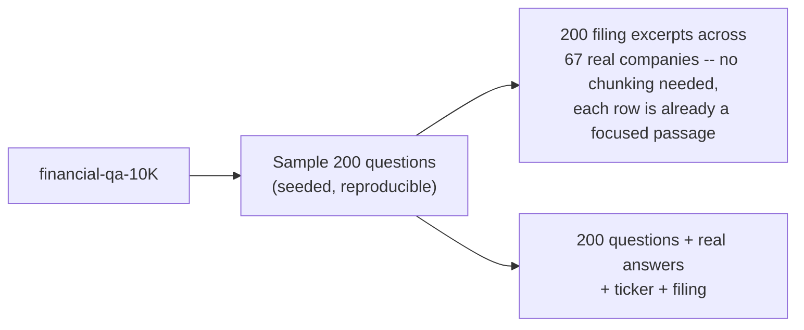
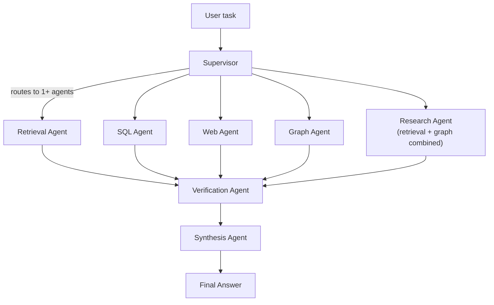
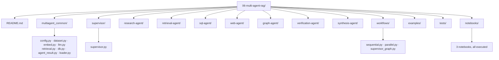

# Level 6 — Multi-Agent RAG

> **Status:** ✅ implemented and executed end-to-end — a real supervisor coordinating specialized agents over real business data, with a real (not assumed) parallel-vs-sequential speedup measurement.

[← Previous level: Agentic RAG](../05-agentic-rag/README.md) · [Back to roadmap](../README.md) · [Next level: Production RAG →](../07-production-rag/README.md)

---

## Objective

Split complex work across specialized agents, coordinated by a supervisor — one agent per data source, each narrow enough that its failures are easy to diagnose, combined by a synthesis step only after each finding is checked.

---

## Data — a third, business-research-flavored open source

| Backend | Real data |
|---|---|
| documents (retrieval + research agent) | **[financial-qa-10K](https://huggingface.co/datasets/virattt/financial-qa-10K)** — real questions over real SEC 10-K filing excerpts across 69 public companies (MSFT, AAPL, META, NFLX, ...) |
| sql | **[Sakila](https://github.com/bradleygrant/sakila-sqlite3)** — a DVD rental store database, a *third* distinct SQL domain in this repo after Chinook (music, Level 3) and Northwind (trade, Level 5) |
| graph | Entities/relations LLM-extracted from the same financial filing excerpts |
| web | Live DuckDuckGo search (`ddgs`), same mechanism as Levels 3, 5 |



---

## Architecture



Selected agents run **in parallel** (`asyncio.gather`, matching this repo's own plan document) by default, or **sequentially** with each agent's task augmented by the prior agent's actual finding — a real, measured trade-off, not an assumed one (see [Evaluation](#evaluation--what-actually-happened)).

---

## Stack

Everything from Levels 1-5 (Ollama, `networkx`, `ddgs`) — no new dependencies.

---

## Folder Structure



> **Every specialized agent's file is named `agent.py`** (`retrieval-agent/agent.py`, `sql-agent/agent.py`, ...) — matching the plan this repo follows, and a real problem: any agent that needs to import *another* agent's class (like `research-agent` needing both `retrieval-agent` and `graph-agent`) can't use the usual "insert the folder, `import agent`" trick every other hyphenated folder in this repo uses, because two `agent.py` files can't both occupy the `agent` slot in `sys.modules`. `multiagent_common/loader.py` fixes this once, generally, with `importlib.util.spec_from_file_location` — see its docstring and [`tests/test_loader.py`](tests/test_loader.py).

---

## Setup

```bash
uv sync
ollama serve
ollama pull nomic-embed-text
ollama pull llama3.2
```

## Running it

```bash
cd 06-multi-agent-rag
uv run python examples/company_research_system.py "How much were the company's debt obligations as of December 31, 2023?"
uv run python examples/company_research_system.py "How many films are in the Sakila database?"
```

First run downloads financial-qa-10K + Sakila and embeds the 200-doc corpus (~15s — no chunking needed, each row is already a focused passage); cached under `data/cache/` after that.

**Notebooks:**
```bash
uv run --with jupyter jupyter lab notebooks/
```

---

## Notebooks

| Notebook | Covers |
|---|---|
| [`01_supervisor_architecture.ipynb`](notebooks/01_supervisor_architecture.ipynb) | Routing real tasks to one *or more* agents at once |
| [`02_specialized_agents.ipynb`](notebooks/02_specialized_agents.ipynb) | Each agent's output on the same task, including a real empty-graph case handled gracefully |
| [`03_parallel_vs_sequential_workflows.ipynb`](notebooks/03_parallel_vs_sequential_workflows.ipynb) | A real 1.74x measured speedup, and a real compound-task failure |

---

## Evaluation — what actually happened

- **The Retrieval Agent got the exact real answer** ($2,299,887 thousand, matching the dataset's ground truth exactly) for a real filing question — see [`01_supervisor_architecture.ipynb`](notebooks/01_supervisor_architecture.ipynb) and [`02_specialized_agents.ipynb`](notebooks/02_specialized_agents.ipynb).
- **The knowledge graph came back empty (0 nodes) on one real run** — entity extraction found nothing usable in 8 sampled financial filing excerpts, likely because dense financial-statement text gives an LLM far less relational structure than the narrative text Levels 3 and 5 used. The Research Agent still produced a correct answer anyway, degrading gracefully to document evidence alone.
- **Parallel execution measured 1.74x faster than sequential** (9.48s → 5.45s for 3 agents) — a real number, not the naive "3 agents = 3x" a reader might assume; parallel wall-clock time is bounded by the slowest individual agent call.
- **The SQL Agent failed on a compound task** ("summarize debt *and* how many films are in the database") in both the parallel and sequential runs — broadcasting one raw task to every agent gave it nothing coherent to turn into a single query. A real limitation of this simple workflow, not a bug in the agent: a production supervisor should tailor each agent's sub-task rather than handing everyone the same original text.

See [`03_parallel_vs_sequential_workflows.ipynb`](notebooks/03_parallel_vs_sequential_workflows.ipynb) for the full numbers.

---

## Common Failure Modes

- **Identical filenames across sibling folders collide in `sys.modules`** the moment more than one gets imported into the same process — this level's own `agent.py`-everywhere convention is a real instance, fixed with `multiagent_common/loader.py`'s file-path-based loading.
- **`asyncio.run()` fails inside Jupyter** ("cannot be called from a running event loop") because the kernel already runs its own loop — a bug this level's own notebook execution caught that a bare-script smoke test did not; `workflows/parallel.py` now detects a running loop and falls back to a fresh thread.
- **Broadcasting one raw task to every agent breaks narrow specialists on compound requests** — see the SQL Agent failure above.
- **A verification-agent judgment is not ground truth** (same lesson as Levels 4-5) — a directly-grounded answer was marked "unsupported" during manual testing; the workflow still surfaces the raw result rather than discarding a plausibly-correct answer over one skeptical LLM call.
- **Parallel agents can't build on each other's findings** — only `workflows/sequential.py`'s `carry_context=True` gives a later agent visibility into an earlier one's actual output.

---

## Tests

```bash
uv run pytest 06-multi-agent-rag/tests -v   # or `make test` from the repo root for all 6 levels
```

23 tests, entirely offline (fake LLM/agent fixtures, no network or Ollama required) — including a real timing-based test proving `run_parallel` is genuinely concurrent (two 0.3s-sleeping fake agents complete in well under 0.6s), a dedicated regression test for the Jupyter event-loop bug, and a test proving the file-path loader can load two different `agent.py` files into the same process without collision.

---

## What I Learned

*(fill in after working through this level yourself)*

---

## Checklist

- [x] Implement the supervisor (multi-agent routing, not single-choice)
- [x] Implement all specialized agents (retrieval, sql, web, graph, research)
- [x] Implement verification and synthesis agents
- [x] Implement sequential and parallel workflows
- [x] Fix the `agent.py`-collision and Jupyter-event-loop bugs found by actually running this level
- [x] Work through and execute all 3 notebooks
- [x] Run real workflows and record real (including failing) results
- [x] Offline test suite (23 tests)
- [ ] Build the mini project (a multi-agent business research assistant on your own data)
- [ ] Update **What I Learned** above
- [ ] Commit results

---

## Next Level

Once you can explain **when multi-agent architecture is useful and when it creates unnecessary complexity** — move to [Level 7 — Production RAG](../07-production-rag/README.md).
