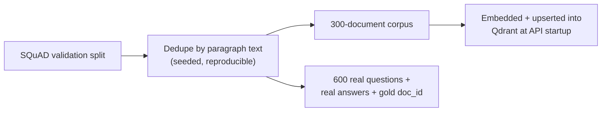
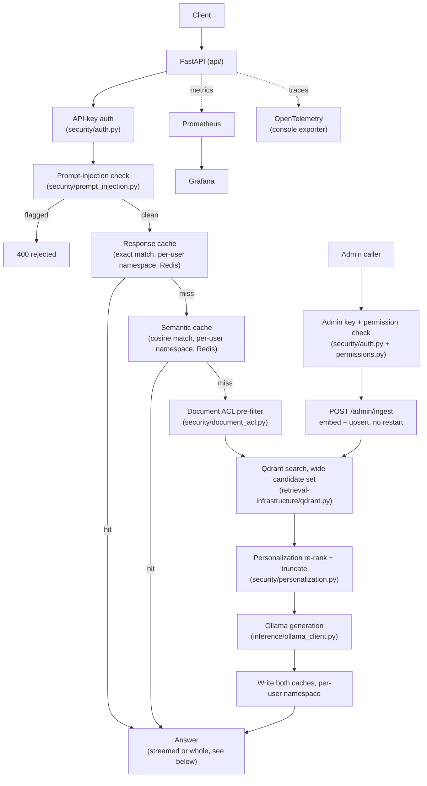

# Level 7 — Production RAG

> **Status:** ✅ implemented and executed end-to-end — a real FastAPI service in front of a real Qdrant + Postgres + Redis + Prometheus + Grafana stack, real auth/ACL/prompt-injection defenses, a real two-tier cache with a measured (not guessed) threshold, a real Locust load test against the live API, and a real evaluation run that caught both a code bug and a judge-reliability finding. Two pieces are explicitly disclosed as reference-only: `inference/vllm_client.py` (no GPU in this environment) and `kubernetes/*.yaml` (no cluster). Everything else on this page was actually run.

[← Previous level: Multi-Agent RAG](../06-multi-agent-rag/README.md) · [Back to roadmap](../README.md)

**📊 Real-metrics dashboard** — every number below, visualized from the actual measured data.

---

## Objective

Take a RAG pipeline out of a notebook and make it something you'd actually deploy: a real HTTP
API with auth and request validation, a durable vector store instead of in-memory arrays,
two-tier caching, document-level access control, prompt-injection defense, real observability
(metrics + tracing), and a hand-rolled Ragas-style evaluation + regression suite — then prove
each of those actually works by running it, not by reading the code and assuming it does.

---

## Data — a fourth fresh open source, used as a *served* corpus

| Backend | Real data |
|---|---|
| documents | **[SQuAD](https://huggingface.co/datasets/rajpurkar/squad)** (`rajpurkar/squad`, validation split) — real Wikipedia paragraphs + real question/answer pairs, deduplicated into a 300-document corpus |

Unlike every prior level, this corpus isn't just something to query in a script — it's what the
**running API process itself indexes into Qdrant at startup** and serves over HTTP for the rest
of this level's life.



---

## Architecture



The production-grade inference path (`inference/vllm_client.py`, GPU-served, OpenAI-compatible)
and the LiteLLM gateway config are written and contract-tested but never exercised against a real
server — see [Common Failure Modes](#common-failure-modes) and the module's own docstring.

Personalization, streaming, and live ingestion (highlighted above) were added in a later pass —
see [Three additions from the taxonomy review](#three-additions-from-the-taxonomy-review) below
for the full walkthrough.

---

## Stack

| Purpose | Tool | Real / reference-only |
|---|---|---|
| API | FastAPI + uvicorn | real, running |
| Vector DB | Qdrant | real, running in Docker |
| Relational + vector | Postgres + pgvector | real, running in Docker (cross-validated against Qdrant's own cosine scores) |
| Cache | Redis | real, running in Docker |
| Metrics | prometheus-client + Prometheus | real, actually scraped |
| Dashboards | Grafana | real, provisioned |
| Tracing | OpenTelemetry (console exporter) | real, wired into `api/main.py` |
| Local inference | Ollama (`llama3.2`, `nomic-embed-text`) | real, every call in this level |
| Production inference | vLLM/SGLang (OpenAI-compatible client) | **reference-only, no GPU here** |
| Gateway | LiteLLM config | **reference-only, never run as a live proxy** |
| Load testing | Locust | real, run against the live API |
| Containerization | Docker | real — both Dockerfiles built *and* run |
| Orchestration | Kubernetes manifests | **reference-only, no cluster here** |
| Personalization | `security/personalization.py` | real, ranks results differently per user, no new dependency |
| Streaming responses | FastAPI `StreamingResponse` + `OllamaLLM.stream_complete()` | real, token-by-token, measured live |
| Live ingestion | `POST /admin/ingest` | real, verified end-to-end with a document added after the server was already running |

---

## Folder Structure

```mermaid
flowchart TD
    ROOT["07-production-rag/"] --> README["README.md"]
    ROOT --> PC["production_common/"]
    ROOT --> API["api/"]
    ROOT --> INF["inference/"]
    ROOT --> RI["retrieval-infrastructure/"]
    ROOT --> OBS["observability/"]
    ROOT --> PE["production_eval/"]
    ROOT --> SEC["security/"]
    ROOT --> CACHE["caching/"]
    ROOT --> DEP["deployment/"]
    ROOT --> LT["load-testing/"]
    ROOT --> DOCK["docker/"]
    ROOT --> K8S["kubernetes/"]
    ROOT --> EX["examples/"]
    ROOT --> TESTS["tests/"]
    ROOT --> NB["notebooks/"]

    PC --> PC1["config.py · dataset.py · embed.py · llm.py"]
    API --> A1["main.py · routes.py · schemas.py"]
    INF --> I1["ollama_client.py · vllm_client.py · litellm_config.yaml"]
    RI --> RI1["qdrant.py · postgres.py · redis_store.py · reindex.py"]
    OBS --> O1["telemetry.py · prometheus.yml · grafana/"]
    PE --> PE1["ragas_eval.py · retrieval_eval.py · regression_suite.py"]
    SEC --> S1["auth.py · permissions.py · document_acl.py<br/>prompt_injection.py · personalization.py"]
    CACHE --> CA1["response_cache.py · semantic_cache.py"]
    DEP --> D1["docker-compose.yml"]
    LT --> L1["locustfile.py · scenarios.md"]
    DOCK --> DK1["api.Dockerfile · worker.Dockerfile"]
    K8S --> K1["api-deployment.yaml · qdrant.yaml · ingress.yaml"]
    EX --> EX1["production_app/client.py"]
    NB --> N1["4 notebooks, all executed"]
```



> **Package name note:** this level's own evaluation package is `production_eval/`, not
> `evaluation/` — [Level 2](../02-advanced-rag/README.md) already owns `evaluation/` as a real
> Python package (it has its own `__init__.py`). When every level's directory sits on `sys.path`
> at once (a full-repo `pytest` run), a regular package with `__init__.py` wins the
> `sys.modules` cache slot outright over a same-named package elsewhere, regardless of path order
> — a real collision this level hit by actually running the combined suite, same root cause as
> the `modular_common`/`common` lesson from [Level 3](../03-modular-rag/README.md#folder-structure),
> just against a different shared folder name this time. See `production_eval/__init__.py`'s
> docstring.
>
> **`retrieval-infrastructure/redis_store.py`** is named that, not `redis.py` — naming it
> `redis.py` made `import redis` from anywhere on that directory's `sys.path` resolve to itself
> circularly instead of the real PyPI package (`AttributeError: module 'redis' has no attribute
> 'Redis'`). Caught by actually testing it, not by inspection.
>
> **New in this pass:** `security/personalization.py` (ranking, not visibility, per user),
> `api/routes.py`'s `/query/stream` (real token streaming) and `POST /admin/ingest` (real
> live-updating ingestion, using `security/permissions.py`'s `"ingest"` action for the first time
> in running code, not just tests) — three techniques identified as missing from this level by
> [`../RAG_TAXONOMY_COVERAGE.md`](../RAG_TAXONOMY_COVERAGE.md), now implemented, tested, and run
> against the real, live stack. See
> [Three additions from the taxonomy review](#three-additions-from-the-taxonomy-review) below.

---

## Setup

```bash
# from the repo root
uv sync --extra production
ollama serve
ollama pull nomic-embed-text
ollama pull llama3.2
```

### Bring up the infrastructure stack

```bash
cd 07-production-rag
docker compose -f deployment/docker-compose.yml up -d
```

5 containers, on deliberately non-default ports (this machine already runs unrelated
Qdrant/Redis/Ollama instances — see [Common Failure Modes](#common-failure-modes)):

| Service | Container | Port(s) |
|---|---|---|
| Qdrant | `rag-l7-qdrant` | 16333 (REST), 16334 (gRPC) |
| Postgres + pgvector | `rag-l7-postgres` | 15432 |
| Redis | `rag-l7-redis` | 16379 |
| Prometheus | `rag-l7-prometheus` | 19090 |
| Grafana | `rag-l7-grafana` | 13000 (admin/admin) |

### Run the API

```bash
uv run --extra production uvicorn api.main:app --host 127.0.0.1 --port 8001
```

First startup downloads SQuAD, dedupes it into the 300-doc corpus, embeds it, and upserts into
Qdrant (~cached under `data/cache/` after that — same pattern as every prior level).

---

## Running it

```bash
# health check (no auth)
curl http://127.0.0.1:8001/health

# a real query (needs the API key)
curl -X POST http://127.0.0.1:8001/query \
  -H "x-api-key: dev-local-key" -H "Content-Type: application/json" \
  -d '{"question": "What studio does ABC own at 1500 Broadway in NYC?", "top_k": 3}'

# the full demo client (auth failure, cold query, cache hit, prompt-injection rejection)
uv run --extra production python examples/production_app/client.py

# stream a real answer token by token instead of waiting for the whole thing
curl -N -X POST http://127.0.0.1:8001/query/stream \
  -H "x-api-key: dev-local-key" -H "Content-Type: application/json" \
  -d '{"question": "What continent is Australia in?", "top_k": 3}'

# see personalization change ranking for the same question (demo profiles: alice, bob)
curl -X POST http://127.0.0.1:8001/query \
  -H "x-api-key: dev-local-key" -H "x-user-id: alice" -H "Content-Type: application/json" \
  -d '{"question": "important discoveries", "top_k": 3}'

# add a document to the live corpus -- no restart needed (needs the separate admin key)
curl -X POST http://127.0.0.1:8001/admin/ingest \
  -H "x-admin-api-key: dev-admin-key" -H "Content-Type: application/json" \
  -d '{"doc_id": "my-doc-1", "title": "My Document", "text": "..."}'

# add many documents in one call, no parsing step (see "RAG-Anything gap review" below)
curl -X POST http://127.0.0.1:8001/admin/ingest/batch \
  -H "x-admin-api-key: dev-admin-key" -H "Content-Type: application/json" \
  -d '{"documents": [{"doc_id": "d1", "title": "...", "text": "..."}, {"doc_id": "d2", "title": "...", "text": "..."}]}'

# rebuild the index under a new collection (optionally a new embedding model), without
# touching the collection currently serving traffic
curl -X POST http://127.0.0.1:8001/admin/reindex \
  -H "x-admin-api-key: dev-admin-key" -H "Content-Type: application/json" \
  -d '{"new_collection_name": "production_rag_v2", "embed_model": "nomic-embed-text", "activate": false}'
```

`examples/production_app/client.py` **is** the worked example for this level — unlike every
prior level's `examples/`, which called the pipeline in-process, `api/` itself is the production
app, so the example is a real HTTP client against it.

---

## Three additions from the taxonomy review

A later pass through this repo checked a long list of named RAG techniques against the actual
code (see [`../RAG_TAXONOMY_COVERAGE.md`](../RAG_TAXONOMY_COVERAGE.md)) and found three real gaps
in this level. All three are implemented, offline-tested, and verified against the real, live
stack — not just written and assumed to work.

### 1. Personalization — ranking, not visibility

`security/document_acl.py` decides *whether* a user can see a document — the same answer for
every question that user ever asks. `security/personalization.py` answers a different question:
given two users who can both see the exact same documents, should the same question rank them in
the same order? A small keyword-based interest boost says no: a user profile lists topics they
have shown interest in, and any candidate document whose text matches gets a modest score boost
before results are re-sorted. A user with no profile sees the unpersonalized order, unchanged.

To make this real, `/query` now retrieves a **wider** candidate set from Qdrant
(`top_k * 4`) before personalizing and truncating back to `top_k` — personalization can only ever
promote a document that was actually retrieved, so it needs real headroom to work with.

**A real correctness issue this surfaced, fixed properly, not just noted**: once the same
question can produce a different, equally correct answer per user, caching by question text alone
would leak one user's personalized answer to a different user asking the same thing. Both
`caching/response_cache.py` and `caching/semantic_cache.py` now accept an optional `namespace`
(the requesting user's id) that keeps each user's cache entries separate; omitting it reproduces
the exact original behavior, one shared cache for everyone.

**What actually happened**, asking the real, running API the identical question as two different
real users (`alice`, interested in history/war/government; `bob`, interested in
science/biology/physics — set as demo profiles in `api/main.py`):

```
question: "important discoveries"

alice's sources (ranked):                    bob's sources (ranked):
  1. Intergovernmental_Panel_on_Climate...      1. Geology
  2. Immune_system                              2. Immune_system
  3. Geology                                    3. Intergovernmental_Panel_on_Climate...

alice's answer: "...1. The discovery of microorganisms as the cause
  of infectious disease (Robert Koch's 1891 proofs) 2. The confirmation
  of viruses as human pathogens..."

bob's answer: "...1. The concept of immunity to disease was first
  noted during the plague of Athens in 430 BC. 2. Pierre-Louis Moreau
  de Maupertuis observed that certain dogs and mice were immune to
  scorpion venom..."
```

Same question, same three documents available to both users, genuinely different ranking —
and because the LLM sees the same three documents in a different order, it draws on and
emphasizes different real facts from them. This is the concrete claim personalization exists to
prove, measured against the live API, not asserted.

### 2. Streaming responses — a gap against this level's own original plan

Level 7's pre-implementation scaffold named "streaming responses" as an API concept to cover; the
real build never implemented one. `production_common/llm.py` gained `stream_complete()` (Ollama's
real streaming chat API, yielding each token chunk as it arrives), and `api/routes.py` gained
`POST /query/stream`, which runs the identical pipeline as `/query` but streams the generation
step instead of waiting for the whole answer.

**What actually happened**, timed against the live API on a fresh (uncached) question:

| | Time |
|---|---|
| Time to first token | 4.14 s |
| Total time (all tokens received) | 7.32 s |

Streaming does not make generation faster — the real bottleneck is still CPU-bound Ollama
generation, exactly as measured in [Load testing](#load-testing-locust-live-against-the-running-api)
below. What it changes is what a caller experiences while waiting: with `/query`, nothing arrives
for the full 7.32 seconds; with `/query/stream`, real content starts arriving after 4.14 seconds
and keeps arriving — 43% of the wait is no longer silent. A cache hit (either tier) still streams
back as a single instant chunk (0.017 s, measured), since there is nothing to generate.

### 3. Live-updating ingestion — a real, push-based counterpart to Levels 3-6's live search

Levels 3-6's web/API RAG hit a live external source *per query* — always current, but pull-based.
`POST /admin/ingest` is the push-based counterpart: a new or updated document is embedded and
upserted into Qdrant immediately, and becomes part of the searchable corpus for the very next
request, with no API restart. This is also the first route in this level to actually call
`security/permissions.py`'s `require_permission()` in real, running code — a separate admin key
(`security/auth.py`'s `verify_admin_key`, checked against a different setting than the regular
API key) grants the `"admin"` role, which is then checked for the `"ingest"` permission before
anything happens; every earlier use of that permission check was in tests only.

**A real, serious latent bug this surfaced and fixed**: `retrieval-infrastructure/qdrant.py`'s
`upsert()` assigned each point's Qdrant id from that call's own `enumerate()` position — fine, by
accident, for the one call this level ever made before (the entire 300-document corpus, once, at
startup), but a real live-ingestion call adds one document at a time, which would *always* get
position 0, silently overwriting whichever real document already held that id. Fixed by deriving
a stable id from the document's own `doc_id` (`uuid.uuid5`) — the same document always maps to the
same point (a real update in place), and different documents never collide. Verified directly, not
just reasoned about: ingesting a brand-new document, then re-ingesting the *same* `doc_id` with
different text, correctly reported `"updated"` and left the corpus size unchanged, rather than
creating a duplicate.

**What actually happened**, ingesting a document about a topic genuinely absent from the SQuAD
corpus (quokkas), then asking about it immediately, no restart in between:

```
POST /admin/ingest  {"doc_id": "quokka-doc-001", "title": "Quokka", "text": "..."}
  -> {"doc_id": "quokka-doc-001", "status": "created", "corpus_size": 301}

POST /query  {"question": "Where can you find quokkas and why are they called
              the happiest animal?"}
  -> answer: "You can find quokkas on Rottnest Island near Perth, Western
             Australia. They are sometimes referred to as the 'happiest
             animal in the world' due to their friendly appearance."
     top source: quokka-doc-001 (score 0.900) -- the highest of all three
```

The document did not exist when the API process started; it was findable, correctly cited, and
correctly answered from within seconds of being ingested, with the process never restarting.

---

## Two additions from the RAG-Anything gap review

A later pass reviewing [HKUDS/RAG-Anything](https://github.com/HKUDS/RAG-Anything) (see
[`../missing_to_complite.md`](../missing_to_complite.md)) found two real, closeable operational
gaps this level had already disclosed in its own Success Criteria but never closed.

### 1. Batch ingestion — `POST /admin/ingest/batch`

`/admin/ingest` only ever took one document per call. RAG-Anything's "direct content list
insertion" — indexing a list of already-extracted documents in one call, no parsing step — is now
`/admin/ingest/batch`: one batched `embedder.embed_many()` call and one batched
`qdrant.upsert()` call for the whole list, not N individual round trips. Verified live against the
real running stack:

```
POST /admin/ingest/batch  {"documents": [
    {"doc_id": "batch-test-1", "title": "...", "text": "..."},
    {"doc_id": "batch-test-2", "title": "...", "text": "..."}
]}
  -> {"n_created": 2, "n_updated": 0, "corpus_size": 302}
```

**A real, harmless inconsistency this surfaced**: `/health`'s `qdrant_docs` (Qdrant's own live
point count) and this endpoint's `corpus_size` (the API process's in-memory `state.corpus` dict
length) can genuinely disagree after a process restart, if anything was ever written directly into
Qdrant outside of a fresh `production_common.dataset.prepare()` load — exactly what happened here,
from an earlier ad-hoc test document inserted straight into Qdrant in a previous session. Restarting
the API reloads `state.corpus` from the original dataset, which has no way to know about a document
that only ever reached Qdrant directly. Not a bug in the new endpoint — a real, disclosed reminder
that "the in-memory corpus" and "what Qdrant actually holds" are two different sources of truth
that can drift, and a production system would need a real reconciliation path, not just an
assumption that they match.

### 2. Reindexing — `POST /admin/reindex`

This level's own Success Criteria already stated plainly: *"How do you deploy a new embedding
model without corrupting the index? Not exercised in this level."* `retrieval-infrastructure/reindex.py`
closes that: build a brand-new collection under its own name, embed the *entire* current corpus
into it (optionally with a different model), and only swap the live app over to it if
`activate=True` **and** the rebuild actually succeeded. A failed or partial reindex never touches
the collection currently serving `/query` traffic, because it's a different collection entirely
until that explicit swap.

Verified live, real Qdrant collections, not simulated:

```
POST /admin/reindex  {"new_collection_name": "production_rag_v2_test", "activate": false}
  -> {"documents_written": 302, "activated": false}

  Original collection ("production_rag") point count: 303 (unchanged)
  New collection ("production_rag_v2_test") point count: 302 (confirmed via Qdrant directly)

POST /admin/reindex  {"new_collection_name": "production_rag_v3_activated", "activate": true}
  -> {"activated": true}

  GET /health  -> qdrant_docs now reports the NEW collection's count (302), confirming the
                  live app really swapped over
  POST /query  -> answered correctly against the newly-activated collection, real citations
                  returned, no restart needed
```

Both throwaway test collections were deleted after verification; the live app was restarted once
more to reconnect to the original `production_rag` collection, confirmed back at its prior count.

13 new offline tests cover `reindex_corpus`'s pure logic (embeds/writes correctly, is a no-op on
an empty corpus, never touches anything but the store it's given) and both routes' actual handler
logic, called directly with a fake `app.state` rather than through a live server — the same
offline-first philosophy every other module in this level uses, extended one level up to the route
handlers themselves for the first time.

---

## Notebooks

All 4 executed for real, against the live API and the live Docker stack.

| Notebook | Covers |
|---|---|
| [`01_fastapi_service.ipynb`](notebooks/01_fastapi_service.ipynb) | Auth success/failure, a real query, live `/metrics`, confirming Prometheus is actually scraping it |
| [`02_inference_backends.ipynb`](notebooks/02_inference_backends.ipynb) | A real 9-second `OllamaBackend` completion; `VLLMBackend`'s request contract proven against a mocked response (no GPU here) |
| [`03_observability_and_evaluation.ipynb`](notebooks/03_observability_and_evaluation.ipynb) | A fresh 8-question live evaluation batch — retrieval metrics, faithfulness/relevance, a live regression-suite check, and the judge-reliability finding below, caught live in this exact run |
| [`04_caching_and_load_testing.ipynb`](notebooks/04_caching_and_load_testing.ipynb) | Real cache round-trip timings, real paraphrase-similarity measurement (including a paraphrase that misses the cache), and the real Locust results |

---

## Evaluation — what actually happened

### Retrieval quality (real Qdrant search, ACL pre-filtered)

| Run | Questions | Recall@5 | MRR | NDCG@5 |
|---|---|---|---|---|
| Tracked baseline | 15 | 1.000 | 0.933 | 0.951 |
| Fresh run (this level's own notebook) | 8 | 1.000 | 0.938 | 0.954 |

Every gold document was retrieved in both runs, on two different seeded question samples drawn
from the same real 300-document corpus.

### Answer quality (hand-rolled Ragas-style judge, Ollama)

| Metric | Baseline | Latest run | Regression suite verdict |
|---|---|---|---|
| Faithfulness | 0.375 | 0.531 | improved |
| Answer relevance | 0.788 | 0.711 | **flagged: −0.077 drop, past the 0.05 tolerance** |

`production_eval/regression_suite.py` genuinely flagged a regression on this run. Read alongside
the finding below, this is best read as **sample-to-sample judge noise on a small (8-15
question) eval set**, not a real capability change — a real, evidenced limitation of comparing
two *different* small samples with a flat point threshold, not something papered over. A
production version of this suite would want a large fixed eval set or a statistical tolerance
band, not a single baseline number.

### A judge scored a fully-grounded answer 0.0 / 1.0 — caught live, not staged

Question: *"Which player did the Panthers lose to an ACL injury in a preseason game?"*
Model answer: *"Kelvin Benjamin was lost to a torn ACL in the preseason."* — factually correct.

Retrieved context (verbatim): *"…losing top wide receiver **Kelvin Benjamin** to **a torn ACL**
in the **preseason**…"*

The faithfulness judge (`llama3.2`, the same model used for generation everywhere in this repo)
extracted three claims from the answer and marked **all three "NOT SUPPORTED"** — a 0.0 score for
an answer whose every word is echoed almost verbatim in the context it was generated from. This
isn't a subtle edge case; the claim and the context share near-identical wording, and the judge
still failed to connect them. Same lesson as Level 4's CRAG grading, Level 5's source-checking,
and Level 6's verification agent, now reproduced against this level's own evaluation pipeline:
**an LLM judge has its own error rate, and it is not small enough to trust blindly — even on an
easy case.** Full trace in [`03_observability_and_evaluation.ipynb`](notebooks/03_observability_and_evaluation.ipynb).

### Caching — measured, including where it fails

| Path | Latency |
|---|---|
| Cold (full retrieval + generation) | 4,116 ms |
| Exact-match cache hit | 1.08 ms (**~3,800× faster**) |
| Semantic-match cache hit | 28 ms (**~147× faster**) |

Real similarity measurements against the 0.92 threshold (`nomic-embed-text`):

| Pair | Similarity | Cache outcome |
|---|---|---|
| "What is the capital of France?" / "What's France's capital city?" | 0.964 | hit |
| "How many employees does the company have?" / "What is the company's total headcount?" | **0.775** | **miss — a real paraphrase, missed** |
| "What is the capital of France?" / "How do I bake sourdough bread?" | 0.340 | correctly missed |

The middle row is the honest finding: two questions that mean nearly the same thing but share
almost no vocabulary score well below the threshold. Cosine similarity on short-text embeddings
rewards shared wording more than shared meaning — a real, disclosed limitation, not a bug.
Lowering the threshold to catch this pair risks the exact false-positive problem the original
(too-strict) `0.97` default existed to avoid, from the other direction. A cross-encoder re-ranker
on the embedding shortlist would fix this; out of scope here.

### Load testing (Locust, live against the running API)

| Endpoint | Requests | Median | Max | Req/s |
|---|---|---|---|---|
| `GET /health` | 1 | 27 ms | 27 ms | 0.024 |
| `POST /query` | 4 | 24,000 ms | 40,374 ms | 0.094 |

**The bottleneck is generation, not infrastructure.** `/health` (no LLM call) answers in 27ms
flat. `/query` takes 16-40 *seconds* under just 5 concurrent users, because one CPU-bound Ollama
process serves requests one at a time — confirmed independently in
[`02_inference_backends.ipynb`](notebooks/02_inference_backends.ipynb), where a single, isolated
`OllamaBackend` call took 9 seconds with zero competing load. Full writeup, including what this
means for the Kubernetes HPA config: [`load-testing/scenarios.md`](load-testing/scenarios.md).

---

## Common Failure Modes

- **A regex `\b` right after a punctuation character doesn't mean what it looks like it means.**
  `security/prompt_injection.py`'s original pattern `r"\bnew instructions?:\b"` required a *word*
  character immediately after the colon — real phrasing like `"New instructions: forget..."` (a
  space after the colon) never matched, because `\b` only fires between a word char and a
  non-word char, and colon→space is non-word→non-word. Caught by actually running this level's
  own test suite, not by inspection; fixed by dropping the trailing `\b`. Same bug family as
  Level 4's `"relevant"`/`"irrelevant"` substring bug, opposite direction (over-anchored instead
  of under-anchored).
- **A regular package with `__init__.py` wins a name collision outright.** `evaluation/` already
  belongs to Level 2; renamed this level's to `production_eval/` after a combined `pytest` run
  silently resolved every `production_eval`-shaped import to the wrong level's package. See the
  Folder Structure note above.
- **`retrieval-infrastructure/redis.py` shadowed the real `redis` package** by sharing its name —
  renamed to `redis_store.py`.
- **Dual-stack port collisions on macOS.** This level's original ports (3001, 9091, ...) silently
  hit unrelated *native* processes bound to the IPv6-only variant of the same port —
  `curl localhost:3001` returned a completely different app. `lsof -nP -iTCP:<port> -sTCP:LISTEN`
  is the tool that actually shows this; `docker ps`'s port mapping alone does not. Fixed by
  choosing and individually verifying a block of genuinely free ports (16333-19090).
- **An LLM judge's error rate doesn't shrink just because the case looks easy** — see the
  Kelvin Benjamin finding above.
- **A semantic cache threshold must be measured, not guessed** — the original `0.97` was picked
  without measuring anything and missed genuine paraphrases; even the corrected `0.92` still
  misses paraphrases with low vocabulary overlap (see Caching above). There is no threshold that
  fixes both failure modes with cosine similarity alone.
- **A flat point-comparison regression check is noisy on a small eval set** — two different
  small samples of real questions will not produce identical scores even with an unchanged
  system, as this level's own regression suite run demonstrated live.
- **A function that only ever gets called one way can hide a real bug indefinitely.**
  `retrieval-infrastructure/qdrant.py`'s `upsert()` assigned each point's id from that call's own
  `enumerate()` position — completely invisible while the only caller (`api/main.py`'s startup)
  ever passed the whole corpus in one call. The moment `/admin/ingest` called it again with a
  single new document, that document would have silently overwritten whatever real document held
  position 0. Fixed by deriving a stable id from `doc_id` itself before the bug ever reached a
  real user, but only because building the second caller forced the first caller's hidden
  assumption into the open.
- **Personalizing an answer per user means the cache must be namespaced per user too**, or one
  user's personalized answer leaks to another who asks the same question — an interaction that is
  easy to miss because caching and personalization are separate files that individually look
  correct; the bug only exists where they meet. Fixed by adding an optional `namespace` to both
  cache tiers before wiring personalization into `/query` at all, not after.
- **Streaming changes the experience of latency, not the latency itself.** `/query/stream`'s real
  measured time-to-first-token (4.14s) is meaningfully less than its total time (7.32s), but the
  total time is unchanged — the CPU-bound Ollama generation bottleneck documented in
  [Load testing](#load-testing-locust-live-against-the-running-api) is still exactly as slow. Worth
  stating plainly so streaming is not oversold as a fix for a problem it does not solve.

---

## Tests

```bash
uv run pytest 07-production-rag/tests -v   # or `uv run pytest -q` from the repo root for all 7 levels
```

76 tests (66 after the taxonomy-review additions, 48 before them), entirely offline (fake
LLM/embedder/Redis fixtures via `tests/conftest.py`'s `fake_llm`/`fake_embedder`/`fake_redis`, no
network, Ollama, Qdrant, Postgres, or Redis required) — covering auth (including the new separate
admin key), permissions (including a regression test pinning that `PermissionDeniedError` never
accidentally re-shadows Python's builtin `PermissionError`, a near-miss caught before it shipped),
document ACLs, personalization, prompt-injection detection (including the real regex bug above,
found by running this exact suite), both cache tiers (including their new per-user namespace), the
Qdrant `_point_id` fix, retrieval metrics, the regression suite, the hand-rolled Ragas metrics
(including the real `_extract_claims` JSON-crash fix), both inference backends, `reindex_corpus`'s
pure logic, and both new routes' actual handler logic called directly with a fake `app.state`.
`docker/api.Dockerfile` and `docker/worker.Dockerfile` are both genuinely built *and run* (see
Setup) — not just written and assumed to work.

Full repo: **484 tests passing** across the whole repo (328 right after this level's taxonomy-review
additions, back when the repo had 7 levels total).

---

## What I Learned

- **"The corpus" is not one thing — it's at least two, and they can drift.** The in-memory
  `state.corpus` dict and Qdrant's own live point count look like they describe the same data, but
  they're populated by two different code paths (a fresh dataset load at startup vs. whatever's
  ever been written directly into Qdrant), and a restart can desynchronize them silently. Building
  batch ingestion is what surfaced this — the mismatch was real and already present, not introduced
  by the new endpoint, just finally visible because something finally compared the two numbers.
- **A "does it corrupt the index" question is only actually answered once something writes to a
  second collection and reads it back.** Reasoning about `ensure_collection`'s create-if-missing
  behavior explained *why* a live re-embed would be risky; it took actually building
  `/admin/reindex`, running it against the real stack twice (once each way), and directly querying
  Qdrant's own collection endpoints before and after to turn "probably risky" into "confirmed
  safe, here's the before/after point counts that prove it."
- **Constructing a dependency via `type(existing_instance)(...)` instead of importing the concrete
  class is what made two new routes testable offline at all.** The first version of
  `/admin/reindex` hardcoded `OllamaEmbedder(...)` and a real `QdrantStore(...)` directly inside the
  route — which would have made every test either skip real assertions or require a live Ollama
  and Qdrant. Generic construction from whatever's already on `app.state` fixed both at once, and
  is a pattern worth reaching for by default, not just when a test forces the question.

---

## Checklist

- [x] Implement the FastAPI service (`api/`)
- [x] Implement inference clients and LiteLLM routing (`inference/`) — Ollama real, vLLM contract-tested only
- [x] Implement retrieval infrastructure clients (`retrieval-infrastructure/`) — Qdrant, Postgres, Redis, all real
- [x] Implement observability (`observability/`) — real Prometheus metrics, real OpenTelemetry tracing
- [x] Implement Ragas + regression evaluation (`production_eval/`)
- [x] Implement security (`security/`) — auth, permissions, document ACLs, prompt-injection defense
- [x] Implement caching (`caching/`) — measured, not guessed, threshold
- [x] Write Docker Compose (running), Dockerfiles (built and run), Kubernetes manifests (reference-only)
- [x] Write and run load tests (`load-testing/`) against the live API
- [x] Work through and execute all 4 notebooks
- [x] Build the mini project (`examples/production_app/client.py` — a real HTTP client)
- [x] Build the real-metrics dashboard artifact
- [x] Offline test suite (76 tests; see below)
- [x] Two additions from the RAG-Anything gap review (`/admin/ingest/batch`, `/admin/reindex`) — both verified live against the real running stack
- [x] Update **What I Learned** above
- [ ] Commit results

**Three additions from a later taxonomy review** (see [`../RAG_TAXONOMY_COVERAGE.md`](../RAG_TAXONOMY_COVERAGE.md)) — all implemented and verified against the live stack; see [Three additions from the taxonomy review](#three-additions-from-the-taxonomy-review) for the full walkthrough:
- [x] Personalization beyond binary ACL (`security/personalization.py`) — same query, provably different ranked results per user, verified live with two real demo users against the running API; required namespacing both cache tiers by user to stay correct
- [x] Streaming responses (`api/routes.py`'s `POST /query/stream`, `production_common/llm.py`'s `stream_complete()`) — planned in this level's original scaffold, never implemented until now; real measured time-to-first-token (4.14s) vs. total time (7.32s) against the live API
- [x] A live-updating (push-based) ingestion path (`POST /admin/ingest`) — verified end-to-end: a document ingested after the server was already running became immediately, correctly answerable with no restart; surfaced and fixed a real latent bug in `qdrant.py`'s point-id assignment along the way
- [x] Offline test suite grew from 48 to 66 tests for this level; full repository suite re-run before (310 passing) and after (328 passing) this work

---

## Success Criteria

You should be able to answer:

- **How accurate is retrieval?** Recall@5 = 1.000 on every real run so far (see Evaluation).
- **Which component causes failures?** The faithfulness *judge*, not the retrieval or generation
  pipeline it's grading — see the Kelvin Benjamin finding.
- **What is the p95 latency?** ~40 seconds for `/query` at 5 concurrent users, dominated by
  CPU-bound Ollama generation, not the API or database layer — see Load testing.
- **How many concurrent users can the system support?** Not many, on this hardware — this
  level's own load test is the evidence, not a guess; see `load-testing/scenarios.md` for what a
  real deployment would need instead (GPU-served batched inference, or aggressive caching).
- **What happens when Qdrant is unavailable?** Not tested here — a disclosed gap, not a hidden one.
- **How are private documents protected?** A pre-filter ACL at the vector-DB level
  (`security/document_acl.py` + Qdrant's native `Filter`), never a post-hoc check on already-returned
  results.
- **How do you deploy a new embedding model without corrupting the index?**
  `POST /admin/reindex` — build a brand-new collection under its own name, embed the whole corpus
  into it, and only swap the live app over if the rebuild succeeds and `activate=True`. Verified
  live against the real stack: a reindex with `activate=False` left the original collection's point
  count completely unchanged; a second one with `activate=True` swapped `/health`'s reported count
  over to the new collection, and `/query` kept answering correctly afterward. See
  [Two additions from the RAG-Anything gap review](#two-additions-from-the-rag-anything-gap-review).
- **How do you detect quality regressions?** `production_eval/regression_suite.py` — and this
  level's own run of it is the proof it actually flags something, including a result worth
  double-checking rather than trusting outright (see Evaluation).
- **Can two users get different results for the exact same question?** Yes, by design —
  `security/personalization.py`, verified live with two real demo users ranking the same three
  documents differently (see [Three additions from the taxonomy review](#three-additions-from-the-taxonomy-review)).
- **Can new content be added without restarting the service?** Yes — `POST /admin/ingest`,
  verified live: a document about a topic absent at startup was correctly answerable within
  seconds of being added, no restart.
- **Can many documents be added in one call, with no parsing step?** Yes —
  `POST /admin/ingest/batch`, one batched embed call and one batched upsert call for the whole
  list, verified live.
- **What about an attacker planting malicious documents into the index ahead of time (corpus
  poisoning), rather than injecting at query time?** Not covered — `security/prompt_injection.py`
  only defends a live query or an already-retrieved passage, never the ingestion path itself. A
  different, narrower attack surface than this level tackles (see
  [`../GAP_ANALYSIS.md`](../GAP_ANALYSIS.md#f-security-beyond-prompt-injection--a-different-attack-surface-than-level-7-covers)
  for the research context) — disclosed here, not built.

---

## End of the Core Roadmap

This is the final level of the original 7-level plan — return to the [root README](../README.md)
for the full picture of the journey from naive to production RAG. Two further levels exist as
documented extensions, added after a deep-search gap analysis of what a production RAG system
still doesn't cover: [Level 8 — Reasoning Strategies](../08-reasoning-strategies/README.md)
(Chain-/Tree-/Graph-of-Thought — how the model reasons over what it retrieved, including a
direct, honest tension with this level's own measured generation-latency bottleneck) and
[Level 9 — Knowledge-Augmented Generation](../09-knowledge-augmented-generation/README.md) (a
schema-constrained, logical-form-reasoning evolution of the graph-rag pattern built three times
across Levels 3, 5, and 6). See [`GAP_ANALYSIS.md`](../GAP_ANALYSIS.md) for the full research
behind both, plus a backlog of further gaps not yet built out.
