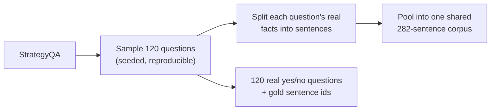
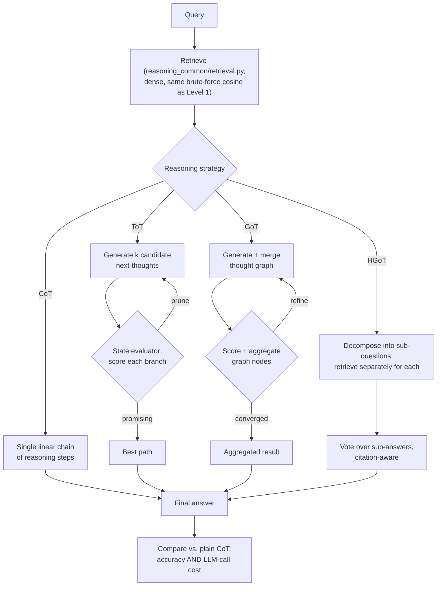
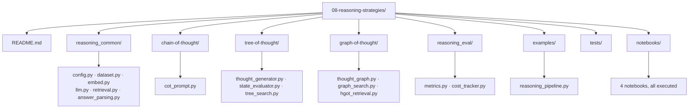

# Level 8 — Reasoning Strategies (CoT / ToT / GoT)

> **Status:** ✅ implemented and executed end-to-end — real Chain-/Tree-/Graph-of-Thought and HGoT
> reasoning over a real retrieved fact corpus, with a real, measured, and genuinely surprising
> result: on this level's own real evaluation, the cheapest strategy won, and the most expensive
> one scored worst. See [Evaluation](#evaluation--what-actually-happened) for the full trace of
> exactly why, not just the numbers.

[← Previous level: Production RAG](../07-production-rag/README.md) · [Back to roadmap](../README.md) · [Next: Knowledge-Augmented Generation →](../09-knowledge-augmented-generation/README.md)

---

## Objective

Every prior level optimized **what gets retrieved and in what order** — routing, adaptivity,
agentic tool use, multi-agent orchestration. None of them changed **how the model reasons over
what it retrieved**: every generation call in Levels 1-7 is a single, direct pass — stuff context
into a prompt, generate once. This level is about that other axis: making the model think in
explicit, inspectable steps before it answers, and comparing three increasingly structured ways
to do that against plain single-shot generation, honestly, including their cost.

This axis is orthogonal to the retrieval-architecture progression — Chain/Tree/Graph-of-Thought
can sit on top of *any* retriever from Levels 1-7, not just a new one built here.

---

## Concepts

| Technique | Shape of the reasoning | Source |
|---|---|---|
| **Chain-of-Thought (CoT)** | A single linear sequence of intermediate reasoning steps before the final answer. | Prompting technique, in wide use since 2022. |
| **Tree-of-Thought (ToT)** | A **tree search** over candidate next-thoughts, each scored by a state evaluator, with backtracking away from unpromising branches. | [Yao et al., 2023](https://arxiv.org/abs/2305.10601) |
| **Graph-of-Thoughts (GoT)** | A **directed graph** of reasoning steps — branches can merge and aggregate, not just split. | [Besta et al., AAAI 2024](https://dl.acm.org/doi/10.1609/aaai.v38i16.29720) |
| **Hierarchical GoT (HGoT)** | Decomposes a query into sub-questions, retrieving **separate, real evidence for each one independently**, then votes over the sub-answers with citation-aware evidence tracking. | 2025-2026 extension, see [`../GAP_ANALYSIS.md`](../GAP_ANALYSIS.md#a-reasoning-strategies) |

All four are implemented: CoT, ToT, and GoT each in their own folder, HGoT inside
`graph-of-thought/` as the RAG-specific descendant of GoT — closer to what "reasoning + retrieval"
looks like in practice than the generic algorithmic-puzzle framing most ToT/GoT demos use.

---

## Data — a fifth fresh open source, chosen for multi-step reasoning

| Backend | Real data | Why this one |
|---|---|---|
| primary | **[StrategyQA](https://huggingface.co/datasets/ChilleD/StrategyQA)** — real yes/no questions whose answers require an *implicit* multi-step reasoning strategy the question itself never states, each with its own real supporting facts | The reasoning steps aren't stated in the question (unlike HotpotQA's explicit bridge entities, already used in [Level 4](../04-adaptive-rag/README.md)) — the model has to *discover* the strategy |
| calibration (optional, no retrieval) | **[GSM8K](https://huggingface.co/datasets/openai/gsm8k)** — grade-school math word problems, the canonical CoT benchmark | Isolates reasoning-strategy quality from retrieval quality |

Neither dataset has been used by any prior level. Every sampled question's own real supporting
facts are split into sentences and pooled into one shared corpus — a question's own facts become
its gold evidence inside a corpus that also contains every other sampled question's facts as real
distractors, the same "union of contexts" shape [Level 4](../04-adaptive-rag/README.md)'s HotpotQA
corpus already used, built from a different real source.



---

## Architecture



The state evaluator (ToT) and the scoring/aggregation step (GoT) are themselves LLM calls — the
same "a judge has its own error rate" lesson that runs through every prior level (Level 4's CRAG,
Level 5's source-checking, Level 6's verification agent, Level 7's faithfulness judge) shows up
here too, now judging *reasoning quality* — and, per this level's own real evaluation below, it
mattered enough to flip the final answer on a real, checkable question.

---

## Stack

**Ollama only** — `nomic-embed-text` for embeddings, `llama3.2` for every generation call
(thought generation, state evaluation, graph scoring), exactly like Levels 1-7. No OpenAI,
Anthropic, or any other hosted API, and no new dependencies. The thought generator, state
evaluator, and tree/graph search are all hand-rolled against this one local model — consistent
with this repo's "understand the mechanism before adopting a framework" approach at every prior
level (hand-rolled ReAct in Level 5, hand-rolled supervisor in Level 6, hand-rolled Ragas metrics
in Level 7).

---

## Folder Structure



> **Package name note:** shared helpers live in `reasoning_common/`, not `common/` — following the
> naming lesson learned the hard way in [Level 3](../03-modular-rag/README.md#folder-structure).
>
> **`reasoning_eval/`, not `evaluation/`** — [Level 2](../02-advanced-rag/README.md) already owns
> `evaluation/` as a real Python package (has its own `__init__.py`). This collided **immediately**,
> the first time this level's own tests were run at all (`ModuleNotFoundError: No module named
> 'evaluation.cost_tracker'`) — the same root cause [Level 7](../07-production-rag/README.md#folder-structure)
> already hit and fixed by renaming to `production_eval/`. The metrics module inside is named
> `metrics.py`, not `reasoning_eval.py`, to avoid the folder and the file sharing one name too.

---

## Setup

```bash
uv sync
ollama serve
ollama pull nomic-embed-text
ollama pull llama3.2
```

## Running it

```bash
cd 08-reasoning-strategies
uv run python examples/reasoning_pipeline.py --strategy cot "Do workers at Nissan's headquarters eat with chopsticks?"
uv run python examples/reasoning_pipeline.py --strategy tot "Would a modern central processing unit circuit chip fit on a housekey?"
uv run python examples/reasoning_pipeline.py --strategy got "Is Cantonese spoken in Japan?"
uv run python examples/reasoning_pipeline.py --strategy hgot "Did the band Led Zeppelin own a prime number of gilded gramophones?"
```

First run downloads StrategyQA and embeds the 282-sentence pooled fact corpus (~15s); cached under
`data/cache/` after that, same as every prior level.

**Notebooks:**
```bash
uv run --with jupyter jupyter lab notebooks/
```

---

## Notebooks

All 4 executed for real, against real Ollama and the real pooled fact corpus.

| Notebook | Covers |
|---|---|
| [`01_chain_of_thought.ipynb`](notebooks/01_chain_of_thought.ipynb) | A real, correct CoT answer requiring actual unit-conversion arithmetic, plus a GSM8K calibration check (also correct, no retrieval involved) |
| [`02_tree_of_thought.ipynb`](notebooks/02_tree_of_thought.ipynb) | The thought generator and state evaluator called directly, then the full search — on the exact question CoT got right, which ToT gets wrong, traced step by step |
| [`03_graph_of_thought.ipynb`](notebooks/03_graph_of_thought.ipynb) | The same failure mode, now compounded by GoT's aggregation step, plus HGoT's sub-question decomposition and citation tracking (including a real off-topic retrieval it does not notice) |
| [`04_reasoning_vs_plain_rag_eval.ipynb`](notebooks/04_reasoning_vs_plain_rag_eval.ipynb) | The full real comparison table: accuracy and LLM-call cost for all four strategies on the same 8 real questions |

---

## Evaluation — what actually happened

Real run: 8 real StrategyQA questions (seeded sample), every strategy given the exact same
retrieved evidence for a fair comparison, scored against real ground truth with
`reasoning_eval/metrics.py`:

| Strategy | Accuracy | Avg. LLM calls | Avg. time |
|---|---|---|---|
| **CoT** | **1.000** | **1.00** | 14.2s |
| ToT | 0.750 | 5.00 | 9.6s |
| **GoT** | **0.500** | **7.00** | 23.3s |
| HGoT | 0.750 | 5.00 | 14.5s |

**The cheapest strategy won, and the most expensive one scored worst.** This is a small sample (8
questions, imbalanced toward `False` by chance with this seed — worth naming plainly) but the
pattern is not noise: it traces back to one specific, checkable, reproducible mechanism, not a
coincidence.

### The Mount Fuji case — the mechanism, not just the numbers

*"Would the top of Mount Fuji stick out of the Sea of Japan?"* (real answer: **True** — Mount Fuji
is ~12,389ft; the Sea of Japan's maximum depth is ~12,276ft).

- **CoT** did the real unit conversion and comparison explicitly, in one pass, and got it right.
- **ToT and GoT** both converged on the identical reasoning step — *"The Sea of Japan's maximum
  depth is greater than Mount Fuji's height"* — which is **backwards** on the real numbers. The
  state evaluator scored this specific, wrong claim **0.8 out of 1.0**, and the search committed
  to it. GoT's aggregation step then combined it with a second branch into an even more
  elaborate, more confident-*sounding* paragraph that still reached the wrong conclusion —
  synthesis has no mechanism to catch an error already present in what it is synthesizing.
- **HGoT** decomposed the question differently and still landed on the wrong answer, from a
  different path.

Branching and scoring did not add robustness here — they added a second place (the evaluator's own
judgment) for the same small model to be wrong, and this run shows it actually was, concretely and
reproducibly, not just in theory. Full traces: [`02_tree_of_thought.ipynb`](notebooks/02_tree_of_thought.ipynb)
and [`03_graph_of_thought.ipynb`](notebooks/03_graph_of_thought.ipynb).

### Weighed against Level 7's own measured cost

[Level 7's load test](../07-production-rag/load-testing/scenarios.md) found a single generation
call already costs 3-6 seconds cold, and 16-40 seconds under just 5 concurrent users, on this
repo's CPU-bound Ollama setup. ToT/GoT/HGoT's real measured 5-7x call multiplier is not a
hypothetical concern layered on top of that — it is a direct, multiplicative worsening of exactly
the bottleneck Level 7 already measured, for a strategy that did not even win on accuracy here.

---

## Common Failure Modes

- **A judge LLM has its own error rate, and it visibly changed the final answer here** — not a
  repeated warning this time, but a directly observed, traced instance: the state evaluator scored
  a factually-backwards numeric comparison at 0.8 confidence, and the search followed it. Same
  lesson as Level 4's CRAG grading, Level 5's source-checking, Level 6's verification agent, and
  Level 7's faithfulness judge — now confirmed on reasoning-path quality specifically.
- **More reasoning machinery does not average out an unreliable judge — it can compound it.** GoT
  (the most machinery: branching, scoring, *and* aggregation) scored the *lowest* accuracy of all
  four strategies at the *highest* cost. Aggregating two branches with an LLM call has no built-in
  way to notice that one of the branches it is combining was already wrong.
- **A more sophisticated technique can lose to a simpler one on a given task** — the same lesson
  [Level 4](../04-adaptive-rag/README.md#evaluation--what-actually-happened) already found with
  multi-hop decomposition losing to plain retrieval, now confirmed again on a completely different
  axis (reasoning strategy, not retrieval strategy) with a completely different dataset.
- **Decomposition prompts are not perfectly deterministic even at low temperature** — two separate
  `decompose_question` calls on the same question, in the same notebook run, produced genuinely
  different sub-questions. Worth knowing before assuming a decomposition step is reproducible.
- **A vague sub-question can retrieve real but off-topic evidence, and HGoT has no mechanism to
  notice** — one real run cited genuine facts about Megadeth and salsa music as "evidence" for a
  question about Led Zeppelin, because a sub-question phrased too generally matched them well
  enough by embedding similarity alone.
- **A same-named shared package across levels collides immediately, not eventually** —
  `evaluation/` (this level's original plan) collided with Level 2's real `evaluation/` package
  the very first time this level's own tests were run at all, before any cross-level suite was
  even attempted. Renamed to `reasoning_eval/` — see the Folder Structure note above.

---

## Tests

```bash
uv run pytest 08-reasoning-strategies/tests -v   # or `uv run pytest -q` from the repo root for all 8 levels
```

59 tests, entirely offline (fake LLM/embedder/retriever fixtures via `tests/conftest.py`, no
network or Ollama required) — including a full scripted trace of Tree-of-Thought's exact call
sequence (generate → evaluate → evaluate → generate → evaluate → evaluate → final-answer) proving
the beam search actually prunes to the best-scoring branch, and a structural test proving
Graph-of-Thoughts' aggregation produces a real multi-parent node in the graph, not just a
plausible-looking LLM-call count. Full repository suite: **387 tests passing** across all 8 levels
together (328 before this level was built).

---

## What I Learned

*(fill in after working through this level yourself)*

---

## Checklist

- [x] Implement Chain-of-Thought prompting + evaluation
- [x] Implement Tree-of-Thought (thought generator, state evaluator, tree search with backtracking)
- [x] Implement Graph-of-Thoughts (thought graph, merge/aggregate, HGoT retrieval-augmented variant)
- [x] Implement the cost tracker (LLM-call count per strategy, not just accuracy)
- [x] Work through and execute all 4 notebooks
- [x] Run real evaluation against real StrategyQA ground truth, including the cost comparison
- [x] Offline test suite (59 tests, 387 across the full repo)
- [ ] Build the mini project (a reasoning-strategy selector that picks CoT/ToT/GoT per question, and can justify why)
- [ ] Update **What I Learned** above
- [ ] Commit results

---

## Next Level

Once you can explain **why the cheapest reasoning strategy won here, and what would need to be
true about a question for a more expensive one to actually help** — move to
[Level 9 — Knowledge-Augmented Generation](../09-knowledge-augmented-generation/README.md), where
the axis shifts again: from *how the model reasons* to *how the knowledge itself is represented*.
