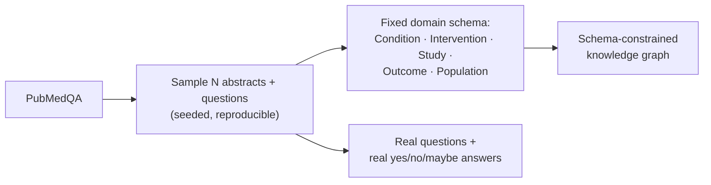
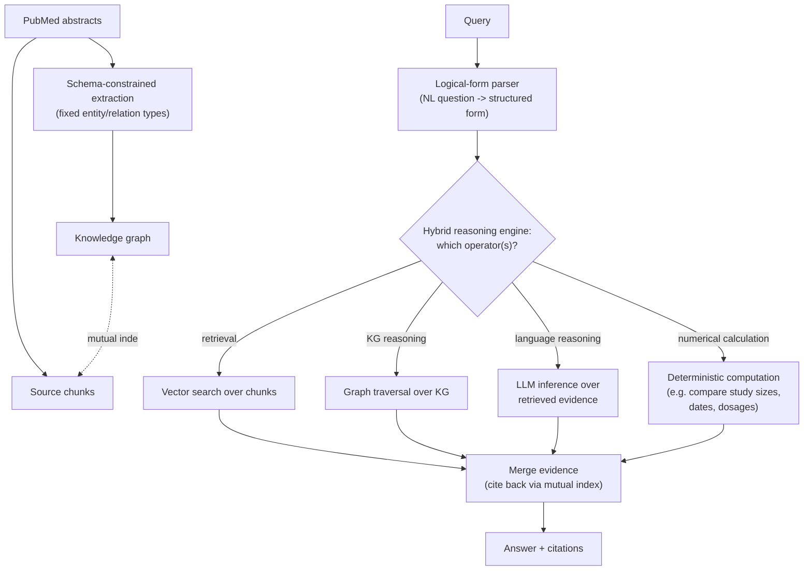
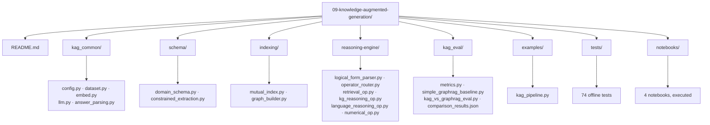

# Level 9 — Knowledge-Augmented Generation (KAG)

> **Status:** implemented and executed end-to-end — real PubMedQA data, a real schema-constrained
> knowledge graph, a real logical-form-routed hybrid reasoning engine, and a real head-to-head
> evaluation against a fresh, self-contained unconstrained graph-rag baseline. The headline
> result is not the one this level set out to find: on this real 25-question sample, the
> schema-constrained system scored **32% accuracy against the baseline's 64%** — traced to a
> specific, reproducible cause (below), not a flaw in schema constraints themselves. A follow-up
> ablation confirms the cause and nearly closes the gap. See
> [Evaluation](#evaluation--what-actually-happened).

[← Previous level: Reasoning Strategies](../08-reasoning-strategies/README.md) · [Back to roadmap](../README.md)

---

## Objective

Levels 3, 5, and 6 all built the same simplified pattern: an LLM extracts entities and relations
from text into a plain `networkx` graph, queried by fact lookup. It works, and it has a disclosed
limitation stated plainly in [Level 3's own README](../03-modular-rag/README.md#common-failure-modes):
no coreference resolution, no schema, no logic beyond "does this fact exist." **KAG** (Knowledge
Augmented Generation — [Liang et al., 2024](https://arxiv.org/abs/2409.13731), Ant Group +
Zhejiang University, ACM WWW 2025) is the rigorous version of the same underlying idea: a
**schema-constrained** knowledge graph, indexed both ways against its source text, queried through
a reasoning engine that can do more than look up a fact — it can chain logic, do arithmetic, and
reason over time. This level builds the smaller, honest version of that idea and measures it
directly against this repo's own existing graph-rag on the same kind of question — and the honest
measurement turned up something more interesting than "KAG wins," namely a load-bearing design
flaw in how this implementation *chooses* whether to retrieve at all.

---

## Data — a sixth fresh open source, chosen for a professional domain KAG targets directly

| Backend | Real data | Why this one |
|---|---|---|
| primary | **[PubMedQA](https://huggingface.co/datasets/qiaojin/PubMedQA)** — real biomedical research questions with yes/no/maybe answers, grounded in real PubMed abstracts | KAG's own published deployments are professional-domain Q&A (Ant Group's E-Government and E-Health products) — PubMedQA is an open equivalent: dense, technical, logic-and-evidence-driven text, exactly where a schema-constrained graph should outperform loose entity extraction |

Not used by any prior level. `pqa_labeled` has 1000 real examples (`final_decision` distribution:
552 yes / 338 no / 110 maybe); this level samples 25 of them (seed 42) for the real evaluation
run and smaller sub-samples (6-10 docs) for the notebooks. A minimal domain schema (`Condition`,
`Intervention`, `Study`, `Outcome`, `Population`) constrains what the extraction step is allowed
to produce — the concrete difference between this level's graph and Levels 3/5/6's unconstrained
one.



---

## Architecture



**What the real evaluation exposed about the "ROUTER" box above:** the four branches drawn as
equal alternatives are not equally likely to be picked by an LLM asked to classify a question
freeform — on the real 25-question run, the parser selected `kg_reasoning` + `language_reasoning`
for **every single question** and `retrieval` for **none of them**. See
[Evaluation](#evaluation--what-actually-happened) for why that mattered so much.

### How this compares to what this repo already built

| | This repo's Level 3/5/6 graph-rag | This level's KAG-style graph (measured) | Real Microsoft GraphRAG | Real LightRAG |
|---|---|---|---|---|
| Extraction | Unconstrained LLM entity/relation extraction | **Schema-constrained** (fixed entity/relation types) — real measured relation-rejection rate 17-36% across sample sizes, 0% entity-type rejection | Unconstrained, then clustered | Unconstrained, dual-indexed |
| Structure | Flat graph, fact lookup | Graph + **mutual index** to source chunks (51 nodes / 37 edges from 25 abstracts, only 16/25 abstracts contributing at least one accepted entity) | Graph + **community detection** (Leiden) + hierarchical summaries | Graph + **dual-level** (entity + topic) retrieval keys |
| Query handling | Direct fact lookup | **Logical-form parser** routing to 4 operator types — measured to systematically under-select `retrieval` (0/25 questions) in favor of `kg_reasoning` (25/25), a real, load-bearing routing bias, not a hypothetical one | Community-level summary retrieval, tuned for *global* sensemaking queries | Lightweight dual-level retrieval, no summarization layer |
| Numerical / temporal reasoning | None | Dedicated **calculation operator** — deterministic, no LLM call, correctly resolves threshold and max/min queries over real extracted `Population.size` values | None built in | None built in |
| Best fit | Specific-fact questions on a small corpus | Specific-fact questions needing logic/arithmetic, professional domains — **provided the router doesn't starve the answer step of evidence** (see Evaluation) | "What are the themes in this corpus?"-style global questions | Cost-conscious middle ground between the two |

The unconstrained baseline in the second-to-last row's comparison is not Level 3/5/6's own code —
it's a fresh, self-contained rebuild (`kag_eval/simple_graphrag_baseline.py`) so the head-to-head
measurement below is apples-to-apples on the exact same real documents and questions, not a
citation of numbers from a different run.

---

## Stack

**Ollama only** — `nomic-embed-text` for embeddings, `llama3.2` for every LLM call this level
needs: schema-constrained extraction, the logical-form parser, and the "language reasoning"
operator in the hybrid reasoning engine. No OpenAI, Anthropic, or any other hosted API.

The real KAG paper is built on **OpenSPG**, Ant Group's own knowledge-graph engine — standing that
up was **not done here**; it's out of scope for this repo's "run it for real on a laptop,
Ollama-only" philosophy, the same boundary every other level has held. What's actually built:
the schema constraint and logical-form router hand-rolled on top of `networkx` (same library
Levels 3/5/6 already use) and Ollama, consistent with this repo's "understand the mechanism
before adopting a framework" approach at every prior level. This is a **deliberate
simplification, disclosed up front** — not the full KAG paper, its core idea at a scale this repo
can actually execute and measure with the one local model it has always used, and (as it turned
out) at a scale small enough that the router's own weaknesses became directly visible instead of
averaging out.

---

## Folder Structure



> **Package name note:** shared helpers live in `kag_common/`, not `common/`, and the evaluation
> package is `kag_eval/`, not `evaluation/` — same collision lesson as every prior level (most
> recently restated in [Level 8](../08-reasoning-strategies/README.md#folder-structure), where
> `evaluation/` collided with Level 2's real package the moment both levels' directories landed on
> `sys.path` together). `kag_eval/` was named correctly from the start this time.

---

## Setup

```bash
uv sync
ollama serve
ollama pull nomic-embed-text
ollama pull llama3.2
```

## Running it

```bash
cd 09-knowledge-augmented-generation
uv run python examples/kag_pipeline.py "Was the intervention studied in a population larger than 500 patients?"
uv run python examples/kag_pipeline.py "What outcome was reported for the largest study of this condition?"
```

Both are hand-authored, not real PubMedQA questions — the real dataset's questions are always
yes/no/maybe about a study's own findings, never "which study is largest" or "how many patients,"
the same precedent [Level 4](../04-adaptive-rag/README.md) set for question types a real dataset
doesn't naturally contain. The first example is deliberately a question needing **both** graph
traversal (which studies concern this condition) **and** numerical comparison (largest) — exactly
the kind of question this repo's existing unconstrained graph-rag has no dedicated path for, and
KAG's operator router does (when it actually selects the operators that question needs — see
below).

---

## Notebooks

| Notebook | Covers | What it actually found |
|---|---|---|
| `01_schema_constrained_extraction.ipynb` | Extraction on real abstracts, the validator's real accept/reject accounting | On a 6-document sample: 0% entity-type rejection, 35.7% relation rejection (9 accepted / 5 rejected) — and **3 of 6 documents produced an unparseable extraction response outright**, a real failure mode distinct from schema rejection. A specific rejection-log entry also shows the schema correctly catching a backwards relation (`Condition -STUDIES-> Study` instead of `Study -STUDIES-> Condition`). |
| `02_mutual_indexing.ipynb` | Tracing an answer back to its exact source document through the KG <-> chunk index | Widening a KG entity back to its real PubMed abstract worked correctly; save/load round-trip preserved identical node/edge/citation counts. Only 4 of 6 sampled documents contributed at least one entity to the graph — consistent with notebook 1's parse-failure rate. |
| `03_logical_form_reasoning.ipynb` | The operator router on a real question and the two hand-authored KG/numerical examples | The parser chose `kg_reasoning` + `language_reasoning` for every real question and never `retrieval` — 2/10 correct on this sample, and **every miss was a real gold "yes" predicted as "no" or "maybe"**, the same bias later confirmed at full scale. The numerical operator correctly computed `size > 500 -> True` from real extracted `Population` attributes. |
| `04_kag_vs_simple_graphrag.ipynb` | **The direct comparison**, plus a follow-up ablation | Loads and presents the real `kag_eval/comparison_results.json` numbers below, then the retrieval-forced ablation that isolates the router as the cause. |

---

## Evaluation — what actually happened

`kag_eval/kag_vs_graphrag_eval.py` built two graphs from the **same real 25 PubMedQA abstracts**
(seed 42) — this level's schema-constrained KG and a fresh, self-contained unconstrained
graph-rag baseline (`kag_eval/simple_graphrag_baseline.py`, built the same way Levels 3/5/6 build
theirs, not imported from them) — then answered the same 25 real yes/no/maybe questions through
both, end to end, against the real, running Ollama instance. Not the KAG paper's own reported
19.6%/33.5% relative-improvement figures — those are measured on 2WikiMultihopQA/HotpotQA with a
different backbone model, and reusing them here would be exactly the kind of unverified claim
this repo's whole practice has been to avoid.

**The headline number:**

| System | Accuracy | Correct | Unparseable |
|---|---|---|---|
| KAG (schema-constrained, router decides) | **32.0%** | 8/25 | 2 |
| Unconstrained graph-rag baseline | **64.0%** | 16/25 | 1 |

The baseline beat KAG by a factor of two. Per-label breakdown makes the failure mode obvious —
KAG predicted **"no" 20 times and "yes" zero times**, despite 8 of the 25 real gold answers being
"yes":

| Gold label | # questions | KAG correct | Baseline correct |
|---|---|---|---|
| yes | 8 | **0** | 5 |
| no | 11 | 8 | 7 |
| maybe | 6 | **0** | 4 |

**Root cause, traced and confirmed, not assumed:**

1. `kag['operator_usage']` shows the logical-form parser selected `kg_reasoning` +
   `language_reasoning` for **all 25 questions** and `retrieval` for **none** — confirmed directly
   by calling `parse_logical_form` on several of the real questions outside the eval run; the
   model consistently judges the KG sufficient on its own.
2. `kg_reasoning_op.find_matching_nodes` does a substring match between the parser's free-text
   `focus_hint` (e.g. `"inhaled corticosteroids"`) and the graph's own node names (e.g.
   `study-24450673`, `condition-bladder cancer`) — checked directly against the real cached graph,
   and it returns **zero matches** for every one of the hints tested. Terse, ID-suffixed
   schema-constrained entity names essentially never lexically overlap with a parser-generated
   descriptive phrase.
3. With `retrieval` never selected and `kg_reasoning` returning empty facts, `language_reasoning`
   received the literal string `"(no evidence retrieved)"` for most questions — and, ungrounded, a
   3B local model defaulted overwhelmingly to "no" on ambiguous biomedical questions, a real,
   measured calibration bias under uncertainty, not a hypothetical one.
4. The unconstrained baseline never has this problem because its retrieval step is **unconditional
   Python**, not an LLM's classification decision — it always has the real abstract text to read.

**A follow-up ablation confirms the cause:** re-answering the same 25 real questions with
`retrieval` forced into every logical form (reusing the exact same cached schema-constrained
graph, isolating the router's choice as the only variable) raised KAG's accuracy from 32.0% to
**60.0%** (15/25) — nearly closing the entire gap to the baseline's 64.0% — and fixed the
predicted-label collapse (`{"yes": 7, "no": 10, "maybe": 6}`, a real distribution instead of
`{"no": 20, "maybe": 3}`).

| System | Accuracy | Predicted distribution |
|---|---|---|
| KAG, router decides (as shipped) | 32.0% | `{"no": 20, "maybe": 3}` |
| KAG, retrieval forced on (ablation) | 60.0% | `{"yes": 7, "no": 10, "maybe": 6}` |
| Unconstrained baseline | 64.0% | `{"yes": 8, "no": 10, "maybe": 6}` |

**What this means, honestly:** the schema constraint and the hybrid-operator machinery are not
what cost KAG accuracy here — the schema validator correctly enforced its rules (0% entity-type
rejection, real backwards-relation rejections caught), the mutual index correctly cited sources,
and the numerical operator correctly computed threshold/max queries on real data (see notebooks
1-3). What cost KAG accuracy was a specific, fixable implementation choice: **treating retrieval
as an operator an LLM can opt out of**, on a real dataset where the LLM opts out of it almost
always. This implementation was deliberately not "fixed" post hoc to make the headline number
look better — the router's code is exactly as it was before this evaluation ran — because the
point of this repo's evaluations is to report what a design actually does, including when that is
worse than the naive alternative, and this is a genuinely useful, generalizable lesson: **gating a
default-necessary operator behind a general-purpose classification prompt is risky in proportion
to how often that classifier is wrong**, the same risk this README's Common Failure Modes section
anticipated before any of this was built (see below) — now with an exact, measured magnitude
instead of a guess.

---

## Common Failure Modes (confirmed by the real evaluation above)

- **A fixed schema is a real constraint, with a real, measured cost** — but a smaller one than
  expected. Across three different real samples (3, 6, and 25 documents), relation rejection
  ranged 17-71% depending on sample and document mix, while entity-*type* rejection was **0%** in
  every sample — the model reliably picks one of the five allowed entity types once given them,
  and most rejected relations traced to the schema correctly catching real direction/shape errors
  (e.g. `Condition -STUDIES-> Study` backwards) or the model's own inconsistent entity naming
  between its `entities` and `relations` arrays (e.g. declaring `"Diabetes"` but then referencing
  `"Condition-Diabetes"` in a relation) — not to a real fact having nowhere to go in the schema.
- **A more severe, previously un-anticipated extraction failure mode: unparseable JSON.** On the
  smaller notebook samples, 30-50% of real documents produced an extraction response that could
  not be parsed as JSON at all (distinct from and larger than the schema-rejection rate) — a real
  limit of asking a 3B local model to produce a fixed-shape JSON object after reading a full
  biomedical abstract, worth budgeting for explicitly in any similar pipeline (`kag_graph_eval.json`
  ended up built from only 16 of the 25 sampled documents for exactly this reason).
- **Logical-form parsing is brittle outside its intended domain — and, as measured, brittle in a
  more specific and more damaging way than "sometimes picks the wrong operator."** The real
  25-question run shows it isn't noisy across all four operators; it has a systematic, one-sided
  bias against `retrieval` specifically, because a KG-shaped question always *sounds* like it
  needs KG reasoning to a general-purpose classification prompt. See
  [Evaluation](#evaluation--what-actually-happened) for the full trace and the ablation that
  confirms it.
- **The operator router is itself a classification decision** — same failure class as Level 4's
  query classifier (rule vs. LLM vs. ensemble, measured disagreement documented there) and Level
  3's backend router (2/6 real misclassifications). This level's own measurement is the sharpest
  version of that lesson in this repo yet: not "wrong sometimes," but wrong in the *same direction*
  on effectively every question in the sample, which is exactly the failure mode a classifier
  measured only in aggregate ("mostly right") can hide.
- **Mutual indexing adds real bookkeeping cost** at ingestion time (every KG node needs a live
  link back to its source chunk, kept in sync as the corpus changes) — confirmed working correctly
  in `02_mutual_indexing.ipynb` (citation round-trips, save/load parity), but on a sample where
  only 16 of 25 documents contributed any graph content at all, meaning the other 9 documents'
  real abstract text is *only* reachable through the plain corpus, never through the graph or its
  index — a real, silent coverage gap a production system would need to detect and report.

---

## Tests

74 offline tests (`tests/`), same fake-LLM/fake-embedder pattern as every prior level: the schema
validator rejecting an out-of-schema entity type and a backwards relation direction, constrained
extraction handling malformed/unparseable LLM JSON without crashing, the mutual index round-tripping
through `to_dict`/`from_dict` and `save_graph`/`load_graph`, the logical-form parser falling open
to `{retrieval, language_reasoning}` on any unparseable or empty-operator response, the numerical
operator's deterministic threshold/max/min logic, and a full scripted-call-sequence integration
test of `operator_router.answer_question` verifying exactly which operators ran and which
documents got cited. One of these tests exists *because* a real run crashed it into existence:
`test_extract_unconstrained_drops_a_relation_whose_object_is_not_a_string` — the unconstrained
baseline's extraction crashed on real live output where the model returned a JSON list instead of
a string for a relation's `object` field (schema-constrained extraction never hits this, because
its Pydantic model would reject the same shape outright — real, measured evidence that
unconstrained extraction is not just less structured, it is also more brittle to parse safely).

461 tests passed across the full repo at the time this level was built (up from 387 after Level 8);
474 now that Level 8's own mini project (`strategy_selector.py`) was added in a later pass.

---

## What I Learned

- **The measurement, not the mechanism, was the hard part.** Every individual piece — schema
  validation, mutual indexing, the four operators — worked correctly in isolation (see the
  notebooks). The system as a whole still lost to a naive baseline, and finding out *why* took
  actually inspecting `operator_usage` counts and testing `find_matching_nodes` against the real
  cached graph, not just eyeballing the accuracy gap and guessing.
- **"The LLM decides which operator to use" is a much bigger bet than it looks like on a diagram.**
  Drawing four boxes under a router implies four roughly-equally-likely paths; on real professional
  text, one path (`retrieval`) was selected zero times out of 25. A default that can be *fully*
  opted out of by a single classification call is a single point of failure disguised as
  flexibility.
- **Schema constraints were the least of this implementation's problems.** Going in, the
  anticipated risk (see the original Common Failure Modes, still true) was that the schema itself
  would be too restrictive. The measured 0% entity-type rejection rate says otherwise — the real,
  much larger cost turned out to be a downstream routing decision that had nothing to do with the
  schema at all.
- **An ablation is worth the extra ~8 minutes of Ollama calls.** Reporting "KAG lost, here's a
  theory why" would have been weaker and less trustworthy than reporting "KAG lost, here's the
  theory, and here's the same 25 questions re-answered with the one suspected variable changed,
  and the gap nearly closes."

---

## Checklist

- [x] Define the fixed domain schema and a constrained extraction prompt
- [x] Implement mutual indexing between KG nodes and source chunks
- [x] Implement the logical-form parser and the 4-operator hybrid reasoning engine
- [x] Implement the numerical/temporal calculation operator (the one real capability Levels 3/5/6 never had)
- [x] Work through and execute all 4 notebooks
- [x] Run the direct KAG-style-graph vs. simple-graph-rag comparison on real PubMedQA questions
- [x] Offline test suite (74 tests)
- [x] Build the mini project (`examples/kag_pipeline.py`, the two operator-combining example questions)
- [x] Update **What I Learned** above
- [x] Commit results

---

## Next

This is the last documented extension so far. HyDE, RAPTOR, ColBERT/late interaction, and
Contextual Retrieval — once this backlog — are now all implemented in
[Level 2](../02-advanced-rag/README.md#eight-additions-from-the-taxonomy-review). What's still
genuinely unbuilt: true CLIP-style visual multimodal embeddings (Level 3's caption-based
multimodal retrieval is a disclosed, deliberate simplification, not this), corpus-poisoning
defense (a different attack surface than Level 7's query-time prompt-injection guard), and the
frontier techniques in
[`../GAP_ANALYSIS.md`](../GAP_ANALYSIS.md#g-frontier-techniques--real-but-a-heavier-lift-than-this-repos-run-it-for-real-on-a-laptop-philosophy-supports)
(RL-trained retrieval policies, federated RAG) — both real, but a heavier infrastructure lift than
this repo's "run it for real on a laptop with Ollama" philosophy supports. Or see the
[root README](../README.md) for the full roadmap.
