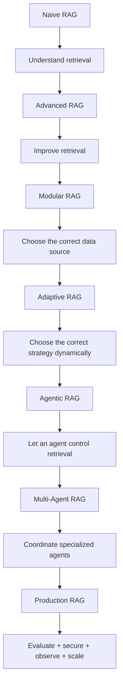
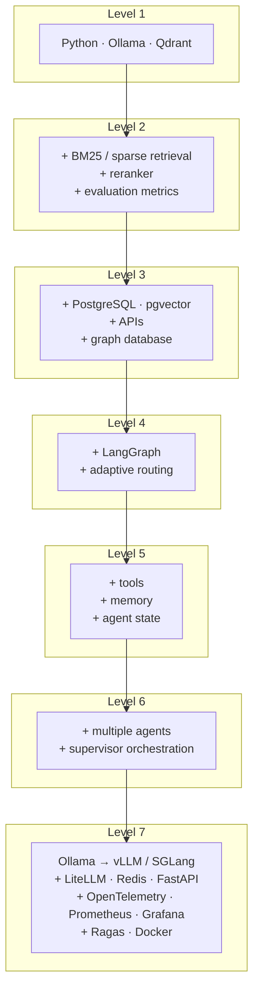
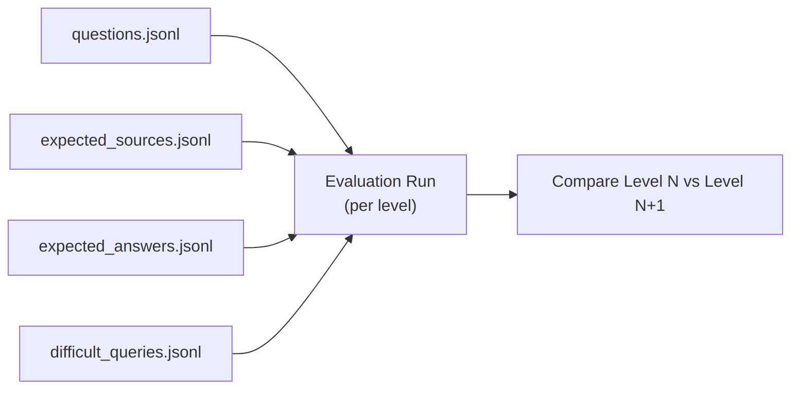

# RAG Specialization

A progressive, hands-on repository for learning **Retrieval-Augmented Generation (RAG)** — from the fundamentals of embeddings and vector search to production-grade, multi-agent RAG systems.

> **Status:** All 7 core levels are implemented and executed end-to-end (real pipelines, real open datasets — a real PDF, three different real SQL databases, live web search, a real multi-hop QA benchmark, a real ReAct agent verified against ground-truth answers, a real multi-agent supervisor with a measured 1.74x parallel speedup, and a real production FastAPI service in front of a live Qdrant + Postgres + Redis + Prometheus + Grafana stack with a real Locust load test and a real evaluation run that caught both a code bug and an LLM-judge reliability finding — tests, notebooks with real output, and a real-metrics dashboard for Level 7). **Level 8** (Reasoning Strategies) is also implemented and executed end-to-end, with a genuinely surprising real result: the cheapest strategy (Chain-of-Thought) beat every more elaborate one on accuracy, at a fraction of the cost — see [Level 8's Evaluation](./08-reasoning-strategies/README.md#evaluation--what-actually-happened). **Level 9** (Knowledge-Augmented Generation) is also implemented and executed end-to-end, with an even sharper surprise: its schema-constrained graph scored *worse* than a naive unconstrained baseline (32% vs. 64% accuracy) — traced to the router almost never selecting retrieval, confirmed by a follow-up ablation that closed most of the gap — see [Level 9's Evaluation](./09-knowledge-augmented-generation/README.md#evaluation--what-actually-happened).

---

## Roadmap

The core repository is organized into **7 progressive levels**. Each level is a folder containing theory, notebooks, source stubs, examples, tests, and its own `README.md`. Two further levels exist as **documented extensions** — structure-only, added after a deep-search gap analysis (see [`GAP_ANALYSIS.md`](./GAP_ANALYSIS.md)) — for anyone who wants to keep going past production.

```mermaid
flowchart LR
    L1["01 · Naive RAG"] --> L2["02 · Advanced RAG"]
    L2 --> L3["03 · Modular RAG"]
    L3 --> L4["04 · Adaptive RAG"]
    L4 --> L5["05 · Agentic RAG"]
    L5 --> L6["06 · Multi-Agent RAG"]
    L6 --> L7["07 · Production RAG"]
    L7 -.extension.-> L8["08 · Reasoning Strategies<br/>(CoT / ToT / GoT)"]
    L8 -.extension.-> L9["09 · Knowledge-Augmented<br/>Generation (KAG)"]

    click L1 "./01-naive-rag/README.md"
    click L2 "./02-advanced-rag/README.md"
    click L3 "./03-modular-rag/README.md"
    click L4 "./04-adaptive-rag/README.md"
    click L5 "./05-agentic-rag/README.md"
    click L6 "./06-multi-agent-rag/README.md"
    click L7 "./07-production-rag/README.md"
    click L8 "./08-reasoning-strategies/README.md"
    click L9 "./09-knowledge-augmented-generation/README.md"
```

| Level | Folder | Focus | Status |
|---|---|---|---|
| 1 | [`01-naive-rag/`](./01-naive-rag/README.md) | The full basic pipeline: load → chunk → embed → retrieve → generate | ✅ implemented |
| 2 | [`02-advanced-rag/`](./02-advanced-rag/README.md) | Making retrieval measurable and tunable | ✅ implemented |
| 3 | [`03-modular-rag/`](./03-modular-rag/README.md) | Routing queries to the right data source | ✅ implemented |
| 4 | [`04-adaptive-rag/`](./04-adaptive-rag/README.md) | Choosing the retrieval strategy dynamically | ✅ implemented |
| 5 | [`05-agentic-rag/`](./05-agentic-rag/README.md) | Letting an agent control retrieval and tools | ✅ implemented |
| 6 | [`06-multi-agent-rag/`](./06-multi-agent-rag/README.md) | Coordinating specialized agents | ✅ implemented |
| 7 | [`07-production-rag/`](./07-production-rag/README.md) | Evaluating, securing, observing, and scaling | ✅ implemented |
| 8 | [`08-reasoning-strategies/`](./08-reasoning-strategies/README.md) | Chain-/Tree-/Graph-of-Thought — how the model reasons over what it retrieved | ✅ implemented (extension) |
| 9 | [`09-knowledge-augmented-generation/`](./09-knowledge-augmented-generation/README.md) | KAG — schema-constrained knowledge graphs + logical-form reasoning | ✅ implemented (extension) |

There is also a [`shared/`](./shared/README.md) folder with assets reused across every level (dataset, prompts, config, utilities, evaluation set), a [`GAP_ANALYSIS.md`](./GAP_ANALYSIS.md) documenting the research behind Levels 8-9, a [`RAG_TAXONOMY_COVERAGE.md`](./RAG_TAXONOMY_COVERAGE.md) cross-referencing ~45 named RAG techniques against the actual code — most gaps found there extend an *existing* level (mainly [Level 2](./02-advanced-rag/README.md): RAPTOR, ColBERT-style late interaction, self-query, conversational rewriting, contextual retrieval) rather than needing a new one — and a [`TASK.md`](./TASK.md) turning both of those into a concrete, checkable build order.

---

## Repository Structure

```mermaid
flowchart TD
    ROOT["rag-specialization/"]
    ROOT --> README["README.md"]
    ROOT --> SHARED["shared/"]
    ROOT --> L1["01-naive-rag/"]
    ROOT --> L2["02-advanced-rag/"]
    ROOT --> L3["03-modular-rag/"]
    ROOT --> L4["04-adaptive-rag/"]
    ROOT --> L5["05-agentic-rag/"]
    ROOT --> L6["06-multi-agent-rag/"]
    ROOT --> L7["07-production-rag/"]
    ROOT --> L8["08-reasoning-strategies/"]
    ROOT --> L9["09-knowledge-augmented-generation/"]
    ROOT --> GAP["GAP_ANALYSIS.md"]
    ROOT --> TAX["RAG_TAXONOMY_COVERAGE.md"]
    ROOT --> TASK["TASK.md"]

    SHARED --> SD["data/ · models/ · prompts/<br/>utils/ · config/ · evaluation/"]
    L1 --> L1D["theory/ · notebooks/ · src/<br/>examples/ · tests/ · data/"]
    L2 --> L2D["chunking/ · retrieval/ · hybrid-search/<br/>reranking/ · query-transformations/<br/>metadata-filtering/ · context-compression/<br/>evaluation/ · examples/ · notebooks/"]
    L3 --> L3D["routing/ · multi-retriever/ · sql-rag/<br/>graph-rag/ · web-rag/ · api-rag/<br/>multimodal-rag/ · examples/ · tests/ · notebooks/"]
    L4 --> L4D["query-classification/ · dynamic-retrieval/<br/>corrective-rag/ · self-rag/ · multi-hop-rag/<br/>fallback-strategies/ · examples/ · evaluation/ · notebooks/"]
    L5 --> L5D["agents/ · tools/ · planning/ · memory/<br/>iterative-retrieval/ · reflection/<br/>verification/ · examples/ · tests/ · notebooks/"]
    L6 --> L6D["supervisor/ · research-agent/ · retrieval-agent/<br/>sql-agent/ · web-agent/ · graph-agent/<br/>verification-agent/ · synthesis-agent/<br/>workflows/ · examples/ · notebooks/"]
    L7 --> L7D["api/ · inference/ · retrieval-infrastructure/<br/>observability/ · production_eval/ · security/<br/>caching/ · deployment/ · load-testing/<br/>docker/ · kubernetes/ · examples/ · notebooks/"]
    L8 --> L8D["reasoning_common/ · chain-of-thought/<br/>tree-of-thought/ · graph-of-thought/<br/>reasoning_eval/ · examples/ · notebooks/"]
    L9 --> L9D["kag_common/ · schema/ · indexing/<br/>reasoning-engine/ · kag_eval/ · examples/ · notebooks/"]
```

Every level folder also has its own `README.md` with a detailed architecture diagram and folder breakdown — see the links in the roadmap table above.

---

## Learning Philosophy

Each level should answer three questions:

1. **How does this architecture work?**
2. **When should I use it?**
3. **How do I measure whether it is better?**

Do not move to the next level until you can explain why the current system succeeds **or** fails.

### Every level contains

- Theory
- Minimal implementation
- Framework implementation
- Notebooks (hands-on, step-by-step)
- Experiments
- Evaluation
- Tests
- A small project

---

## Main Open-Source Stack

| Purpose | Tool |
|---|---|
| Language | Python |
| Local inference | Ollama |
| Production inference | vLLM or SGLang |
| Vector / hybrid retrieval | Qdrant |
| Relational retrieval | PostgreSQL + pgvector |
| Cache / state | Redis |
| RAG pipelines | LlamaIndex |
| Agent orchestration | LangGraph |
| API layer | FastAPI |
| Evaluation | Ragas |
| Observability | OpenTelemetry + Prometheus + Grafana |
| Packaging | Docker |

### Technology progression by level

---

## Project Progression

Each level finishes with one practical mini project.

| Level | Project |
|---|---|
| 1 | Local PDF chatbot |
| 2 | Hybrid-search documentation assistant |
| 3 | Enterprise assistant using Docs + SQL + APIs |
| 4 | Adaptive RAG that changes retrieval strategy |
| 5 | Autonomous research agent |
| 6 | Multi-agent company research platform |
| 7 | Self-hosted production RAG service |
| 8 *(extension)* | Reasoning-strategy selector — picks CoT/ToT/GoT/HGoT per question type |
| 9 *(extension)* | KAG pipeline answering questions needing both graph traversal and numerical comparison |

---

## Shared Evaluation Dataset

One evaluation dataset (see [`shared/README.md`](./shared/README.md)) is reused across all levels so retrieval quality can be compared as the architecture becomes more advanced.

---

## Level Completion Checklist

Before moving to the next folder, complete:

- [ ] Read the theory
- [ ] Run the minimal implementation
- [ ] Build the framework implementation
- [ ] Work through the level's notebooks
- [ ] Add unit tests
- [ ] Run retrieval experiments
- [ ] Measure quality
- [ ] Document failures
- [ ] Build the mini project
- [ ] Update the level's README with lessons learned
- [ ] Commit results

---

## Repository Reference

The full design document this structure is generated from lives in [`RAG_REPO_STRUCTURE.md`](./RAG_REPO_STRUCTURE.md).
