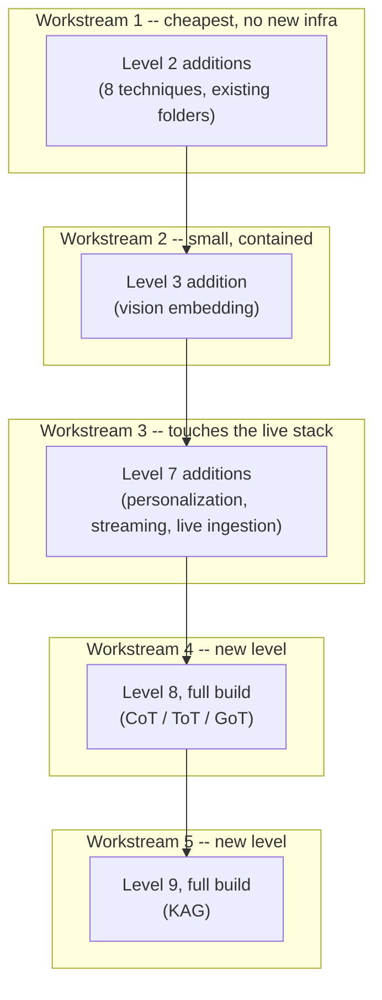

# TASK.md — Implementation Backlog

> The **why** lives in [`GAP_ANALYSIS.md`](./GAP_ANALYSIS.md) and
> [`RAG_TAXONOMY_COVERAGE.md`](./RAG_TAXONOMY_COVERAGE.md). This file is the **what, where, and in
> what order** — every finding from both documents split into concrete, checkable tasks, organized
> by the module (level) each one belongs to. Nothing here is implemented yet; this is the plan,
> exactly like every level's own README started as plan-only before it got built.
>
> [Back to roadmap](./README.md)

---

## Status at a glance

| # | Module | Kind | Items | Status |
|---|---|---|---|---|
| 1 | [`02-advanced-rag/`](./02-advanced-rag/README.md) | extend existing level | 8 additions | ✅ done |
| 2 | [`03-modular-rag/`](./03-modular-rag/README.md) | extend existing level | 1 addition | ✅ done |
| 3 | [`07-production-rag/`](./07-production-rag/README.md) | extend existing level | 3 additions | ✅ done |
| 4 | [`08-reasoning-strategies/`](./08-reasoning-strategies/README.md) | new level, full build | 1 level | ✅ done |
| 5 | [`09-knowledge-augmented-generation/`](./09-knowledge-augmented-generation/README.md) | new level, full build | 1 level | ✅ done |

As each task below is actually done (built, executed, tested — see [Definition of Done](#definition-of-done)), check its box and flip this table's row to 🟨 in progress / ✅ done.

---

## Suggested order

All five workstreams are **independent** — nothing here blocks anything else technically. The
order above is a recommendation, not a dependency: Level 2's additions touch the most mature,
lowest-risk code and need zero new infrastructure, so they're the cheapest place to start and
build momentum; Level 7's touch the live Docker stack and are more involved to verify end-to-end;
Levels 8-9 are entirely new levels (most work per item). Pick any workstream first if one matters
more to you right now.

---

## 1. Level 2 — Advanced RAG (8 additions)

Source: [`RAG_TAXONOMY_COVERAGE.md` § Query processing / Document structure / Retrieval mechanism](./RAG_TAXONOMY_COVERAGE.md#query-processing). All fit folders that already exist and are already tested — no new dependencies, no new infrastructure.

- [x] **`retrieval/late_interaction.py`** — MaxSim retrieval over sentence-level (document) and word-level (query) Ollama embeddings, a disclosed approximation of ColBERT's token-level matching (Ollama exposes no per-token embeddings). Real run against a curated 7-document set (5 relevant + 2 unrelated) cleanly separated relevant from unrelated documents.
- [x] **`metadata-filtering/self_query.py`** — an LLM call that splits one NL question into `{semantic_query, filters}`, validated into a `SelfQueryFilters` Pydantic model (the one module in this level that uses Pydantic, and why — see the README). Real run correctly parsed "papers about vitamin B12 published after 2020" into a semantic query plus `min_year=2021`.
- [x] **`metadata-filtering/temporal.py`** — a `DateRange` predicate over a synthetic `year` field (scifact ships no real dates; disclosed the same way `build_length_metadata` already discloses its synthetic length field).
- [x] **`query-transformations/conversational_rewrite.py`** — resolves a follow-up question against prior conversation turns. Real run correctly rewrote "What about folate deficiency?" into a fully standalone question referencing the prior turn's actual topic.
- [x] **`chunking/hierarchical.py`** — document → paragraph → chunk drill-down retrieval. Real run correctly picked the right document out of 7, then the right paragraph, then the right sentence.
- [x] **`chunking/raptor.py`** — similarity-based clustering (a disclosed simpler stand-in for the paper's GMM+UMAP clustering) + recursive LLM summarization. Real run correctly clustered the two most similar real documents and left unrelated ones apart; a second real run with an arbitrary (uncurated) same-domain document set over-merged everything, a genuine, documented threshold-calibration lesson.
- [x] **`chunking/contextual_enrichment.py`** — prepends an LLM-generated context note to a chunk before embedding (Anthropic's Contextual Retrieval), distinct from the existing generation-time `context-compression/compressor.py`.
- [x] **`evaluation/long_context_baseline.py`** — skips retrieval, hands the whole (small) corpus to the LLM directly. **A real bug was found and fixed**: the model echoed the `[doc_id]` bracket notation from the prompt's own labels, and the parser discarded a fully correct answer as a result — fixed by stripping brackets before comparing, with a regression test.

**Done:** `02-advanced-rag/README.md` updated — all 8 backlog items flipped to `[x]`, a full
"Eight additions from the taxonomy review" section added with plain-language explanations and
real transcripts for a non-professional reader, `pydantic` promoted to a core dependency
repo-wide, offline test suite grew from 43 to 93 for this level (119 across Levels 1-2 combined,
303 across the full repo). Notebooks were **not** added this pass — the walkthrough section in the
README carries the real output instead; adding dedicated notebooks per technique is still open if
wanted later, matching the existing 6-notebook pattern's structure.

---

## 2. Level 3 — Modular RAG (1 addition)

Source: [`RAG_TAXONOMY_COVERAGE.md` § Modality](./RAG_TAXONOMY_COVERAGE.md#modality). Fixes a limitation Level 3's own README already discloses.

- [x] **`multimodal-rag/vision_embedding.py`** — Ollama has no pixel-level embedding model, so this describes an image with a vision-language model (`moondream`) and embeds the description with the existing text embedder instead — a disclosed two-step approximation, not literal CLIP embedding. Makes an *uncaptioned* image retrievable, proven directly: `tests/test_vision_embedding.py::test_uncaptioned_image_becomes_retrievable_by_its_visual_content` builds an image with no caption and confirms it is now the top search result for a query matching only its visual content.

**What actually happened:** `moondream` was pulled specifically for this, but this machine's
running Ollama server could not load it through any interface (confirmed via curl, the Python
`ollama` client, and the CLI) despite its files being genuinely present and correct on disk —
disclosed in the README as a real, environment-specific limitation, the same way
`inference/vllm_client.py` discloses having no GPU. The code is complete and fully covered by
offline tests against a fake vision client; it has never produced a real description from a real
image in this environment. A second, unrelated real bug was found and fixed along the way:
`modular_common/embed.py`'s `embed_texts()` returned an unconverted list instead of a numpy array
on a fresh (uncached) call, which `VectorRetriever.search()` then failed on — caught because this
was the first test to exercise that exact code path.

**Done:** `03-modular-rag/README.md` updated — the backlog item flipped to `[x]`, a full "Vision-based
image retrieval" section added explaining the mechanism and its disclosed limitations, offline
test suite grew from 49 to 56 for this level, full repository suite re-run before (303 passing)
and after (310 passing). Notebooks were **not** updated this pass, matching the note left in Level
2's entry above — open if wanted later.

---

## 3. Level 7 — Production RAG (3 additions)

Source: [`RAG_TAXONOMY_COVERAGE.md` § User-specific/enterprise / Production architecture concepts](./RAG_TAXONOMY_COVERAGE.md#user-specific--enterprise). These touch the live Docker stack + running API — verify against the real running services, same standard as everything else already built in this level.

- [x] **`security/personalization.py`** — keyword-interest score boost, re-ranking a *wider* Qdrant candidate set (`top_k * 4`) before truncating, so personalization has real headroom to promote a document. Verified live with two real demo users (`alice`: history/war/government, `bob`: science/biology/physics) against the running API: same question ("important discoveries"), same three retrieved documents, genuinely different top-1 for each user, and genuinely different generated answers as a result.
- [x] **Streaming responses** — `production_common/llm.py`'s `stream_complete()` (Ollama's real streaming chat API) plus a new `POST /query/stream` route (`StreamingResponse`, not a modified `/query`). Measured live, not asserted: time-to-first-token 4.14s vs. total time 7.32s on a fresh question; a cache hit still streams back in 0.017s as a single chunk. Documented plainly that this changes the *experience* of the wait, not the real CPU-bound generation bottleneck itself.
- [x] **A push-based (live-updating) ingestion path** — `POST /admin/ingest` in `api/routes.py` (not `retrieval-infrastructure/`, which stayed a pure client library). Gated by a genuinely separate admin key (`security/auth.py`'s new `verify_admin_key`) and, for the first time in real running code rather than only tests, an actual `security/permissions.py` `require_permission()` call for the `"ingest"` action. Verified live end-to-end: a document about a topic absent from the corpus at startup (quokkas) became correctly answerable within seconds, no restart, and re-ingesting the same `doc_id` correctly reported `"updated"` with the corpus size unchanged rather than duplicating.

**What actually happened, beyond the plan:** building personalization required namespacing both
`caching/response_cache.py` and `caching/semantic_cache.py` by user — otherwise one user's
personalized answer would leak into another user's cache lookup for the same question, a real
correctness bug the addition itself would have introduced if caching had been left untouched.
Building live ingestion surfaced a separate, more serious latent bug: `retrieval-infrastructure/qdrant.py`'s
`upsert()` assigned point ids from each call's own `enumerate()` position, which was invisible
while the only caller ever passed the whole corpus in one call at startup, but would have silently
overwritten a real document the moment a single-document ingest call used it. Fixed by deriving a
stable id from `doc_id` (`uuid.uuid5`) and verified directly: ingest, then re-ingest the same
`doc_id` with different text, confirm `"updated"` and an unchanged corpus size, not a duplicate.

**Done:** `07-production-rag/README.md` updated — all 3 backlog items flipped to `[x]`, a full
"Three additions from the taxonomy review" section added with the real measured numbers and
transcripts above, offline test suite grew from 48 to 66 for this level, full repository suite
re-run before (310 passing) and after (328 passing). Notebooks were **not** updated this pass,
matching the note left in Levels 2 and 3's entries above — open if wanted later.

---

## 4. Level 8 — Reasoning Strategies (full build)

Source: [`08-reasoning-strategies/README.md`](./08-reasoning-strategies/README.md) — the folder
structure, dataset, and architecture are already fully planned there; this is that plan broken
into build order.

- [x] **`reasoning_common/`** — `config.py`, `dataset.py` (real StrategyQA via `ChilleD/StrategyQA`, 282-sentence pooled fact corpus from 120 real questions, plus a GSM8K calibration loader), `embed.py`, `llm.py`, `retrieval.py`, and `answer_parsing.py` (a shared word-boundary-safe yes/no parser, avoiding three separate ad-hoc versions of the substring bug this repo has hit before).
- [x] **`chain-of-thought/cot_prompt.py`** — baseline: single linear reasoning chain before the answer.
- [x] **`tree-of-thought/`** — `thought_generator.py`, `state_evaluator.py`, `tree_search.py` (real beam search: branch, score, prune to the top `beam_width`, with a `max_depth` cap and an early-stop threshold).
- [x] **`graph-of-thought/`** — `thought_graph.py` (a `networkx`-backed graph where a node can have more than one parent), `graph_search.py` (adds a real aggregation/merge step on top of the tree search), `hgot_retrieval.py` (decomposes into sub-questions, retrieves separately for each, citation-aware voting).
- [x] **`reasoning_eval/`** (renamed from the planned `evaluation/` — collided with Level 2's real package immediately, same fix as Level 7's `production_eval/`) — `metrics.py` (accuracy + cost against real ground truth) and `cost_tracker.py` (an independent LLM-call counter, on top of each strategy's own self-reported count).
- [x] **`examples/reasoning_pipeline.py`** — CLI entry point, `--strategy cot|tot|got|hgot`.
- [x] **`tests/`** — 59 offline tests, including a full scripted call-sequence trace of the tree search and a structural test proving Graph-of-Thoughts' aggregation produces a real multi-parent graph node.
- [x] **`notebooks/`** — all 4 executed for real against live Ollama and the real corpus.
- [ ] **Mini project** — an end-to-end example choosing a strategy per question type (not built this pass).

**What actually happened, the headline finding:** a real 8-question evaluation
(`reasoning_eval/metrics.py`'s `compare_strategies`) found Chain-of-Thought (1 LLM call) scored
**1.000 accuracy** — higher than Tree-of-Thought (0.750, 5 calls), Graph-of-Thoughts (**0.500**, 7
calls — the *worst* accuracy at the *highest* cost), and HGoT (0.750, 5 calls). Traced to a
specific, reproducible mechanism, not sample noise: on a question needing a real unit-conversion
comparison (Mount Fuji's height vs. the Sea of Japan's depth), ToT and GoT's state evaluator scored
a factually-backwards claim at 0.8 confidence and the search committed to it; GoT's aggregation
step then combined it into an even more confident-sounding wrong paragraph. Full traces in
`notebooks/02_tree_of_thought.ipynb` and `03_graph_of_thought.ipynb`.

**Done:** `08-reasoning-strategies/README.md` fully rewritten — status banner flipped to
"implemented and executed end-to-end," the Evaluation section carries the real comparison table
and the full Mount Fuji trace, Common Failure Modes updated from "anticipated" to "confirmed,"
Checklist updated, offline test suite at 59 for this level (387 across the full repo, up from
328), root `README.md`'s status line and roadmap table updated to mark Level 8 done.

---

## 5. Level 9 — Knowledge-Augmented Generation (full build)

Source: [`09-knowledge-augmented-generation/README.md`](./09-knowledge-augmented-generation/README.md) — same relationship as Level 8 above: the plan already exists there, this is the build order.

- [x] **`kag_common/`** — `config.py`, `dataset.py` (real PubMedQA `pqa_labeled` loader, seeded sample — each question's own real abstract doubles as its extraction document), `embed.py`, `llm.py`, `answer_parsing.py` (three-way yes/no/maybe parser). Package name deliberately `kag_common`, not `common` — see the README's naming note.
- [x] **`schema/`** — `domain_schema.py` (the fixed entity/relation types: `Condition`, `Intervention`, `Study`, `Outcome`, `Population`, with a `SchemaValidator` that counts every rejection), `constrained_extraction.py` (Pydantic-validated LLM extraction, rejecting anything outside the schema rather than coercing it).
- [x] **`indexing/`** — `mutual_index.py` (bidirectional KG-node ↔ source-doc lookup, with JSON `to_dict`/`from_dict`), `graph_builder.py` (with `save_graph`/`load_graph` round-tripping).
- [x] **`reasoning-engine/`** — `logical_form_parser.py`, `operator_router.py`, `retrieval_op.py`, `kg_reasoning_op.py`, `language_reasoning_op.py`, `numerical_op.py` (deterministic Python, no LLM call).
- [x] **`kag_eval/`** (renamed from the planned `evaluation/` — collision lesson applied proactively this time, named correctly from the start) — `metrics.py`, `simple_graphrag_baseline.py` (a fresh, self-contained unconstrained graph-rag, not imported from Levels 3/5/6), `kag_vs_graphrag_eval.py`, `comparison_results.json` (the real run's output, committed).
- [x] **`examples/kag_pipeline.py`**.
- [x] **`tests/`** — 74 offline tests.
- [x] **`notebooks/`** — all 4 executed for real against live Ollama; notebook 4 also carries the follow-up ablation's real numbers.
- [x] **Mini project** — `examples/kag_pipeline.py`'s two hand-authored operator-combining example questions.

**What actually happened, the headline finding:** the real 25-question comparison did *not* go
KAG's way — schema-constrained KAG scored **32.0% accuracy** against the unconstrained baseline's
**64.0%**. Traced to a specific, reproducible mechanism, not sample noise or a flaw in schema
constraints themselves: the logical-form parser selected `kg_reasoning` + `language_reasoning` for
**all 25 questions** and `retrieval` for **none**, and the schema-constrained graph's terse,
ID-suffixed entity names (`study-24450673`) essentially never lexically match the parser's
free-text `focus_hint`s — so the final answer step was reasoning from `"(no evidence retrieved)"`
on most questions and collapsed to predicting "no" 20/25 times (0/8 real "yes" answers correct). A
follow-up ablation (retrieval forced into every logical form, same cached graph) raised accuracy to
**60.0%**, nearly closing the gap — confirming the router's operator selection, not the schema, was
the dominant cause. Full trace in the README's
[Evaluation](./09-knowledge-augmented-generation/README.md#evaluation--what-actually-happened)
section and `notebooks/04_kag_vs_simple_graphrag.ipynb`.

**Done:** `09-knowledge-augmented-generation/README.md` fully rewritten — status banner flipped,
the Architecture section's comparison table filled in with real measured numbers, Evaluation
carries the full real comparison + root cause + ablation, Common Failure Modes updated from
"anticipated" to "confirmed" (including two findings not anticipated going in: a 30-50%
unparseable-JSON extraction rate, and the router's *systematic*, one-sided bias against retrieval
rather than generic noise), Checklist updated, offline test suite at 74 for this level (461 across
the full repo, up from 387), root `README.md`'s status line and roadmap table updated to mark
Level 9 done.

---

## Definition of Done

Every task above is only done when it meets the same bar every other module in this repo already
does — this is the one non-negotiable, repeated at every level so far and repeated once more here:

- **Actually runs**, against real data (a real open dataset, never synthetic placeholder text
  unless the README says so explicitly and why, as `metadata-filtering/`'s `build_length_metadata`
  already does).
- **Actually executed**, not just written — every notebook run end-to-end
  (`jupyter nbconvert --execute --inplace`) with real output in the file, not left as empty code
  cells.
- **Tested offline** — fake LLM/embedder/store fixtures, no live Ollama/Docker call required for
  `pytest` to pass; added to the root `pyproject.toml`'s `testpaths`/`pythonpath` if it's a new
  level.
- **Honest about what actually happened**, including a bad or surprising result — this repo's
  whole worked example (the CRAG substring bug, the faithfulness judge scoring a grounded answer
  0.0, the semantic cache threshold correction, the HyDE gap-analysis correction two documents
  ago) is that a real run sometimes contradicts the plan, and the plan gets corrected, in public,
  rather than the surprising result getting smoothed over.
- **Package-name collision check**: before naming any new shared package, grep the rest of the
  repo for that name — `common`, `evaluation`, and (now) any name reused across two levels have
  each caused a real, previously-shipped bug in this exact repo. It is cheaper to check first.

---

## Updating this file

As work lands: check the relevant box(es), flip that module's row in the
[status table](#status-at-a-glance) to 🟨/✅, and add a one-line "shipped" note under the task if
anything surprising happened building it (a bug, a benchmark that came out differently than
expected, a dependency that didn't work the way planned) — consistent with every README this
repo already has.
