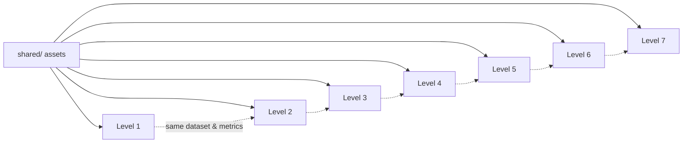
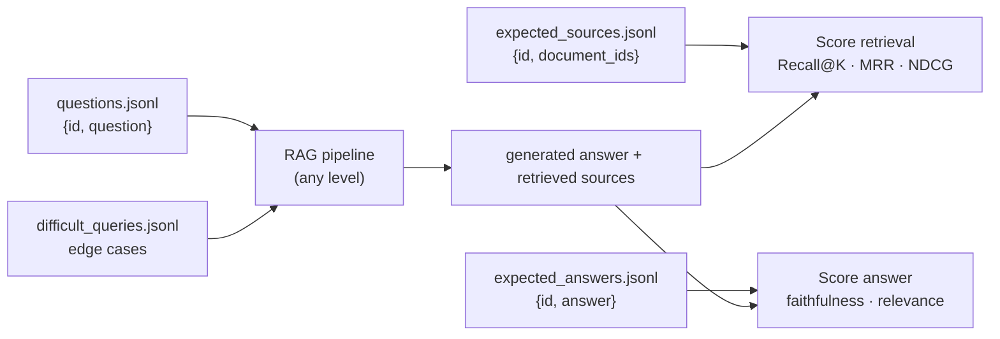

# Shared Assets

Reusable assets used across **every level** of the RAG specialization — one dataset, one prompt set, one config layer, one evaluation harness, so results stay comparable as the architecture evolves from [Level 1](../01-naive-rag/README.md) to [Level 7](../07-production-rag/README.md).

> **Status:** structure only — folders and this README exist; files and implementation are added as each level needs them.

---

## Why a shared folder?

If each level ingests different documents or asks different questions, you can't tell whether a change in answer quality came from a **better architecture** or a **different test**. Keeping the data, prompts, config, and evaluation set constant isolates the one variable that matters: the RAG design itself.



---

## Folder Structure

```mermaid
flowchart TD
    SHARED["shared/"] --> DATA["data/"]
    SHARED --> MODELS["models/"]
    SHARED --> PROMPTS["prompts/"]
    SHARED --> UTILS["utils/"]
    SHARED --> CONFIG["config/"]
    SHARED --> EVAL["evaluation/"]

    DATA --> D1["sample.pdf"]
    DATA --> D2["faq.md"]
    DATA --> D3["documents.jsonl"]

    MODELS --> M1["model_config.yaml"]

    PROMPTS --> P1["rag_prompt.txt"]
    PROMPTS --> P2["query_rewrite_prompt.txt"]
    PROMPTS --> P3["verifier_prompt.txt"]

    UTILS --> U1["loaders.py"]
    UTILS --> U2["logging.py"]
    UTILS --> U3["text.py"]

    CONFIG --> C1["settings.py"]
    CONFIG --> C2["retrieval.yaml"]

    EVAL --> EV1["questions.jsonl"]
    EVAL --> EV2["expected_sources.jsonl"]
    EVAL --> EV3["expected_answers.jsonl"]
    EVAL --> EV4["difficult_queries.jsonl"]
```



| Folder | Purpose |
|---|---|
| `data/` | The small, fixed document set every level ingests (PDF, FAQ, JSONL). |
| `models/` | Embedding / LLM model configuration shared across levels. |
| `prompts/` | Prompt templates reused by naive, advanced, and agentic pipelines. |
| `utils/` | Common helpers: document loaders, logging, text cleaning. |
| `config/` | Central settings and retrieval configuration. |
| `evaluation/` | The one evaluation dataset used to compare every level. |

---

## Evaluation Dataset



Example `questions.jsonl` record:

```json
{"id":"q001","question":"What is the refund period?"}
```

Example `expected_sources.jsonl` record:

```json
{"id":"q001","document_ids":["refund_policy_2026"]}
```

This is what lets you prove — with numbers — that Level 2's hybrid search actually beat Level 1's naive vector search, rather than just feeling like it did.

---

## Planned Contents (not yet implemented)

- [ ] `data/sample.pdf`, `data/faq.md`, `data/documents.jsonl`
- [ ] `models/model_config.yaml`
- [ ] `prompts/rag_prompt.txt`, `query_rewrite_prompt.txt`, `verifier_prompt.txt`
- [ ] `utils/loaders.py`, `logging.py`, `text.py`
- [ ] `config/settings.py`, `retrieval.yaml`
- [ ] `evaluation/questions.jsonl`, `expected_sources.jsonl`, `expected_answers.jsonl`, `difficult_queries.jsonl`

## Back to

[← Root README](../README.md)
